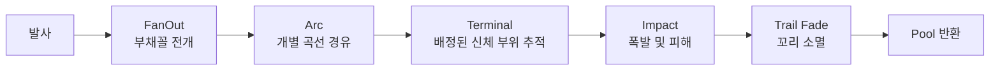

# Distributed Monster Missile Strike Development Plan

최종 갱신일: 2026-07-20

이 문서는 `TitanDestroyer`의 플레이어 특수 미사일 공격을 대형 몬스터의 여러 부위에 분산 명중하는 대량 미사일 연출로 변경하기 위한 구현 기준이다. 구현 담당 Codex는 이 문서를 우선 기준으로 사용한다.

## 한 줄 목표

현재 좌우 런처에서 발사되는 특수 미사일 30발을 짧은 시간에 펼쳐 발사하고, 각 미사일이 서로 다른 곡선 경로를 거쳐 대형 몬스터의 여러 `AimPoint` 주변에 분산 명중하도록 변경한다.

## 확정 범위

반드시 적용한다.

- 특수 미사일 다수를 짧은 시간에 연속 발사한다.
- 발사 직후 미사일이 좌우·상하로 펼쳐지는 `FanOut` 단계를 추가한다.
- 미사일마다 서로 다른 경유점을 사용하는 `Arc` 단계를 추가한다.
- 마지막에는 배정된 몬스터 타격점을 지속 추적하는 `Terminal` 단계로 전환한다.
- 보스의 여러 `AimPoint`를 모든 미사일에 균등하게 분배한다.
- 같은 `AimPoint`로 향하는 미사일도 서로 다른 로컬 오프셋을 사용해 한 점에 겹치지 않게 한다.
- 움직이거나 애니메이션 중인 몬스터에서도 타격 위치가 신체를 따라가게 한다.
- 길게 남는 청록색 발광 트레일을 적용한다.
- 여러 부위에서 폭발이 순차적으로 발생하도록 도착 시점을 분산한다.
- 고속 미사일이 한 프레임 사이에 보스를 관통하지 않도록 기존 선분 충돌 판정을 사용한다.
- 미사일, 트레일, 반복 폭발에서 발생하는 런타임 할당을 줄이기 위해 풀링을 적용한다.
- 일반 단발 미사일이 아니라 `PlayerSpecialAttackController`가 발사하는 특수 미사일 공격을 우선 변경한다.

## 명시적 제외 범위

다음 기능은 구현하지 않는다.

- 환경 타격 수신기
- 건물, 지형, 배경 오브젝트 충돌
- 건물 파괴
- 프랙처 메시 생성
- 손상형 건물 교체
- 하이브리드 파괴 시스템
- 환경 파편 물리 처리
- 환경 충돌용 `Raycast`, `SphereCast`, LayerMask
- 일반 단발 미사일 `HomingMissileController`의 비행 방식 변경
- 특수공격 컷인 UI와 방송 UI의 디자인 변경
- 카메라 연출의 전면 개편
- 기존 타겟 선택 UI와 크리티컬 규칙의 전면 개편

구현 중 환경 관련 클래스나 컴포넌트를 새로 만들지 않는다. 예를 들어 `EnvironmentImpactReceiver`, `DestructibleBuilding`, `BuildingDamageReceiver` 같은 타입을 추가하면 이 계획의 범위를 벗어난다.

## 참고 영상에서 가져올 요소

참고 영상의 핵심은 환경 파괴가 아니라 아래의 시각적 리듬이다.

1. 수십 발이 거의 동시에 넓게 펼쳐진다.
2. 각 미사일이 서로 다른 곡선을 그린다.
3. 궤적이 화면에 오래 남아 미사일 수가 강조된다.
4. 여러 목표 지점에서 폭발이 짧은 간격으로 연속 발생한다.

이 프로젝트에서는 다수 건물 대신 한 마리의 대형 몬스터를 사용한다. 몬스터의 여러 `AimPoint`와 그 주변 오프셋이 영상 속 건물별 충돌점을 대신한다.

## 현재 코드 기준

### PlayerSpecialAttackController

파일:

- `Assets/_Project/Scripts/Gameplay/PlayerSpecialAttackController.cs`

현재 동작:

- `DefaultMissileCountPerSide = 15`이므로 기본 발사 수는 좌우 15발, 총 30발이다.
- `missilesPerVolley = 2`다.
- `missileSalvoDuration = 2f` 동안 순차 발사한다.
- `ResolveSpecialTarget()`이 반환한 하나의 `Transform`을 모든 특수 미사일이 공유한다.
- `MissileSideArcPattern`은 5개 패턴을 반복하므로 30발에서 궤적 중복이 발생할 수 있다.
- `specialMissileDamage` 기본값은 `0f`다.

### SpecialHomingMissileController

파일:

- `Assets/_Project/Scripts/Gameplay/SpecialHomingMissileController.cs`

현재 동작:

- 상태는 `SideArc`, `Straight`, `Turning`, `Boost`로 구성된다.
- `SideArc`는 2차 베지어 곡선을 사용한다.
- `Boost` 진입 시 `boostDirection`을 한 번 계산한 뒤 같은 방향으로 직진한다.
- `Update()`는 현재 위치만 사용해 `BattleController.TryHitBoss()`를 호출한다.
- `EnsureTrailRenderer()`와 `EnsureSmokeTrail()`이 구현되어 있지만 현재 호출되지 않는다.
- `EmitCartoonSmoke()`는 매 프레임 호출된다.
- 미사일 오브젝트와 일부 비주얼 리소스가 런타임에 생성되고 `Destroy()`된다.

### BossController

파일:

- `Assets/_Project/Scripts/Gameplay/BossController.cs`

재사용할 API:

- `GetCombatAimPointCount()`
- `GetCombatAimPoint(int index)`
- `AimPoint`
- `HitPoint`
- 보스의 `damageHurtboxes`

현재 `AimPoint`, `AimPoint2`, `AimPoint3`, `AimPoint4`, `AimPoint5`를 자동 탐색한다. 1차 구현에서는 새 환경 타격 시스템을 만들지 않고 이 목록을 특수 미사일 분산 타격 앵커로 사용한다.

### BattleController

파일:

- `Assets/_Project/Scripts/Gameplay/BattleController.cs`

재사용할 API:

```csharp
TryHitBoss(
    Vector3 previousWorldPoint,
    Vector3 worldPoint,
    float hitRadius,
    float damage,
    Collider projectileCollider = null,
    float criticalChance = 0f)
```

이 오버로드는 이전 위치와 현재 위치 사이의 선분을 보스 hurtbox와 검사한다. 따라서 특수 미사일에는 별도 `Physics.SphereCastNonAlloc`을 추가하지 않는다. 이 방식은 환경과 충돌하지 않으면서 고속 관통만 방지한다.

## 목표 비행 구조



### 1. FanOut

목적:

- 발사 직후 30발이 한 줄로 겹치는 현상을 방지한다.
- 영상처럼 미사일이 런처 주변에서 방사형으로 펼쳐지는 실루엣을 만든다.

동작:

- 지속시간은 짧게 유지한다.
- 각 미사일은 카메라 기준 `right`, `up`, 플레이어의 발사 전방 벡터를 조합한 서로 다른 방향을 받는다.
- 좌측 런처는 왼쪽 비중을, 우측 런처는 오른쪽 비중을 높인다.
- 완전 랜덤 대신 미사일 인덱스로 계산한 결정적 패턴을 사용한다.
- 같은 실행에서 궤적이 겹치지 않아야 하며, 재현 가능한 테스트가 가능해야 한다.

권장 초기값:

| 항목 | 초기값 | 설명 |
| --- | ---: | --- |
| `fanOutDuration` | `0.28s` | 펼쳐지는 시간 |
| `fanOutDistance` | `5.5` | FanOut 동안 이동할 거리 |
| `fanOutHorizontal` | `1.0` | 좌우 전개 비율 |
| `fanOutVertical` | `0.65` | 상하 전개 비율 |

### 2. Arc

목적:

- FanOut 종료 위치에서 몬스터까지 직선으로 날아가지 않고 서로 다른 큰 곡선을 만든다.
- 트레일이 서로 교차하고 겹치면서 대량 미사일 연출을 만든다.

동작:

- 각 미사일에 보이지 않는 개별 경유점을 하나 이상 배정한다.
- 경유점은 플레이어와 보스 사이의 중간 위치에 카메라 `right/up` 오프셋을 더해 만든다.
- 미사일 인덱스별로 좌우, 높이, 깊이, 지속시간을 조금씩 다르게 한다.
- 현재 5개짜리 `MissileSideArcPattern` 반복은 제거하거나 새 분산 함수로 대체한다.
- 궤적은 기존 2차 베지어를 확장해도 되고, 필요하면 3차 베지어를 사용할 수 있다.
- 구현 단순성을 우선하면 FanOut 종료점, Arc 제어점, Terminal 진입점을 사용하는 2차 베지어로 시작한다.

권장 초기값:

| 항목 | 초기값 | 설명 |
| --- | ---: | --- |
| `arcDuration` | `0.75s` | 곡선 비행 기준 시간 |
| `arcDurationJitter` | `0.18s` | 도착 시간 분산 |
| `arcHorizontalRadius` | `10` | 좌우 곡선 반경 |
| `arcVerticalRadius` | `7` | 상하 곡선 반경 |
| `terminalEntryDistance` | `8` | 몬스터 앞 Terminal 시작 거리 |

### 3. Terminal

목적:

- Arc 종료 후 자신의 최종 타격점을 향해 빠르게 돌입한다.
- 몬스터가 움직이거나 애니메이션 중이어도 지정 부위를 계속 추적한다.

동작:

- `Terminal`에서는 매 프레임 최종 타격점의 월드 위치를 다시 계산한다.
- 방향은 `Vector3.RotateTowards` 또는 동등한 제한 회전 방식으로 갱신한다.
- 속도는 현재 `cruiseSpeed`, `acceleration`, `turnRate` 튜닝을 재사용한다.
- `boostDirection`을 한 번 계산한 뒤 고정하는 현재 방식은 사용하지 않는다.
- 각 미사일은 자신의 `targetAnchor`와 `targetLocalOffset`을 보관한다.

최종 타격점 계산:

```csharp
Vector3 targetWorldPosition = targetAnchor.TransformPoint(targetLocalOffset);
```

`targetLocalOffset`을 로컬 좌표로 저장하기 때문에 타격점이 보스의 이동과 애니메이션을 따라간다.

## 몬스터 타격점 분산 규칙

### 기본 앵커 목록

1차 구현에서는 `BossController`의 전투용 AimPoint 목록을 그대로 사용한다.

```csharp
int count = bossController.GetCombatAimPointCount();
Transform anchor = bossController.GetCombatAimPoint(index);
```

규칙:

- AimPoint가 2개 이상이면 모든 AimPoint에 미사일을 균등 배분한다.
- 30발, AimPoint 5개라면 기본적으로 각 AimPoint에 6발을 배정한다.
- AimPoint 수와 미사일 수가 나누어떨어지지 않으면 차이가 최대 1발을 넘지 않게 한다.
- 사용자가 선택한 AimPoint 하나에 모든 미사일을 집중시키지 않는다.
- 선택된 AimPoint도 전체 목록의 일부로 포함한다.
- 일반 탄과 일반 단발 미사일의 선택 AimPoint 추적 규칙은 변경하지 않는다.

### AimPoint 주변 로컬 오프셋

같은 AimPoint에 배정된 미사일이 같은 좌표에 겹치지 않도록 각 미사일에 서로 다른 로컬 오프셋을 준다.

권장 방식:

- 황금각 `137.507764°`를 사용한 원반 분포 또는 동등한 저편향 분포를 사용한다.
- 단순 `Random.insideUnitCircle`만 사용해 특정 지점에 뭉치는 현상을 만들지 않는다.
- 로컬 `x/y`에 타원형 오프셋을 만들고 로컬 `z`는 작게 유지한다.
- 보스 크기에 맞게 Inspector에서 반경을 조정할 수 있어야 한다.

권장 초기값:

| 항목 | 초기값 | 설명 |
| --- | ---: | --- |
| `targetSpreadRadius` | `1.6` | AimPoint 주변 기본 분산 반경 |
| `targetSpreadVerticalScale` | `1.25` | 세로 분산 배율 |
| `targetSpreadDepth` | `0.2` | 앞뒤 오프셋 제한 |

AimPoint가 하나뿐이어도 오프셋 분산을 통해 여러 위치에 명중해야 한다. AimPoint가 하나도 없으면 `bossController.AimPoint`, 이후 `bossController.transform` 순으로 fallback한다.

### 결정적 분산

- 궤적과 타격점 생성에 전역 `UnityEngine.Random` 상태를 직접 소비하지 않는 것이 좋다.
- `salvoSequence`와 `missileIndex`를 해시해 각 미사일의 패턴을 계산한다.
- 같은 seed에서는 같은 분포가 나와 테스트와 재현이 가능해야 한다.
- 다음 특수공격에서는 `salvoSequence`가 바뀌어 패턴이 조금 달라질 수 있다.

## 충돌 및 명중 처리

환경 충돌은 검사하지 않는다.

`SpecialHomingMissileController.Update()`에서 다음 순서를 사용한다.

```csharp
Vector3 previousPosition = transform.position;
UpdateFlight(deltaTime);

bool hit = battleController.TryHitBoss(
    previousPosition,
    transform.position,
    hitRadius,
    damage,
    projectileCollider: null,
    criticalChance: criticalChance);
```

효과:

- 미사일이 빠르게 이동해도 이전 위치와 현재 위치 사이의 보스 hurtbox를 검사한다.
- 건물, 지형, 배경 콜라이더는 전혀 검사하지 않는다.
- 별도 `SphereCastNonAlloc`과 충돌 결과 배열이 필요 없다.
- 기존 `BossController.CheckHit(previousWorldPoint, worldPoint, ...)`를 재사용한다.

주의:

- 최종 타격점은 보스 hurtbox 내부 또는 충분히 가까운 위치에 있어야 한다.
- 보스 프리팹에 AimPoint가 hurtbox 밖에 배치되어 있다면 AimPoint 위치를 수정하거나 `targetSpreadRadius`를 줄인다.
- 명중 시 폭발 위치는 미사일의 실제 현재 위치를 사용한다.

## 발사 리듬

현재 총 30발은 유지한다. 영상과 같은 밀도를 만들기 위해 전체 발사 시간을 줄인다.

권장 초기값:

| 항목 | 현재 | 변경 초기값 |
| --- | ---: | ---: |
| `missileCountPerSide` | `15` | `15` 유지 |
| 총 미사일 수 | `30` | `30` 유지 |
| `missilesPerVolley` | `2` | `4` |
| `missileSalvoDuration` | `2.0s` | `0.6s` |

발사 간격과 Arc 시간 jitter를 함께 사용해 모든 미사일이 정확히 같은 프레임에 명중하지 않게 한다.

목표 명중 리듬:

- 첫 명중과 마지막 명중 사이가 약 `0.7~1.5초`가 되게 한다.
- 한 프레임에 모든 폭발이 발생하지 않게 한다.
- 같은 AimPoint에 배정된 미사일도 도착 순서가 섞여야 한다.

## 트레일 및 미사일 비주얼

### 필수 트레일

특수 미사일에는 청록색 발광 트레일을 적용한다.

최소 구현:

- `EnsureVisuals()`에서 실제로 `EnsureTrailRenderer()`를 호출한다.
- 현재 회백색 gradient를 청록색 계열로 변경한다.
- 트레일 수명을 늘린다.
- 곡선 모서리가 부드럽게 보이도록 corner vertex를 추가한다.
- 모든 미사일이 개별 Material을 생성하지 않고 공유 Material을 사용한다.

권장 초기값:

| 항목 | 초기값 |
| --- | ---: |
| `trailTime` | `1.6s` |
| `trailStartWidth` | `0.24` |
| `trailEndWidth` | `0.03` |
| `trailMinVertexDistance` | `0.12` |
| `trailCornerVertices` | `2` |
| 시작색 | 밝은 흰색-청록색 |
| 끝색 | 투명 청록색 |

품질 개선 구현:

- 가는 밝은 core TrailRenderer와 넓고 투명한 glow TrailRenderer를 두 겹으로 사용할 수 있다.
- core와 glow는 각각 공유 Material을 사용한다.
- URP Bloom에서 읽히는 HDR 색상을 사용한다.

### 특수 미사일 연기

참고 영상은 밝은 라인 트레일이 핵심이다.

- `SpecialHomingMissileController`의 `EmitCartoonSmoke()`는 특수 미사일 스트라이크에서 기본 비활성한다.
- 일반 단발 미사일의 연기 표현은 변경하지 않는다.
- 필요하면 매우 옅은 smoke trail을 선택 옵션으로 남길 수 있지만 필수 완료 조건은 아니다.

### 폭발

- 기존 `missileImpactEffectTemplate`을 우선 재사용한다.
- 미사일마다 자신의 실제 명중 위치에서 폭발한다.
- Arc 지속시간, 발사 간격, 속도 jitter로 폭발 시점을 자연스럽게 분산한다.
- 폭발 크기와 피해 판정은 분리한다.
- 폭발 VFX가 없는 경우에도 명중과 풀 반환은 정상 동작해야 한다.

## 피해량 및 크리티컬 정책

1차 구현에서는 전투 밸런스를 바꾸지 않는다.

- `specialMissileDamage` 기본값 `0f`를 유지한다.
- 현재 특수 미사일의 critical chance 스냅샷 흐름을 유지한다.
- 궤적과 타격점 분산 때문에 피해량이 30배 증가하지 않도록 한다.
- 향후 특수공격에 실제 피해를 부여할 때는 `totalSpecialDamage / spawnedMissileCount` 방식으로 분배하는 별도 변경을 한다.
- 이번 구현에서 일반 미사일의 `missileDamage` 계산은 변경하지 않는다.

## 오브젝트 풀링

현재처럼 매 발사마다 `new GameObject`, `AddComponent`, Material 생성, `Destroy`를 반복하지 않는다.

### 권장 구조

새 파일 후보:

- `Assets/_Project/Scripts/Gameplay/SpecialMissilePool.cs`

역할:

- `SpecialHomingMissileController` 인스턴스 생성 및 재사용
- 기본 40개 prewarm
- 부족할 때만 확장
- 발사 시 상태 초기화
- 명중 또는 lifetime 종료 후 반환

권장 API 예시:

```csharp
public sealed class SpecialMissilePool
{
    public void Prewarm(int count);
    public SpecialHomingMissileController Get();
    public void Release(SpecialHomingMissileController missile);
}
```

반환 전 초기화:

- `TrailRenderer.emitting = false`
- 트레일 fade가 끝날 때까지 대기
- `TrailRenderer.Clear()`
- ParticleSystem 정지 및 clear
- target reference 제거
- runtime state 초기화
- GameObject 비활성화

다음 발사 시 초기화:

- 위치와 회전 설정
- target anchor와 local offset 설정
- FanOut/Arc/Terminal 시간 재설정
- 속도, lifetime, 피해, critical chance 재설정
- TrailRenderer clear 후 emitting 활성화
- 미사일 renderer 활성화

### Trail Fade 상태

명중 즉시 미사일 GameObject를 비활성화하면 트레일도 즉시 사라진다. 이를 피하기 위해 `ImpactFade` 상태를 둔다.

- 명중 시 미사일 본체 renderer를 숨긴다.
- 트레일 emitting을 끈다.
- 비행과 추가 충돌을 중지한다.
- `trailTime`이 지난 뒤 풀로 반환한다.

### Material 정책

- 미사일마다 Material을 만들지 않는다.
- core/glow 트레일 Material은 공유한다.
- Material별 색상 변주가 필요하면 `TrailRenderer.colorGradient` 또는 `MaterialPropertyBlock`을 사용한다.
- 풀링 이후 반복 발사에서 `runtimeMaterials`가 계속 증가하지 않아야 한다.

## 권장 코드 변경 범위

### 수정: PlayerSpecialAttackController.cs

변경 사항:

- 모든 미사일에 하나의 `ResolveSpecialTarget()` 결과를 전달하는 구조를 제거한다.
- 보스의 모든 combat AimPoint를 수집한다.
- 미사일 인덱스별 `targetAnchor`를 균등 분배한다.
- 미사일 인덱스별 `targetLocalOffset`을 생성한다.
- FanOut 방향과 Arc 경유점을 생성한다.
- `ConfigureSideArc()` 대신 새 `ConfigureStrikePath()`를 호출한다.
- 발사 시간을 기본 `0.6초`, volley 크기를 기본 `4`로 조정한다.
- 특수 미사일 풀을 생성하고 prewarm한다.
- 특수공격 취소, 보스 사망, 씬 종료에서도 풀 상태가 정리되게 한다.

추가 serialized field 후보:

```csharp
[Header("Missile Strike Distribution")]
[SerializeField] private float targetSpreadRadius = 1.6f;
[SerializeField] private float targetSpreadVerticalScale = 1.25f;
[SerializeField] private float targetSpreadDepth = 0.2f;

[Header("Missile Strike Flight")]
[SerializeField] private float fanOutDuration = 0.28f;
[SerializeField] private float fanOutDistance = 5.5f;
[SerializeField] private float arcDuration = 0.75f;
[SerializeField] private float arcDurationJitter = 0.18f;
[SerializeField] private float arcHorizontalRadius = 10f;
[SerializeField] private float arcVerticalRadius = 7f;
[SerializeField] private float terminalEntryDistance = 8f;

[Header("Missile Strike Pool")]
[SerializeField] private int missilePoolPrewarmCount = 40;
```

### 수정: SpecialHomingMissileController.cs

변경 사항:

- 비행 상태를 `FanOut`, `Arc`, `Terminal`, `ImpactFade` 중심으로 정리한다.
- 기존 public `Launch()`의 전투 데이터 설정은 최대한 재사용한다.
- 새 `ConfigureStrikePath()`를 추가해 특수 경로 데이터를 전달한다.
- target을 `Transform` 하나로만 보관하지 않고 `targetAnchor + targetLocalOffset`으로 보관한다.
- Terminal에서 매 프레임 `targetAnchor.TransformPoint(targetLocalOffset)`을 계산한다.
- `boostDirection` 고정 직진을 제거한다.
- 이전 위치와 현재 위치를 사용하는 `TryHitBoss` 오버로드를 호출한다.
- `EnsureTrailRenderer()`를 실제 초기화 흐름에 연결한다.
- 특수 미사일의 cartoon smoke는 기본 비활성한다.
- `Destroy(gameObject)` 대신 풀 반환 흐름을 지원한다.
- 풀 없이 생성된 fallback 인스턴스도 안전하게 파괴할 수 있어야 한다.
- 명중 후 `ImpactFade` 동안 중복 피해가 발생하지 않아야 한다.

새 설정 데이터 예시:

```csharp
public struct SpecialMissileStrikePath
{
    public Transform TargetAnchor;
    public Vector3 TargetLocalOffset;
    public Vector3 FanOutDirection;
    public float FanOutDuration;
    public float FanOutDistance;
    public Vector3 ArcControlPoint;
    public Vector3 TerminalEntryPoint;
    public float ArcDuration;
}
```

실제 타입명은 프로젝트 네이밍에 맞게 조정할 수 있지만, 긴 `Launch()` 매개변수 목록에 경로 인자를 계속 추가하지 말고 하나의 설정 구조체로 묶는다.

### 추가: SpecialMissilePool.cs

변경 사항:

- 특수 미사일 생성/대여/반환 담당
- 컨트롤러의 reset API 호출
- prewarm 및 확장 정책
- 씬 종료 시 정리

### 선택 수정: BossController.cs

현재 `GetCombatAimPointCount()`와 `GetCombatAimPoint()`로 충분하면 수정하지 않는다.

목록 복사 비용이나 호출 편의가 필요할 때만 아래와 같은 non-alloc API를 추가할 수 있다.

```csharp
public void GetCombatAimPoints(List<Transform> results);
```

환경 타격 API나 건물 관련 API는 추가하지 않는다.

### 변경하지 않음: HomingMissileController.cs

일반 단발 미사일의 현재 비행, 타겟 선택, 피해량, 쿨다운은 그대로 유지한다.

## 구현 순서

### 1단계: 타격점 분산

- `PlayerSpecialAttackController`에서 combat AimPoint 목록을 수집한다.
- 30발을 AimPoint에 균등 분배한다.
- 각 미사일에 결정적 로컬 오프셋을 생성한다.
- 디버그 로그 또는 Gizmo로 배정된 최종 지점을 확인한다.

완료 조건:

- 모든 미사일이 동일한 Transform 하나를 공유하지 않는다.
- AimPoint가 5개면 각 AimPoint에 6발씩 배정된다.
- 같은 AimPoint의 로컬 오프셋이 서로 겹치지 않는다.

### 2단계: FanOut/Arc/Terminal 비행

- 새 phase를 구현한다.
- Terminal에서 target world position을 매 프레임 갱신한다.
- Arc 시간 jitter를 적용한다.

완료 조건:

- 발사 직후 분명한 부채꼴 전개가 보인다.
- 궤적이 5개 패턴 반복처럼 겹쳐 보이지 않는다.
- 모든 미사일이 최종적으로 보스를 향한다.

### 3단계: 고속 명중 판정

- 이전 위치를 저장한다.
- `BattleController.TryHitBoss(previous, current, ...)`를 사용한다.
- 현재 위치만 검사하는 호출을 제거한다.

완료 조건:

- 속도를 크게 올려도 보스를 통과하는 미사일이 없어야 한다.
- 건물과 지형은 계속 통과해야 한다.
- 환경용 Physics query가 추가되지 않아야 한다.

### 4단계: 트레일과 연쇄 폭발

- 청록색 TrailRenderer를 활성화한다.
- 트레일 수명과 폭을 조정한다.
- cartoon smoke를 특수 미사일에서 비활성한다.
- 도착 시간 분산을 확인한다.

완료 조건:

- 다수 궤적이 최소 1초 이상 화면에 남는다.
- 폭발이 여러 몬스터 부위에서 순차 발생한다.
- 명중 즉시 트레일 전체가 사라지지 않는다.

### 5단계: 풀링

- 특수 미사일 풀을 추가한다.
- 40개를 prewarm한다.
- 반복 특수공격에서 인스턴스와 Material이 계속 증가하지 않게 한다.

완료 조건:

- 두 번째 특수공격부터 미사일 본체 생성/파괴가 반복되지 않는다.
- 풀 반환 후 target reference와 trail이 깨끗하게 초기화된다.
- 이전 공격의 트레일이 다음 공격 시작점으로 이어지지 않는다.

### 6단계: 회귀 검증과 튜닝

- 일반 미사일 회귀 테스트
- 특수공격 중 보스 pause/resume 확인
- 컷인 및 방송 이벤트 확인
- 씬 Retry 후 풀과 이벤트 상태 확인
- 발사 수, 비행시간, 타격 분산, 트레일 파라미터 최종 튜닝

## 테스트 계획

### EditMode 테스트

추가 파일 후보:

- `Assets/_Project/Tests/EditMode/MissileStrikeDistributionTests.cs`

테스트 항목:

- 30발/5 AimPoint 분배 결과가 각각 6발인지 확인
- 31발/5 AimPoint 분배 차이가 1 이하인지 확인
- 같은 seed에서 같은 로컬 오프셋이 생성되는지 확인
- 서로 다른 missile index가 같은 오프셋을 반복하지 않는지 확인
- AimPoint 0개, 1개인 fallback 확인
- 입력된 반경보다 큰 오프셋이 생성되지 않는지 확인

### PlayMode 테스트

추가 파일 후보:

- `Assets/_Project/Tests/PlayMode/SpecialMissileStrikePlayModeTests.cs`

테스트 항목:

- target anchor가 이동하면 Terminal 목표 위치도 따라가는지 확인
- 고속 이동에서 선분 판정으로 보스 명중이 발생하는지 확인
- 환경 Collider를 사이에 두어도 미사일이 멈추지 않는지 확인
- 명중 후 중복 피해가 발생하지 않는지 확인
- trail fade 후 풀로 반환되는지 확인
- 10회 연속 salvo 후 active missile 수가 0으로 돌아오는지 확인
- 풀의 총 생성 개수가 비정상적으로 계속 증가하지 않는지 확인

### 수동 시각 검증

BattleArena에서 아래를 확인한다.

- 좌우 런처에서 미사일이 거의 동시에 펼쳐진다.
- 화면 중앙에서 30발이 한 줄로 겹치지 않는다.
- 좌우·상하 곡률이 미사일마다 다르다.
- 머리, 몸통, 좌우 부위 등 여러 AimPoint 주변에서 명중한다.
- 같은 AimPoint에서도 폭발 위치가 조금씩 다르다.
- 첫 폭발과 마지막 폭발이 짧은 시간 차를 두고 발생한다.
- 미사일이 건물이나 배경에 닿아도 폭발하지 않는다.
- 보스가 움직여도 Terminal 단계가 지정 부위를 따라간다.
- 트레일이 곡선을 충분히 보여 준 뒤 자연스럽게 사라진다.
- 특수공격 종료 후 플레이어 입력과 보스 행동이 정상 복구된다.

## 성능 기준

초기 목표:

- 기본 30발 동시 운용
- 풀 prewarm 이후 미사일 본체 생성/파괴 0회
- 미사일별 Update에서 LINQ 사용 금지
- 미사일별 Update에서 배열/List 생성 금지
- 미사일별 Material 인스턴스 생성 금지
- target anchor 목록은 salvo 시작 시 한 번 수집
- 트레일의 `minVertexDistance`를 지나치게 낮추지 않는다.
- 풀은 scene object reference를 씬 종료 이후 static으로 유지하지 않는다.

프로파일링 시 확인:

- 특수공격 발사 프레임 GC Alloc
- 30개 TrailRenderer의 vertex 비용
- 폭발 VFX 동시 재생 비용
- 풀 반환 시 spike
- Retry 후 유실된 reference 또는 남은 coroutine

## 호환성 및 회귀 조건

반드시 유지한다.

- 기존 특수공격 컷인
- `SetPlayerInputPaused(true/false)` 흐름
- `SetBossPaused(true/false)` 흐름
- `ClearBossProjectiles()` 호출
- `SpecialMissileSalvoCompleted` 이벤트
- `BattleEventBroadcastTrigger` 연동
- 선택 AimPoint 기반 일반 탄/일반 미사일 발사
- 크리티컬 확률 스냅샷 흐름
- `GameplayDebugFlags.IgnoreMissileCooldown`
- BattleArena Retry

## 구현 금지 사항

- 30개의 최종 타격점을 월드 좌표로 고정하지 않는다.
- 모든 미사일에 같은 target Transform과 같은 local offset을 전달하지 않는다.
- `UnityEngine.Random` 전역 상태에만 의존해 테스트가 매번 달라지게 하지 않는다.
- 미사일마다 새 Material을 생성하지 않는다.
- 명중 즉시 TrailRenderer가 붙은 오브젝트를 비활성화해 꼬리를 잘라 버리지 않는다.
- 특수 미사일 구현 때문에 일반 `HomingMissileController`를 함께 리팩터링하지 않는다.
- 환경 Collider를 검사하지 않는다.
- 환경 관련 MonoBehaviour를 추가하지 않는다.
- 현재 특수공격 기본 피해량을 임의로 변경하지 않는다.
- 씬 또는 prefab asset을 Play Mode 런타임 코드에서 영구 수정하지 않는다.

## 완료 정의

아래 조건을 모두 충족하면 구현 완료로 본다.

- 특수 미사일 30발이 약 0.6초 안에 발사된다.
- FanOut, Arc, Terminal 세 단계가 시각적으로 구분된다.
- 모든 미사일이 대형 몬스터의 여러 AimPoint 주변으로 균등 분산된다.
- 같은 AimPoint에 배정된 미사일도 서로 다른 위치에 명중한다.
- Terminal 목표가 몬스터 이동과 애니메이션을 따라간다.
- 고속 미사일이 보스를 관통하지 않는다.
- 건물과 환경에는 충돌하거나 폭발하지 않는다.
- 청록색 트레일이 곡선 경로를 충분히 보여 준다.
- 폭발이 여러 부위에서 순차적으로 발생한다.
- 명중 후 트레일이 자연스럽게 fade된다.
- 반복 발사에서 풀링이 정상 작동한다.
- 일반 미사일, 타겟 선택 UI, 컷인, 방송 이벤트에 회귀가 없다.
- Unity 컴파일 오류가 없다.
- 관련 EditMode/PlayMode 테스트가 통과한다.

## Codex 작업 지시 요약

구현 담당 Codex는 다음 순서로 작업한다.

1. 현재 코드를 다시 읽고 이 문서의 현재 코드 기준과 차이가 있는지 확인한다.
2. 기존 사용자 변경사항과 dirty worktree를 보존한다.
3. 타격점 분산 로직을 먼저 순수 함수로 구현하고 테스트한다.
4. 특수 미사일에만 FanOut/Arc/Terminal을 적용한다.
5. 기존 선분 기반 보스 명중 API를 사용한다.
6. 청록색 트레일과 ImpactFade를 적용한다.
7. 풀링을 연결한다.
8. Unity 컴파일과 테스트를 실행한다.
9. BattleArena에서 시각 검증한다.
10. 최종 결과에서 변경 파일, 튜닝값, 테스트 결과, 남은 제한사항을 보고한다.
