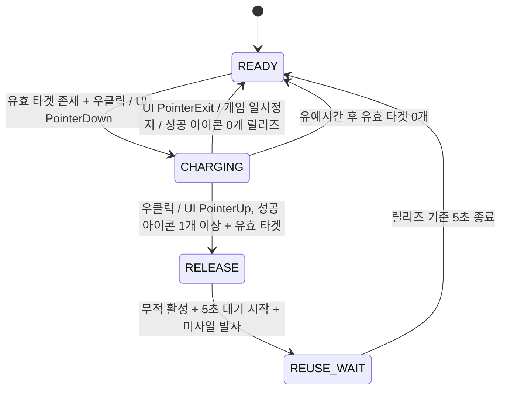

Project U / Lock-on System Spec v0.1

---

# 프로젝트 U

## 락온 시스템 개발 사양서

Lock-on Charge / Missile Salvo / Salvo Invincibility System

| 항목 | 내용 |
| --- | --- |
| 문서 버전 | v0.1 |
| 작성일 | 2026-07-31 |
| 프로젝트 | 프로젝트U |
| 대상 | 기획자 / 클라이언트 프로그래머 / UI·VFX·애니메이션 담당 |
| 목적 | 락온 버튼 기반 미사일 공격·발사 연동 무적 시스템을 개발자가 바로 구현 검토할 수 있도록 정리 |

> **핵심 한 줄**
>
> 락온 버튼을 누르고 있으면 1~5개의 성공 락온이 축적되고, 버튼을 떼면 같은 릴리즈 흐름에서 살보 준비 → 발사 연동 무적 활성 → 단계별 미사일 발사 순서로 처리된다. 헬기의 별도 회피 기동은 없다.

이 문서는 현재 기획 결론을 기준으로 한 개발 전달용 초안이다. 단계별 발수·기본 총 데미지 비율과 발사 연동 무적시간의 초기값은 확정하며, 별도 배율 변수로 둔 5단계 최대 데미지는 프로토타입 플레이 테스트 후 조정할 수 있다. 락온 재사용 대기는 모든 단계 공통 5초로 확정한다.

---

## 목차

1. 시스템 목표와 확정 방향
2. 플레이어 조작 구조
3. 락온 버튼 기본 플로우
4. 상태 머신 설계
5. 락온 타겟 선정 규칙
6. 단계별 효과와 밸런스 초안
7. 미사일 발사 / 발사 연동 무적 처리
8. UI, 애니메이션, VFX, SFX 요구사항
9. 데이터 구조 / 개발 파라미터
10. 의사 코드
11. 리스크와 대응
12. 개발 체크리스트

---

## 1. 시스템 목표와 확정 방향

프로젝트U는 대도시를 침공한 거대괴수를 상대로 고정 전투 카메라 앞의 화면 평면에서 헬기를 상하좌우로 움직이며 싸우는 3D 공중 액션 보스전 게임이다. 플레이어 헬기가 괴수 중심의 원형 궤도를 직접 도는 구조가 아니라, 도시와 환경의 회전으로 괴수 주변을 선회하는 느낌을 만든다. 이 게임의 조작은 비행 시뮬레이션이 아니라 보스 패턴 회피와 공격 타이밍에 집중해야 한다.

### 1.1 확정된 전투 방향

| 분류 | 확정 내용 | 개발상 의미 |
| --- | --- | --- |
| 전투 방식 | 고정 카메라 화면 평면형 | 플레이어는 카메라의 고정 깊이 평면과 화면 이동 범위 안에서 상하좌우 회피와 공격 타이밍에 집중한다. |
| 이동 조작 | 상하좌우 2축 이동 | 전후 입력과 괴수 기준 거리 조작은 사용하지 않는다. 괴수와의 고정 전투 반경을 계산하거나 자동 유지하지 않는다. |
| 선회 연출 | 도시·환경 회전 | 플레이어와 카메라가 괴수 주위를 도는 대신 배경이 회전해 선회 전투의 인상을 만든다. |
| 카메라 | 고정 Base 전투 카메라 + PlayerVisual Overlay 카메라 | 두 카메라는 같은 위치·회전·투영값을 사용한다. 일반 전투 중 괴수를 따라 궤도 회전하거나 미사일 릴리즈 후 별도 시점으로 복귀하지 않는다. |
| 플레이어 렌더링 | 원본 3D 직접 렌더링 | 복제 헬기·RenderTexture·RawImage를 사용하지 않고 실제 플레이어 헬기를 URP 플레이어 전용 Overlay 카메라로 표시한다. |
| 조준 방식 | 자동조준 / 락온 보정 | 별도 조준 스틱을 요구하지 않는다. 조준은 시스템이 돕고 플레이어 판단은 타이밍에 둔다. |
| 생존 방식 | 미사일 발사 연동 무적 | 락온 버튼을 떼면 살보 준비 성공 직후 무적을 먼저 켜고, 현재 Special과 같은 0.6초 다연발 발사를 시작한다. 무적은 첫 묶음 발사 직전부터 마지막 묶음 발사 완료까지 유지하며 강제 이동·회전·돌파 기동은 없다. |
| 핵심 판단 | 더 모을지, 지금 떼서 살지 | 락온 차지 욕심과 생존 판단이 순간 선택의 중심이다. |

### 1.2 시스템 목표

- 조작을 단순화한다. 이동은 상하좌우, 공격·무적 타이밍은 락온 버튼 중심으로 묶는다.
- 현재의 고정 카메라·화면 평면 이동 규칙과 좌클릭/`Space` 기관총 기본 공격은 유지한다. 기존 단발 미사일·Special 공격을 신규 락온 살보로 교체하고 플레이어 표시 경로는 원본 3D + 전용 Overlay 카메라 구조로 정리한다.
- 조준 스트레스를 줄이고 보스 패턴 회피와 타이밍 판단을 강조한다.
- 낮은 락온 단계는 생존용, 높은 락온 단계는 강한 공격용이 되도록 역할을 나눈다.
- 풀차지 성공 시 현재 다연발 살보를 최대 발수와 밀도로 발사해 보상을 확실히 준다.
- 1단계 짧은 릴리즈 무적 남발은 유효 릴리즈부터 시작하는 모든 단계 공통 5초 재사용 대기로 방지하고, 5단계만 정답이 되는 문제는 공격 패턴과 보상 밸런스로 방지한다.

### 1.3 플레이어 원본 3D 렌더링 전환 원칙

현재 `PlayerOrbitController`의 화면용 복제 헬기 구조는 고정 평면 이동을 빠르게 화면에 표현하기 위한 기존 구현이다. 장기적으로 헬기 피격, 발광, 방어 상태, 손상, 연기, 불꽃 VFX를 확장할 수 있도록 다음 구조로 교체한다.

- 실제 플레이어 GameObject와 선택된 원본 헬기 프리팹 인스턴스를 이동, 피격, 무기 발사 위치, 애니메이션, 재질 변경, VFX의 단일 기준으로 사용한다.
- 기존의 `_ScreenVisual` 복제 인스턴스, `PlayerScreenSpaceVisualRenderCamera`, `PlayerScreenSpaceVisualCanvas`, `PlayerScreenSpaceVisualImage`, `RenderTexture` 출력 경로는 교체 대상이다.
- 원본 헬기의 `MeshRenderer`, `SkinnedMeshRenderer`와 헬기에 부착되는 파티클·트레일 VFX만 `PlayerVisual` 레이어에 둔다.
- 플레이어 루트, 피격 Collider, 피해 판정, 이동 기준 Transform의 기존 레이어는 변경하지 않는다. 시각 오브젝트 레이어 변경이 물리 충돌 규칙에 영향을 주지 않도록 시각 루트와 게임플레이 루트를 분리한다.
- 런타임 레이어 전환기는 Renderer와 Collider가 같은 GameObject를 발견하면 해당 오브젝트의 레이어를 바꾸지 않고 구성을 실패 처리해 물리 레이어 오염을 막는다. 헬기에 새로 부착된 Renderer/VFX는 주기적으로 포함하고, 헬기 계층에서 분리된 효과는 원래 월드 레이어로 복구한다.
- Base 전투 카메라는 월드·괴수·미사일을 렌더링하고 `PlayerVisual` 레이어를 제외한다.
- PlayerVisual 카메라는 URP Camera Stack의 `Overlay` 카메라로 등록하고 `PlayerVisual` 레이어만 렌더링한다. 깊이 버퍼를 분리해 헬기가 월드·괴수·환경에 가려지지 않게 한다.
- PlayerVisual 카메라는 Base 전투 카메라와 같은 위치, 회전, Projection, FOV 또는 Orthographic Size, Aspect, Viewport를 사용한다. 카메라 연출이 적용되면 두 카메라가 같은 렌더 리그를 따라야 한다.
- 선택된 원본 헬기 프리팹의 내부 로컬 위치가 이동 기준점에서 벗어나 있더라도 복제본을 만들지 않는다. 실행 시 원본 헬기의 Renderer Bounds 화면 중심을 플레이어 이동 기준점에 맞추고, 외형 교체·비활성화·종료 시 원래 로컬 위치를 복구한다. 총구와 좌우 미사일 발사 앵커는 이동 기준점에 계속 연결해 시각 모델과 월드 투사체 시작점이 같은 화면 영역에 있도록 한다.
- 신규 락온 미사일은 헬기에서 분리되어 발사되는 즉시 기존 월드 레이어를 사용한다. PlayerVisual 카메라로 미사일을 항상 전면에 그리지 않는다.
- 기존 카메라 평면 이동은 유지한다. 좌우·상하 입력은 카메라 Right/Up 축으로 원본 플레이어를 이동시키고 전후 깊이는 고정한다.
- 화면 경계 제한은 기존 RawImage 크기가 아니라 원본 헬기 Renderer Bounds의 화면 투영값을 사용한다. 로터와 기체 끝에 설정 가능한 여백을 더해 전체 모델이 화면 밖으로 잘리지 않게 한다.
- `EnsureRuntimeDefaults()`에서 `useScreenSpaceVisual = true`를 강제하는 기존 처리는 제거 대상이다. 원본 3D 경로 검증이 끝난 뒤 복제 화면용 메서드와 런타임 오브젝트 생성 코드를 삭제한다.

> **전환 안전 원칙**
>
> 먼저 원본 3D + Overlay 카메라를 병렬로 검증하고, 원본 헬기의 크기·방향·화면 경계·총구 위치·피격 위치가 기존 플레이와 일치하는 것을 확인한 뒤 복제 화면 경로를 제거한다. 최종 상태에서 원본과 복제본을 동시에 표시하면 안 된다.

## 2. 플레이어 조작 구조

| 입력 | 동작 | 비고 |
| --- | --- | --- |
| 상하좌우 이동 | 카메라 화면 기준 좌우·상하 이동 | 고정 카메라 깊이와 화면 이동 범위 안에서 움직인다. 전후 거리 조작은 없음. |
| 좌클릭/`Space` | 현재 기관총 기본 공격 유지 | 기존 연사 간격·탄도·런타임 개틀링 데미지를 유지한다. 신규 락온의 차지·발사 연동 무적·5초 재사용 대기 중에도 기관총 입력을 제거하거나 다른 기능으로 바꾸지 않는다. 기존 랜덤 크리티컬 UI·판정은 적용하지 않는다. |
| 마우스 우클릭 누름 | READY이며 유효 락온 타겟이 1개 이상일 때 락온 차지 시작 / 괴수 부위에 락온 아이콘 순차 활성화 | 유효 타겟이 0개이거나 5초 재사용 대기 중이면 신규 누름 입력을 무시한다. 성공한 락온 아이콘 수가 1~5단계가 된다. |
| 마우스 우클릭 뗌 | 성공한 락온 아이콘이 1개 이상일 때 해당 개수에 맞는 살보 준비 → 발사 연동 무적 → 미사일 발사 | 별도 회피 액션 없이 공격과 무적 판정을 한 입력 흐름에서 처리하되 내부 순서는 고정한다. 성공 락온이 없거나 릴리즈 시 유효 타겟이 없으면 발사하지 않는다. |
| 모바일 HUD 락온 버튼 누름/뗌 | 마우스 우클릭과 동일 | 유효 타겟이 0개이거나 5초 재사용 대기 중이면 `interactable = false`로 표시한다. 기존 `Button.onClick`을 사용하지 않고 `PointerDown`에서 차지를 시작하고 `PointerUp`에서 릴리즈한다. |
| 락온 취소 | HUD 버튼을 누른 포인터가 버튼 영역 밖으로 나감 / 게임 일시정지 | 차지 시간·단계·타겟·UI를 즉시 초기화한다. 미사일, 발사 연동 무적, 5초 재사용 대기는 발생하지 않으며 새 입력을 다시 눌러야 한다. |

> **조작 철학**
>
> 플레이어는 조준점을 세밀하게 움직이는 것이 아니라, 위험 패턴 속에서 락온 버튼을 얼마나 오래 붙잡고 언제 떼는지를 판단한다.

### 2.1 기존 공격·HUD 정리와 보존 범위

신규 락온 공격은 **기존 기관총 기본 공격과 병행**하며, 기존 단발 미사일과 Special 공격만 대체한다. 다음 항목은 제거 대상이다.

- 우클릭 단발 미사일 입력과 단발 미사일 발사 경로
- 기존 `Special` 버튼과 플레이어 입력 정지, 보스 정지, 보스 투사체 제거, 컷인 등을 포함한 시네마틱 실행 흐름
- 기존 `Missile`/`Special` HUD 버튼, 쿨다운 표시, 조작 안내와 해당 `onClick` 연결
- 기존 `AimPoint`를 플레이어가 클릭해 선택하는 마커 UI
- 5초 주기로 바뀌는 랜덤 크리티컬 대상 UI와 랜덤 크리티컬 판정
- 기존 `SpecialMissileSalvoCompleted`에 연결된 전투 방송 연출 및 `BattleEventBroadcastTrigger` 실행 경로

기존 `Missile`/`Special` HUD의 쿨다운 표시는 제거하지만, 신규 락온 HUD에는 유효 릴리즈부터 5초 동안 버튼 비활성 상태와 남은 재사용 시간을 표시할 수 있다. 이는 기존 쿨다운 시스템을 유지하는 것이 아니라 신규 락온의 단일 재사용 대기 피드백이다.

다음 항목은 제거하지 않고 신규 락온 공격의 발사 코어와 시각 효과로 유지한다.

- 좌클릭/`Space` 기관총 입력, 기본 총알 발사 경로, 현재 연사 간격·탄도와 런타임 개틀링 데미지. 단, 기존 랜덤 크리티컬 UI·판정은 제거한다.
- 다중 타겟 분배, 미사일 오브젝트 풀링, 짧은 간격의 연속 발사, 타겟 유도 비행
- 여러 미사일이 순차 발사되어 앞 미사일의 궤적을 뒤 미사일이 따라가며 꼬리를 물고 날아가는 것처럼 보이는 기존 다연발 살보 연출
- 다연발 미사일의 기본·발광 `TrailRenderer`와 비행 궤적 효과

기존 `Special`의 시네마틱 실행 흐름과 버튼은 제거하되, 위 다연발 발사 코드와 효과는 먼저 독립된 공용 발사 API로 분리한 뒤 신규 락온과 테스트 호출 경로가 함께 사용한다. 우클릭은 기존 단발 미사일 입력이 아니라 신규 락온 누름/뗌 입력으로 대체한다.

기관총 발사와 신규 락온은 `PlayerCombatController`에 실제 적용된 같은 개틀링건 1발 기본 데미지를 기준으로 연결한다. 기관총은 이 값을 기존 총알 발사에 계속 사용하고, 신규 락온은 유효 릴리즈 순간의 값만 별도 스냅샷해 살보 데미지를 계산한다. 신규 락온은 기관총 발사 함수나 랜덤 크리티컬 판정을 호출하지 않는다.

## 3. 락온 버튼 기본 플로우

1. 시스템이 현재 화면 안과 화면 경계 유예 범위의 유효 괴수 락온 포인트를 검색한다.
2. 유효 타겟이 0개면 모바일 HUD 락온 버튼을 비활성화하고 마우스 우클릭 락온 입력도 무시한다.
3. 유효 타겟이 1개 이상일 때 플레이어가 마우스 우클릭을 누르거나 모바일 HUD 락온 버튼을 `PointerDown`한다.
4. 차지 시간 기준을 통과할 때마다 유효 타겟에 락온 아이콘을 하나 생성한다. 아이콘 생성에 성공한 개수가 현재 1~5단계다.
5. 락온 중에도 플레이어는 기존 상하좌우 이동을 계속할 수 있다.
6. 플레이어가 우클릭을 떼거나 HUD 버튼을 `PointerUp`하면 성공한 락온 아이콘 수에 따라 5·10·15·20·30발을 발사한다.
7. 릴리즈 시 공용 살보를 먼저 준비하고, 준비 성공 후 발사 연동 무적을 켠 다음 현재 Special과 같은 0.6초 다연발 발사를 시작한다. 무적은 첫 묶음 직전부터 마지막 묶음 발사 완료까지 유지하며 위치·방향·회전은 강제로 바뀌지 않는다.
8. 살보 준비에 성공한 유효 릴리즈 순간부터 모든 단계 공통 5초 재사용 대기를 시작한다. 그동안 새 락온만 막고 헬기 이동과 이미 발사된 미사일의 비행은 계속한다.
9. HUD 버튼을 누른 포인터가 버튼 밖으로 나가거나 게임이 일시정지되면 릴리즈하지 않고 차지를 취소한다.

버튼을 누른 시간은 도달 가능한 `chargeStage`만 결정하고, 실제 공격 단계는 타겟 아이콘 생성에 성공한 `successfulLockCount`로 결정한다. 보스 애니메이션이나 타겟 상태 변화로 타겟이 일시적으로 화면 경계 밖으로 나가도 차지 시간과 성공 수를 즉시 초기화하지 않는다. 짧은 화면 이탈을 허용해야 조작 스트레스가 줄어든다.



*그림 1. 우클릭·모바일 HUD 락온 입력 및 취소 상태 흐름*

## 4. 상태 머신 설계

| 상태 | 진입 조건 | 처리 내용 | 종료 조건 |
| --- | --- | --- | --- |
| READY | 전투 시작 / 유효 릴리즈 기준 5초 재사용 대기 종료 | 자동조준 후보 갱신. 유효 타겟 0개면 HUD 버튼 비활성·우클릭 무시 | 유효 타겟 존재 상태에서 락온 버튼 누름 |
| CHARGING | 우클릭 또는 HUD `PointerDown` | 차지 시간 누적, 성공 아이콘 수에 따른 단계 증가, 락온 아이콘 생성, 타겟 후보 갱신 | 성공 락 1개 이상 + 유효 타겟 상태의 릴리즈 / 포인터 이탈 / 게임 일시정지 / 피격 중단 조건 / 유예시간 후 유효 타겟 0개 |
| RELEASE | 버튼 뗌 | 살보 요청 준비·풀 예약 → 발사 연동 무적 시작 → 5초 재사용 대기 시작 → 준비된 미사일 큐 시작 순서로 처리 | 발사 시작 호출 완료 |
| REUSE_WAIT | 살보 준비에 성공한 유효 릴리즈 직후 | 릴리즈 프레임부터 5초를 한 번만 계산하고 신규 락온 입력·HUD 버튼만 비활성화. 헬기 이동, 0.6초 발사 연동 무적, 미사일 큐와 이미 발사된 미사일 비행은 독립적으로 계속 | 릴리즈 기준 5초 종료 후 READY |

`salvoInvincible`은 입력 상태와 분리된 독립 플래그다. 모든 단계에서 현재 Special의 발사 흐름과 같은 0.6초 동안 유지하고 마지막 미사일 묶음의 생성·발사가 끝난 직후 해제한다. 무적이 끝나도 `REUSE_WAIT`는 유지하며, 무적 종료·살보 생성 완료·미사일 명중 또는 소실은 5초 타이머를 다시 시작하거나 단축·연장하지 않는다.

### 4.1 중단/예외 규칙

- 모바일 HUD 버튼을 누른 포인터가 버튼 영역 밖으로 나가면 현재 차지를 취소하고 READY로 돌아간다. 포인터가 다시 들어와도 자동 재개하지 않으며 새 `PointerDown`이 필요하다.
- CHARGING 중 게임이 일시정지되면 마우스와 모바일 입력 모두 현재 차지를 취소한다. 재개 후 이전 버튼 뗌 이벤트로 미사일이나 무적이 발동하지 않게 입력 상태를 초기화한다.
- 성공한 락온 아이콘이 0개인 상태에서 버튼을 떼면 미사일과 무적 없이 차지만 취소한다. 시간상 `chargeStage`가 1 이상이어도 타겟 아이콘 생성에 실패했다면 동일하게 취소한다.
- 락온 중 플레이어가 일반 피격을 당해도 차지를 전부 끊을지, 일부만 깎을지는 난이도에 따라 결정한다.
- 보스 페이즈 또는 약점 개폐 상태가 바뀌어도 현재 차지 시간, 성공한 락온 아이콘 수와 단계는 유지한다. 새 상태에서 공격 불가능해진 타겟만 즉시 유효한 다른 타겟으로 재배정하며, 재배정된 아이콘은 성공 개수에 그대로 포함한다. 단, 모든 유효 후보가 사라진 상태가 유예시간을 넘기는 경우에는 아래 0타겟 예외 규칙에 따라 발사 없이 취소한다.
- 닫힌 약점은 공격 가능한 락온 후보에서 제외한다. 재배정할 타겟이 일시적으로 없으면 화면 이탈 유예시간 동안 기다리고, 유예시간이 끝날 때까지 유효 타겟이 0개면 미사일·무적·5초 재사용 대기 없이 차지를 취소하고 락온 입력을 비활성화한다.
- 5초 재사용 대기는 게임 플레이 시간 기준으로 계산한다. 게임 일시정지 중에는 대기 시간과 미사일 수명이 함께 멈추며, 일시정지만으로 READY가 되지 않는다.
- 유효 타겟이 0개인 유예시간 중에 버튼을 떼면 즉시 발사 없이 취소한다. 타겟이 다시 생성되거나 유효 후보로 돌아오면 버튼을 다시 활성화하고, 유지한 차지 시간·성공 아이콘 수를 기준으로 재배정한 뒤에만 릴리즈할 수 있다.
- 이미 릴리즈한 살보는 릴리즈 시점의 타겟·약점 배율 스냅샷을 사용한다. 비행 중 페이즈나 약점 상태가 바뀌어도 그 살보를 취소하거나 배율을 다시 계산하지 않는다.
- 건물과 환경 메시는 락온 후보의 가림 판정이나 미사일 충돌 대상으로 사용하지 않는다.
- 차지 도중 타겟이 화면 밖으로 나가면 고정 카메라를 움직여 보정하지 않고, 화면 이탈 유예시간과 타겟 재평가로 처리한다.

### 4.2 보스 페이즈 저장·약점 상태 테스트 표시

현재 게임에 없는 보스 페이즈와 약점 개폐 상태는 신규 락온 기획을 검증하기 위한 최소 테스트 기능으로 구현한다. 실제 보스 AI와 결합하지 않고 상태 저장, 화면 표시, 점멸 효과를 각각 독립된 테스트 구성요소로 분리한다.

- 권장 구성은 상태만 보관하는 `BossTestState`, 화면 상단 텍스트만 담당하는 `BossPhaseDebugHud`, 전신 점멸만 담당하는 `BossWeakPointDebugFlash` 세 컴포넌트다. UI와 점멸 컴포넌트는 상태 변경 이벤트만 구독한다.
- 테스트 상태 컴포넌트에 `currentPhase`와 `isWeakPointOpen`을 저장한다. `currentPhase`의 기본값은 1이며 HP 비율에서 매 프레임 계산하지 않고 명시적으로 변경된 값을 유지한다.
- 테스트 상태는 해당 전투 중에만 유지한다. 전투 재시작이나 새 전투 진입 시 기본값으로 초기화하며 영구 세이브 데이터에는 포함하지 않는다.
- 현재 페이즈는 기존 전투 `BattleCanvas`의 화면 상단 중앙에 `PHASE {번호}` 형식으로 표시한다. 프로젝트에서 이미 사용하는 `UnityEngine.UI.Text`만 사용하고 별도 UI 패키지는 추가하지 않는다.
- 약점 개폐 상태는 텍스트로 표시하지 않는다. 약점이 열리면 괴수 신체 전체가 알아보기 쉽게 반복 점멸하고, 닫히면 점멸을 즉시 중단해 원래 모습으로 돌아간다.
- 전신 점멸은 괴수 비주얼 루트 아래의 `MeshRenderer`와 `SkinnedMeshRenderer`만 대상으로 한다. 파티클, 투사체, UI 마커, 디버그 오브젝트는 대상에서 제외한다.
- 점멸은 Unity 기본 `Coroutine`, `Renderer`, `MaterialPropertyBlock`을 이용해 원래 색과 테스트 강조색을 일정 간격으로 전환한다. 시작 전에 Renderer별 기존 PropertyBlock을 보관하며 커스텀 셰이더, 신규 VFX Graph, 원본 Material 에셋 수정은 사용하지 않는다.
- 점멸 전용 테스트 컴포넌트는 `OnDisable`과 약점 닫힘 처리에서 Renderer별로 보관한 PropertyBlock을 복구한다. 컴포넌트를 비활성화하거나 제거하면 게임 로직과 원본 Material에 흔적이 남지 않아야 한다.
- 디버그 패널이나 테스트 명령으로 페이즈 번호를 변경하고 약점 상태를 열림/닫힘으로 전환할 수 있어야 한다. 실제 보스 페이즈 AI 완성은 이 테스트 기능의 선행 조건이 아니다.
- 페이즈 또는 약점 상태가 바뀌면 각각 `OnBossPhaseChanged`와 `OnWeakPointStateChanged` 이벤트를 호출한다. 두 이벤트 모두 차지 시간·성공 아이콘 수를 유지한 채 락온 후보를 갱신하고 공격 불가능해진 타겟만 즉시 재배정한다. 페이즈 이벤트는 화면 상단 UI도 갱신하고, 약점 이벤트는 전신 점멸도 함께 갱신한다.

## 5. 락온 타겟 선정 규칙

락온은 플레이어가 직접 부위를 고르는 방식이 아니다. 시스템이 괴수의 후보 포인트를 평가해 단계별로 자동 배정한다. 단, 완전 랜덤은 불쾌할 수 있으므로 랜덤성과 우선순위를 섞는다.

> **신규 타겟 구현 원칙**
>
> 현재 게임의 단순 `AimPoint` Transform과 수동 선택 UI는 호환 기준으로 사용하지 않는다. 신규 기획에 맞는 락온 타겟 컴포넌트를 만들고, 실제 괴수 부위의 본·소켓 또는 전용 추적 앵커에 배치한다. 아래의 약점·공격 가능 상태·우선순위 데이터는 이 신규 타겟 시스템을 기준으로 한다.

| 우선순위 | 타겟 조건 | 설명 |
| --- | --- | --- |
| 1 | 현재 노출된 약점 | 가장 높은 데미지 보상. 약점이 열렸을 때 자동으로 우선 배정하며 해당 타겟에 배정된 미사일은 개틀링 기준식으로 산출한 발당 기본 데미지의 2배를 적용. |
| 2 | 강공격을 준비 중인 부위 | 브레스 기관, 에너지 구체 생성 부위 등. 공격 차단/경직과 연결 가능. |
| 3 | 플레이어가 최근 공격한 부위 | 타격 연속성을 유지해 조작감이 흔들리지 않게 함. |
| 4 | 화면 중앙에 가까운 부위 | 플레이어의 위치 선정과 카메라 방향이 결과에 반영됨. |
| 5 | 가까운 대형 부위 | 유효한 대형 부위가 존재할 때 다른 고우선 후보가 없어도 사용할 수 있는 최종 fallback. 유효 타겟 자체가 0개인 상황까지 강제로 타겟을 만들지는 않음. |

### 5.1 타겟 후보 필터

| 필터 | 통과 조건 | 비고 |
| --- | --- | --- |
| 시야 | 카메라 화면 안에 있거나 화면 경계 근처 | 완전히 화면 밖이면 우선순위 하락. |
| 공격 가능 | 현재 파괴 불가 / 무적 부위가 아니며, 약점이면 `isWeakPointOpen = true` | 닫힌 약점과 무효 부위 락온 방지. |
| 추적 좌표 | 등록된 본·소켓 또는 전용 추적 앵커가 활성 상태 | 추적 좌표가 사라지거나 비활성화되면 후보에서 제외. |
| 중복 | 같은 부위에 과도하게 몰리지 않음 | 단계별로 여러 부위에 배정해 풀살보 느낌 강화. |

### 5.2 단계별 배정 방식

- 1단계는 가장 안정적으로 맞출 수 있는 주요 부위에 배정한다.
- 2~4단계는 주변 부위와 약점을 섞어 배정한다.
- 5단계는 현재 다연발 미사일을 핵심 약점과 복수 부위에 최대 수량으로 분배해 풀살보 느낌을 만든다.
- 락온 아이콘이 활성화되는 순서는 약간의 무작위성을 주되, 위험 패턴 차단 부위와 약점은 높은 가중치를 준다.
- 차지 기준을 통과했더라도 유효 타겟에 아이콘 생성이 성공해야 단계가 증가한다. 성공 아이콘 수 1·2·3·4·5개는 각각 미사일 5·10·15·20·30발에 대응한다.
- 단계별 발수는 기존 기획 비율 `[2, 4, 6, 8, 12]`의 최댓값 12를 현재 구현된 Special 풀살보 총 30발에 맞춰 `30 / 12 = 2.5`배 확대한 `[5, 10, 15, 20, 30]`으로 확정한다.
- 발사 미사일의 타겟 반복 순서는 랜덤이다. 성공한 락온 타겟 목록을 한 주기마다 무작위로 섞어 순서대로 배정하고, 필요한 미사일 수가 목록보다 많으면 다시 섞어 반복한다. 이렇게 무작위 순서를 유지하면서도 특정 타겟이 우연히 전부 독점하는 극단적인 편중을 막는다.
- 유효 타겟이 0개면 락온 입력 자체를 비활성화한다. 차지 도중 모든 타겟이 사라진 경우 유예시간 안에 재생성·재진입한 타겟으로 재배정하고, 끝내 생성되지 않으면 발사 없이 취소한다.

## 6. 단계별 효과와 밸런스 초안

아래 단계별 수치는 개발 시작용 초기값이다. 모든 단계는 현재 Special의 0.6초 다연발 발사 흐름을 사용하고 그 발사 시간에만 무적이다. 5단계의 약점 배율 적용 전 기본 총 데미지는 릴리즈 시점의 개틀링건 1발 기본 데미지에 별도 배율 변수 `10.0`을 곱해 산출한다. 해당 배율 변수는 프로토타입에서 쉽게 수정할 수 있지만, 단계별 기본 총 데미지 비율과 5초 재사용 대기는 아래 값으로 시작한다.

| 단계 | 권장 차지 시간 | 미사일 수 | 5단계 대비 기본 총 데미지 | 발사 연동 무적 시간 | 역할 | 연출 |
| --- | --- | --- | --- | --- | --- | --- |
| 1 | 0.25~0.40초 | 5발 | 30% | 0.60초 | 긴급 생존 | 기존 다연발 미사일을 0.6초 동안 발사 |
| 2 | 0.60~0.80초 | 10발 | 40% | 0.60초 | 생존 우선 | 기존 다연발 미사일을 0.6초 동안 발사 |
| 3 | 1.10~1.30초 | 15발 | 50% | 0.60초 | 공방 절충 | 기존 다연발 살보의 타겟 분산 강화 |
| 4 | 1.60~1.90초 | 20발 | 60% | 0.60초 | 공격 우세 | 기존 다연발 살보의 발사 수·밀도 강화 |
| 5 | 2.30~2.70초 | 30발 | 100% | 0.60초 | 풀차지 보상 | 현재 구현된 Special과 같은 총 30발을 최대 발수·밀도로 발사 |

### 6.1 밸런스 원칙

- 1~2단계는 생존에 유용하지만 딜 효율은 낮아야 한다.
- 5단계는 위험을 감수한 만큼 시간 대비 데미지와 경직치 보상이 있어야 한다.
- 릴리즈 시점의 개틀링건 1발 기본 데미지를 `G`, 별도 조정 변수 `fullSalvoGatlingDamageMultiplier`를 `10.0`이라고 할 때 5단계 기본 총 데미지 예산은 `G × 10.0`이다. 여기서 `G`는 기존 랜덤 크리티컬을 적용하기 전 `PlayerCombatController`의 실제 런타임 개틀링 데미지를 한 번만 읽은 값이다.
- 단계별 기본 총 데미지 예산은 `G × 10.0 × [0.30, 0.40, 0.50, 0.60, 1.00]`이며, 발당 기본 데미지는 해당 단계의 총 데미지 예산을 `[5, 10, 15, 20, 30]`의 실제 발수로 나누어 계산한다.
- 현재 기본 개틀링 데미지 `G = 25`를 예로 들면 5단계 기본 총 데미지는 `250`이다. `250`을 별도 고정값으로 저장하지 않고 반드시 `G`와 배율 변수에서 계산해 개틀링 업그레이드·디버그 조정이 다음 릴리즈부터 반영되게 한다.
- 같은 `G = 25` 예시의 단계별 기본 총 데미지는 `[75, 100, 125, 150, 250]`, 발당 기본 데미지는 각각 `[15, 10, 8.333..., 7.5, 8.333...]`이다. 실제 계산은 반올림해 저장하지 않고 `float` 파생값을 사용한다.
- 개방 약점에 배정된 미사일은 개틀링 데미지 기준식으로 산출해 릴리즈 때 스냅샷한 발당 기본 데미지에 `2.0` 배율을 적용한다. 랜덤 크리티컬과 중첩하지 않는다.
- 발사 연동 무적은 단계와 관계없이 현재 Special의 발사 시간과 같은 0.6초로 고정하고, 모든 단계에 동일한 5초 재사용 대기를 적용해 연속 무적 남발을 막는다.
- 보스 분노 상태나 강한 패턴에서 낮은 단계 릴리즈도 긴급 생존 수단으로 의미 있게 쓰이도록 공격 타이밍을 설계한다.
- 단계가 올라갈수록 락온 사운드와 UI 피드백을 강하게 해서 플레이어가 현재 위험-보상 상태를 즉시 알아야 한다.

## 7. 미사일 발사 / 발사 연동 무적 처리

### 7.1 발사 처리

- 성공한 락온 아이콘이 1개 이상일 때만 버튼 릴리즈를 유효하게 처리한다. 버튼을 뗀 순간 성공 아이콘 수와 해당 타겟 정보를 불변 스냅샷으로 확정한다.
- 미사일은 현재 Special과 동일하게 한 묶음에 최대 4발씩 발사하고, 첫 묶음부터 마지막 묶음까지의 전체 생성·발사 시간을 모든 단계에서 `0.60초`로 맞춘다. `volleyCount = Ceil(missileCount / 4)`, `launchInterval = volleyCount > 1 ? 0.60 / (volleyCount - 1) : 0`으로 계산하며 마지막 묶음 뒤에는 추가 대기하지 않는다.
- 모든 단계에서 현재 구현된 동일한 유도 미사일을 사용하며 각 미사일은 배정된 락온 부위를 추적한다.
- 성공 아이콘 1·2·3·4·5개는 각각 기존 미사일 5·10·15·20·30발을 생성한다. 각 미사일의 타겟은 성공 타겟 목록을 주기마다 무작위로 섞어 반복 배정한다.
- 소형·대형 미사일을 구분하지 않는다. 모든 단계에서 현재 Special에 사용되는 같은 다연발 미사일만 사용하며, 5단계는 총 30발을 핵심 약점과 우선순위가 높은 복수 부위에 분배한다.
- 릴리즈 시점의 실제 개틀링건 1발 기본 데미지 `G`, `fullSalvoGatlingDamageMultiplier = 10.0`, 단계별 총 데미지 비율과 실제 발수에서 해당 단계의 발당 기본 데미지를 확정한다. 개방 약점 타겟의 `damageMultiplier`는 `2.0`, 일반 타겟은 `1.0`으로 스냅샷에 저장하며 각 미사일 최종 데미지는 `발당 기본 데미지 × 배정 타겟 damageMultiplier`다. 랜덤 크리티컬은 적용하지 않는다.
- 발사 후 타겟 Transform이 사라지면 현재 미사일 구현과 같이 마지막 진행 방향으로 관성 비행하고, 충돌 또는 수명 종료 규칙에 따라 정리한다. 가까운 부위 자동 재지정은 1차 구현 범위에 포함하지 않는다.

#### 7.1.1 기존 다연발 미사일 구현 재사용 원칙

- 신규 기획에서 말하는 무적 발동 액션은 현재 구현된 다연발 미사일 발사다. 별도의 회피 이동이나 회피 모션은 추가하지 않는다.
- 현재 구현된 다중 타겟 분배, 미사일 풀링, 연속 발사, 유도 비행 코드를 신규 락온 시스템의 발사 코어로 재사용한다.
- 앞 미사일의 궤적을 뒤 미사일이 이어 따라가며 여러 발이 꼬리를 물고 날아가는 것처럼 보이는 현재 다연발 살보의 4발 단위·총 0.6초 발사 흐름, 유도 움직임, 기본·발광 `TrailRenderer` 효과를 유지한다. 이 연출과 관련 리소스는 제거 대상이 아니다.
- 미사일 포드 개방 애니메이션은 구현하지 않는다. 헬기 `Animator`나 무장 파츠의 개방 상태를 발사 조건으로 추가하지 않고, 현재 좌우 `MissileLauncher` 앵커에서 기존 다연발 살보를 바로 발사한다.
- 기존 `Special`의 플레이어 입력 정지, 보스·보스 공격 정지, 보스 투사체 제거 코드는 모두 제거한다. 공용 발사 API를 어느 경로에서 호출해도 이 세 동작은 발생하지 않는다.
- 미사일 수는 성공한 락온 아이콘 수에 대응하는 `[5, 10, 15, 20, 30]`을 사용한다. 이는 기존 비율 `[2, 4, 6, 8, 12]`을 현재 Special 총 30발 기준으로 비례 확대한 값이다. 발사 흐름은 현재 Special의 4발 단위·총 0.6초 값을 그대로 사용한다. 데미지는 릴리즈 시 개틀링 데미지에서 계산한 신규 락온 스냅샷을 사용하고 개방 약점 타겟만 발당 기본 데미지에 `2.0` 배율을 적용한다.
- `SalvoRequest.missileCount`와 위 배열은 한쪽 발사대 수가 아니라 좌우 발사대 합계 총발수다. 기존 `missileCountPerSide` 값을 공용 API에 그대로 사용하거나 총발수를 다시 2배로 계산하지 않는다. 좌우 런처를 인덱스별로 번갈아 선택하며 30발은 좌우 15발씩, 홀수 발수는 양쪽 차이가 최대 1발이 되도록 배분한다.
- 미사일 타겟은 기존 AimPoint가 아니라 신규 락온 타겟 시스템에서 확정한 타겟 목록을 사용한다.
- 발사 중에도 플레이어의 기존 상하좌우 이동, 보스 공격, 이미 생성된 보스 투사체는 정상적으로 계속된다.

#### 7.1.2 공용 다연발 발사 API 분리

신규 락온 시스템을 구현하기 전에 기존 `PlayerSpecialAttackController` 내부의 다연발 발사 코어를 독립 컴포넌트 또는 서비스로 분리한다. 문서상 권장 작업명은 `PlayerMissileSalvoLauncher`이며 실제 클래스명은 프로젝트 규칙에 맞춰 조정할 수 있다.

```text
SalvoStartResult TryPrepareSalvo(SalvoRequest request, out SalvoHandle handle)
SalvoCommitResult StartPreparedSalvo(SalvoHandle handle)
void CancelPreparedSalvo(SalvoHandle handle, string reason)
```

- 신규 락온 컨트롤러, 디버그 패널, 테스트 명령 등 모든 호출 경로는 동일한 `TryPrepareSalvo` → `StartPreparedSalvo` API를 사용한다. 기존 private `LaunchMissileSalvo()`를 경로별로 복제하지 않는다.
- `TryPrepareSalvo`는 요청 검증, 불변 스냅샷 생성, 고유 `salvoId` 발급과 풀 용량 예약만 수행한다. 이 단계에서는 Coroutine을 시작하거나 미사일을 한 발이라도 발사하지 않는다.
- 신규 락온 경로는 준비 성공 직후 발사 연동 무적 상태를 먼저 활성화한 다음 같은 실행 흐름에서 `StartPreparedSalvo`를 호출한다. 따라서 첫 미사일을 생성하는 모든 코드는 발사 연동 무적 플래그가 이미 `true`인 뒤에만 실행된다.
- `StartPreparedSalvo`는 실제 시작 성공 여부를 `SalvoCommitResult`로 반환한다. `Started`가 확인된 뒤에만 5초 재사용 대기·`OnLockRelease`·`OnFullSalvo`를 확정한다. 시작 전 실패나 예외면 예약을 반환하고 이미 켠 발사 연동 무적을 즉시 해제하며 5초 대기와 `OnFullSalvo` 없이 `SHOOT ERROR`를 표시한다.
- 디버그 패널과 테스트 명령은 준비 성공 후 무적을 켜지 않고 곧바로 `StartPreparedSalvo`를 호출한다. 이 경우 미사일만 발사되고 무적·락온 5초 재사용 대기·`OnFullSalvo`는 발생하지 않는다. 단, 공용 풀의 현재 가용 수량 검사는 동일하게 적용한다.
- 준비된 핸들은 준비된 같은 프레임의 호출 흐름에서 시작하거나 취소해야 한다. 시작하지 않은 채 프레임을 넘긴 핸들은 자동 `Canceled` 처리하고 예약한 풀 용량을 반환해 영구 `Busy` 상태를 방지한다.
- `SalvoRequest`에는 호출 출처, 미사일 수, 현재 Special에서 가져온 4발 단위·총 0.6초 발사 흐름, 발당 기본 데미지, 확정된 `SalvoTargetSnapshot` 목록, 비행·VFX 설정과 타겟 소실 정책을 담는다. 호출 순간 복사한 불변 스냅샷으로 처리해 발사 도중 외부 목록, 단계 설정, 약점 개폐 또는 `PlayerCombatController`의 개틀링 데미지 변경 영향을 받지 않게 한다.
- `SalvoTargetSnapshot`에는 타겟 Transform, `targetId`, 릴리즈 시점의 개방 약점 여부와 `damageMultiplier`를 담는다. 미사일 타겟 반복 목록은 이 스냅샷 배열을 주기마다 무작위로 섞어 필요한 발수까지 반복 생성한다.
- 발사 서비스는 좌우 `MissileLauncher` 앵커, 미사일 풀, 분산 계산, 연속 발사와 유도 비행만 담당한다.
- 발사 서비스는 플레이어 입력, 보스·보스 공격 일시정지, 보스 투사체 검색·삭제, 컷인, 카메라 포즈, HUD 상태, 방송 연출을 참조하거나 변경하지 않는다.
- 발사 연동 무적, 유효 릴리즈부터의 락온 5초 재사용 대기와 `OnFullSalvo` 판단은 신규 락온 컨트롤러가 담당한다.
- 기존 AimPoint 선택, 랜덤 크리티컬, `PlayerCombatController`의 현재 무기 판정이나 실시간 약점 상태를 발사 서비스 안에서 다시 조회하지 않는다. 신규 락온 컨트롤러가 유효 릴리즈 때 생산용 읽기 전용 개틀링 데미지 값과 `fullSalvoGatlingDamageMultiplier`에서 발당 기본 데미지를 계산하고, 발사 서비스는 `SalvoRequest`에 확정된 값과 타겟별 배율만 사용한다.
- 컷인 텍스처나 기존 Special UI가 없어도 공용 발사 API는 사용할 수 있어야 한다.
- 기존 `TryActivate()` 또는 테스트용 어댑터를 일시적으로 남겨야 한다면 내부 발사 코드를 보유하지 않고 `TryPrepareSalvo()` 성공 직후 `StartPreparedSalvo()`를 호출한다. 기존 `CanActivate()`의 컷인 리소스 검사와 `SpecialAttackRoutine()`은 공용 발사 조건으로 사용하지 않는다.
- 1차 구현의 모든 호출 경로는 동일한 미사일 비행·VFX 프로필과 공용 풀을 사용한다. 향후 서로 다른 미사일 외형이 필요하면 프로필별 풀을 분리하며, 기존 풀 인스턴스의 비주얼을 요청마다 덮어쓰지 않는다.
- 명중 피해 적용을 위해 `BattleController` 또는 전용 명중 인터페이스는 사용할 수 있지만, 발사 서비스에는 전투 일시정지·투사체 삭제 같은 전역 상태 변경 권한을 주지 않는다.
- 발사 후 타겟이 파괴되거나 비활성화되면 해당 미사일은 요청 스냅샷의 `InertialFlightThenExpire` 정책에 따라 관성 비행한다. 기존 AimPoint나 임의의 다른 부위로 자동 재지정하지 않는다.
- Coroutine과 풀 대여·반환은 Unity 메인 스레드에서만 처리한다. 발사 큐 취소는 아직 생성하지 않은 미사일만 중단하며, 이미 발사된 미사일은 자체 충돌·수명 규칙을 따른다. 전투·씬 종료 시에는 발사 서비스가 소유한 활성 미사일만 정리하고 다른 서비스의 미사일이나 보스 투사체를 전역 검색해 삭제하지 않는다.

여러 경로에서 독립적으로 호출될 수 있으므로 공용 API는 호출 출처와 무관하게 같은 검증·결과 규칙을 사용한다. 1차 구현은 한 번에 하나의 준비 또는 발사 큐만 허용한다.

- `TryPrepareSalvo`가 `Prepared`를 반환한 호출에만 고유 `salvoId`가 포함된 `SalvoHandle`을 반환한다. `Busy`·`Rejected` 결과의 핸들은 `null`이며 결과 객체에 사유만 기록한다.
- 이미 준비된 핸들이 있거나 발사 큐가 진행 중이면 새 준비 요청은 미사일을 일부라도 발사하지 않고 `Busy`로 실패한다. `Busy` 결과에는 새 `salvoId`를 발급하지 않으며 진단용 `blockingSalvoId`만 선택적으로 제공한다. 정상 플레이에서는 5초 재사용 대기 종료 후 요청한 살보가 발사 가능해야 한다. 그럼에도 `Busy` 또는 풀 가용량 부족이 발생하면 정상 취소로 숨기지 않고 발사 실패로 기록하고 8장의 `SHOOT ERROR` 디버그 표시를 실행한다.
- 미사일 큐 인덱스, 타겟·비행·VFX 스냅샷, 발사 완료 여부와 Coroutine 상태는 승인된 요청의 `SalvoHandle`에 둔다. 기존 `lastMissileSalvoCompleted` 공유 플래그는 제거하고, `activeRoutine` 대신 현재 활성 `SalvoHandle`만 추적한다.
- 각 승인 요청은 자체 시작·취소·완료 이벤트를 발생시키며 이전 살보의 지연 콜백이 다음 살보 상태를 덮어쓰지 않아야 한다.
- 공용 발수 설정의 단일 원본은 `missileCountBySuccessfulLocks`이며 `maxSalvoMissileCount = Max(missileCountBySuccessfulLocks)`를 초기화 시 한 번 계산한다. 현재 한 요청의 최대 발수는 30이다. 풀 용량은 이 파생값과 공유하지 않고 별도 하드코딩 상수 `missilePoolCapacity = 40`으로 고정한다.
- 미사일 풀은 발사 서비스 초기화 때 정확히 40개를 한 번만 Prewarm하고 총 생성 상한도 40으로 고정한다. 요청마다 `Prewarm()`을 반복하거나 런타임에 41번째 미사일을 생성하지 않는다. 풀에 40개가 있어도 한 요청의 발수 상한은 계속 30이다.
- 풀은 `total`, `available`, `reserved`, `leased`를 추적하고 항상 `total = available + reserved + leased = missilePoolCapacity = 40`을 유지한다. 준비 성공 시 요청 전량을 `available → reserved`, 실제 발사 시 한 발씩 `reserved → leased`, 미사일 수명·충돌·Trail 페이드 완료 시 `leased → available`, 미발사 취소분은 `reserved → available`로 한 번만 이동한다.
- 공용 풀은 같은 활성 미사일을 중복 대여·반환하지 않는다. 5초 재사용 대기 뒤 `available`이 새 요청 발수보다 적으면 런타임 41번째 미사일을 만들기 전에 `leased` 상태가 4.25초 이상인 가장 오래된 미사일부터 부족한 수만큼만 회수한다. 현재 30발 큐의 마지막 묶음은 릴리즈 후 0.6초 안에 발사되므로, 다음 5초 릴리즈 시 가장 늦은 미사일도 최소 약 4.4초를 점유한 상태가 되어 최대 30발 전량 예약을 보장한다.
- 용량 확보 회수는 새 요청이 실제로 부족할 때만 수행한다. 정상 명중·수명 종료로 이미 반환된 미사일과 새 요청에 필요하지 않은 이전 미사일은 건드리지 않는다. 회수된 장기 비행 미사일은 해당 시점에 비행·피해·Trail을 종료하고 같은 슬롯을 새 살보에 넘긴다. 타겟 소실이나 비정상 장기 비행에서 오래된 미사일의 잔여 연출보다 5초 뒤 신규 입력 보장을 우선한다.
- 4.25초 미만의 미사일만 남아 있어 필요한 수를 회수할 수 없거나 풀 불변식이 손상된 경우에는 일부 발사하거나 상한을 늘리지 않고 해당 요청 전체를 발사 전에 `Rejected("PoolCapacityUnavailable")`로 거절한다. 이때 무적과 5초 재사용 대기는 시작하지 않으며 `SHOOT ERROR`를 표시한다.
- 락온 경로에서 `Busy`·`Rejected` 또는 첫 미사일 전 시작 실패를 받으면 `OnSalvoPrepareFailed`로 HUD에 전달한다. 공용 발사 서비스 자체는 HUD를 참조하지 않으며 디버그·테스트 호출자는 화면 표시 없이 Console 로그만 남긴다.
- 발수 배열을 조정하면 `maxSalvoMissileCount`만 다시 계산한다. `missilePoolCapacity = 40`은 자동 변경하지 않는 별도 하드코딩 상수이며, 배열 최댓값이 40을 넘으면 초기화를 실패시키고 설정 오류를 보고한다. 풀 용량 변경은 해당 상수를 명시적으로 수정하는 별도 작업으로만 수행한다.
- 전투 비활성, 플레이어 사망, 유효 발사 앵커 없음, 미사일 수 0, 유효 타겟 스냅샷 없음은 전역 상태 변경 없이 `Rejected` 결과를 반환한다. 정상 플레이의 락온 경로는 유효 타겟 0개일 때 입력 자체가 비활성화되므로 이 거절은 방어 검증이다.

### 7.2 발사 연동 무적 처리

| 항목 | 설계안 | 개발 메모 |
| --- | --- | --- |
| 발동 시점 | 살보 준비 성공 직후, 첫 미사일 발사 시작 전 | `TryPrepareSalvo` 성공 → 무적 플래그 활성화 → `StartPreparedSalvo` 순서를 보장. |
| 플레이어 동작 | 강제 위치 이동·회전·돌파 기동 없음 | 무적 중과 5초 재사용 대기 중 모두 기존 상하좌우 이동을 그대로 유지하며 위험 방향 계산도 하지 않음. |
| 발사 연동 무적 판정 | 현재 Special의 0.6초 발사 흐름 동안 일반 피해와 지속 피해 무시 | 첫 묶음 발사 직전에 시작해 마지막 묶음 발사 완료 직후 종료한다. 기존 피격 후 무적과 별도 상태로 관리하며 건물·환경 물리 충돌은 다루지 않음. |
| 시각 피드백 | 0.6초 다연발 미사일 발사 자체를 무적 발동 액션으로 사용 | 별도 헬기 회피 애니메이션·잔상·방어막은 필수 구현하지 않음. |
| 카메라 | 고정 Base 전투 카메라와 PlayerVisual Overlay 카메라 동기화 | 미사일 발사에 필요한 짧은 화면 흔들림을 선택 적용할 경우 두 카메라가 같은 렌더 리그를 따르며, 플레이어 이동 평면과 피격 위치는 흔들지 않음. |
| 락온 재사용 대기 | 살보 준비에 성공한 유효 릴리즈 프레임부터 모든 단계 공통 5초 | 별도 후딜레이와 쿨다운을 두지 않는다. 무적 종료·살보 완료와 독립적으로 흐르며 신규 락온 입력만 막음. |

#### 7.2.1 발사 연동 무적과 피격 후 무적의 분리 원칙

- 기존 피격 후 무적은 일반 피격이 짧은 시간에 반복되는 것을 막는 방어 규칙으로 유지한다.
- 신규 발사 연동 무적은 락온 버튼을 뗀 뒤 살보 준비가 성공한 시점에 시작하고, 현재 Special과 같은 0.6초 발사 큐에서 마지막 묶음 발사가 완료되면 종료되는 독립 상태로 만든다. 별도의 단계별 무적시간 배열이나 독립 후딜 타이머를 만들지 않는다. `Busy`·`Rejected`로 준비에 실패하면 무적을 시작하지 않는다.
- 일반 피해 처리에서는 발사 연동 무적을 먼저 확인한 뒤 기존 피격 후 무적을 확인한다.
- 지속 피해 처리에서는 발사 연동 무적일 때만 피해를 막고, 발사 연동 무적이 아니면 기존 지속 피해 규칙을 유지한다.
- 발사 연동 무적으로 차단된 지속 피해 틱은 보류하거나 누적하지 않는다. 잔류 빔 등 각 지속 피해 소스의 `damageTickElapsed` 또는 동등한 누적값을 즉시 `0`으로 초기화하고 해당 프레임의 피해 루프를 종료한다.
- 무적 종료 후에는 종료 이후 새로 누적된 시간만으로 다음 지속 피해 틱을 계산한다. 무적 중 쌓였던 틱이 한꺼번에 적용되거나 첫 프레임에 소급 적용되어서는 안 된다.
- 무적 시작 순간 모든 활성 누적값을 초기화할 수 있도록 지속 피해 소스는 9.5의 `ContinuousDamageTickState`를 활성 기간 동안 등록한다. 각 소스 자체의 매 프레임 무적 검사와 레지스트리의 시작 순간 일괄 초기화를 함께 사용한다.
- 발사 연동 무적은 피해 판정만 무시한다. Rigidbody, 건물, 환경 또는 물리 충돌을 통과시키는 기능은 구현 범위에 포함하지 않는다.

### 7.3 위험 패턴과의 상호작용

- 파편탄·대형 투사체, 가속 횡베기 빔, 추적 잔류 빔 등 현재 위험 패턴은 발사 연동 무적 타이밍으로 피해 없이 통과 가능해야 한다.
- 추적 잔류 빔처럼 지속 피해 경로를 사용하는 공격도 발사 연동 무적 중에는 피해를 주지 않아야 하며, 차단된 틱 누적값을 매 프레임 초기화해 무적 종료 뒤 소급 피해가 발생하지 않게 한다.
- 정확한 타이밍에 떼면 피해를 피하면서 딜을 넣는 손맛을 준다.
- 정확 릴리즈 판정은 선택 사항이다. 적용 시 추가 락온 게이지 또는 데미지 보너스 등을 줄 수 있다. 확정된 5초 재사용 대기를 단축하는 보너스는 이번 범위에 포함하지 않는다.
- 발사 연동 무적 중에도 0.6초 미사일 큐는 정상 진행되어야 한다. 첫 묶음 전에 무적을 켜고 마지막 묶음 발사 직후 같은 흐름에서 무적을 해제해 공격과 생존 판정의 구간을 일치시킨다.

## 8. UI, 애니메이션, VFX, SFX 요구사항

| 분야 | 필수 요구사항 | 설명 |
| --- | --- | --- |
| 입력 UI | 모바일 HUD 락온 버튼 | 기존 `Missile`/`Special` 버튼을 제거하고 락온 버튼 하나를 제공한다. `onClick` 대신 `PointerDown`·`PointerUp`·`PointerExit`을 처리하며 유효 타겟 0개 또는 5초 재사용 대기 중에는 비활성 상태로 표시한다. |
| UI | 1~5단계 락온 아이콘 | 괴수 부위 위에 실제 타겟 생성에 성공한 아이콘만 순차 활성화. 성공 개수가 현재 단계이며 단계별 색/크기/효과 차등. |
| UI | 차지 단계 게이지 | 버튼을 누르는 동안 현재 단계와 다음 단계까지의 진행률 표시. |
| UI | 릴리즈 가능 피드백 | 1단계부터 발사 가능하다는 것을 즉시 알려야 함. |
| UI | 재사용 대기 피드백 | 유효 릴리즈부터 5초 동안 락온 버튼을 비활성화하고 남은 시간을 선택적으로 표시. 대기 종료 시 유효 타겟이 있으면 즉시 다시 활성화. |
| 디버그 UI | 발사 실패 텍스트 | 정상 발사를 기대한 유효 릴리즈가 `Busy`·`Rejected` 또는 시작 전 예외로 실패하면 기존 상단 중앙 uGUI `StatusLabel`에 정확히 `SHOOT ERROR`를 크고 붉게 표시한다. 정상 입력 취소에는 표시하지 않는다. |
| 테스트 UI | 화면 상단 페이즈 텍스트 | 기존 `BattleCanvas` 상단 중앙에 `PHASE {번호}`를 표시해 저장된 현재 페이즈를 검증. |
| 테스트 VFX | 약점 개방 전신 점멸 | 약점이 열린 동안 괴수의 `MeshRenderer`·`SkinnedMeshRenderer` 전체를 기본 Unity 기능으로 점멸시키고, 닫히면 즉시 원상복구. |
| 렌더링 | 원본 헬기 3D 직접 표시 | `PlayerVisual` URP Overlay 카메라가 원본 헬기와 헬기 부착 VFX를 렌더링. 복제 헬기·RenderTexture·RawImage는 사용하지 않음. |
| VFX | 미사일 궤적 | 현재 구현된 동일 미사일의 4발 단위·총 0.6초 발사, 기본·발광 Trail과 유도 연출을 유지한다. 단계 차이는 총 발수·타겟 분산·화면 효과 강도로 표현한다. |
| VFX | 발사 연동 무적 피드백 | 별도 헬기 기동 잔상·방어막 대신 0.6초 다연발 미사일 발사를 무적 발동의 주요 시각 피드백으로 사용. |
| 확장 VFX | 헬기 피격·발광·손상 | 원본 헬기의 Renderer, MaterialPropertyBlock, 전용 VFX 앵커를 사용해 장기 확장. 현재 프로토타입의 필수 무적 피드백은 아님. |
| VFX | 5단계 풀살보 | 포드 개방 애니메이션이나 별도 대형 미사일 없이 기존 다연발 살보를 최대 발수·밀도로 발사하고 큰 화면 흔들림을 적용. |
| SFX | 단계 상승음 | 1~5단계 상승마다 명확한 사운드. 5단계는 별도 완성음 필요. |
| SFX | 릴리즈음 | 발사음 + 부스트음이 동시에 나야 시스템 정체성이 명확함. |

### 8.1 이벤트 훅 목록

| 이벤트명 | 호출 시점 | 사용처 |
| --- | --- | --- |
| OnLockAvailabilityChanged(isAvailable) | 유효 타겟 존재 여부 또는 5초 재사용 대기 상태가 바뀌어 `유효 타겟 존재 && (READY 또는 CHARGING)` 결과가 변경 | HUD 버튼 활성·비활성 표시. 신규 우클릭 시작은 이 값과 `READY`를 함께 확인 |
| OnLockStart | 유효 타겟 존재 상태에서 락온 버튼을 처음 누름 | UI 게이지 시작, 락온 사운드 시작 |
| OnLockStageUp(successfulLockCount) | 타겟 아이콘 생성 성공으로 락온 단계 상승 | 성공 단계 아이콘 활성화, 단계 상승음 |
| OnLockTargetAdded(target, successfulLockCount) | 새 타겟 락온 아이콘 생성 성공 | 부위 위 아이콘 생성, 타겟 하이라이트 |
| OnLockCanceled(reason) | HUD `PointerExit`, 게임 일시정지, 성공 락 0개 릴리즈, 타겟 0개 상태의 릴리즈 또는 유예시간 만료 | 차지 게이지·락온 아이콘·입력 유지 상태 초기화 |
| OnSalvoPrepareFailed(status, reason) | 성공 락 1개 이상과 유효 타겟이 있는 플레이어 릴리즈가 `Busy`·`Rejected`이거나 첫 미사일 발사 전 시작 실패 | `HUDPresenter.ShowShootError(reason)` 호출, 화면에는 `SHOOT ERROR`, 상세 사유는 Console 로그에 기록 |
| OnLockRelease(successfulLockCount, targetSnapshots) | 살보 준비 성공 후 무적을 켠 직후, 준비된 발사 시작 직전 | 성공 락 수와 확정 타겟 스냅샷 전달 |
| OnLockReuseWaitStarted(duration) | 살보 준비에 성공한 유효 릴리즈 프레임. `duration = 5.0` | 신규 락온 입력·HUD 버튼 비활성, 선택적 남은 시간 표시 |
| OnLockReuseWaitEnded | 유효 릴리즈 기준 5초 종료 | 유효 타겟이 있으면 HUD 버튼·우클릭 신규 차지 입력 재활성 |
| OnSalvoInvincibleStart(duration) | 살보 준비 성공 직후, `StartPreparedSalvo` 호출 전. `duration = 0.60` | 첫 미사일보다 먼저 발사 연동 무적 플래그 활성화 |
| OnSalvoInvincibleEnd | 0.6초 발사 흐름의 마지막 묶음 생성·발사 완료 직후 | 발사 연동 무적 플래그만 해제. 5초 재사용 대기 상태와 타이머는 변경하지 않음 |
| OnSalvoStarted(salvoId, source) | `StartPreparedSalvo`가 준비된 큐의 실제 발사를 시작 | 호출 경로별 테스트 기록, 살보 단위 추적 |
| OnMissileFired(salvoId, target) | 개별 미사일 발사 | 발사 이펙트, 사운드, 카메라 진동 |
| OnSalvoCanceled(salvoId, reason) | 승인된 발사 큐가 전투 종료·플레이어 사망·예외 등으로 중단 | 해당 요청 상태 정리, 활성 큐와 락온 무적 해제. 유효 플레이어 릴리즈가 첫 미사일 전에 실패한 경우에만 `SHOOT ERROR` 표시 |
| OnSalvoCompleted(salvoId) | 해당 요청의 마지막 미사일 생성·발사 완료. 정상 1차 구현은 시작 후 약 0.60초 | 모든 미사일의 명중 완료가 아님. 락온 경로는 이 완료를 받아 발사 연동 무적을 해제 |
| OnFullSalvo | 성공 락온 아이콘 5개 릴리즈 | 현재 Special과 같은 다연발 미사일 총 30발의 최대 발수·밀도와 강한 VFX·SFX 연출 |
| OnPerfectRelease | 위험 판정 직전 정확히 릴리즈 | 보너스 연출/보상. 선택 사항 |
| OnBossPhaseChanged(phase) | 테스트용 보스 페이즈 변경·저장 | 화면 상단 `PHASE {번호}` 갱신, 차지·성공 단계 유지, 공격 불가능해진 락만 즉시 재배정 |
| OnWeakPointStateChanged(isOpen) | 테스트용 약점 개폐 상태 변경 | 전신 점멸 시작·중단, 차지·성공 단계 유지, 공격 불가능해진 약점 락만 즉시 재배정 |
| OnPlayerHit | 플레이어가 실제 피해를 받음 | 원본 헬기 피격 점멸, 충격 파티클. 장기 VFX 확장 훅 |
| OnPlayerArmorBroken | 플레이어 장갑이 파괴됨 | 원본 헬기 손상 연기·스파크 시작. 장기 VFX 확장 훅 |
| OnPlayerArmorRecovered | 장갑이 복구 기준을 넘음 | 손상 연기·스파크 중단 또는 약화. 장기 VFX 확장 훅 |
| OnPlayerDestroyed | 플레이어 기체 파괴 | 원본 헬기 파괴·폭발 VFX. 장기 VFX 확장 훅 |

`OnSalvoStarted`, `OnMissileFired`, `OnSalvoCanceled`, `OnSalvoCompleted`, `OnSalvoPrepareFailed`는 요청별 게임 내부·진단 훅이며 방송 이벤트가 아니다. `OnFullSalvo`는 신규 락온 컨트롤러가 5단계 릴리즈일 때만 호출하는 VFX·SFX 훅으로 유지하고, 테스트 경로의 일반 살보 완료와 자동 연결하지 않는다. 기존 `SpecialMissileSalvoCompleted` 방송 구독과 `BattleEventBroadcastTrigger` 실행 경로는 제거하며 신규 대체 방송 이벤트는 이번 구현 범위에 추가하지 않는다.

#### 8.1.1 `SHOOT ERROR` 임시 디버그 표시 규칙

- 새 TMP 패키지나 별도 Canvas를 추가하지 않고 현재 전투 HUD의 `UnityEngine.UI.Text` 기반 `StatusLabel`을 재사용한다. 공용 발사 서비스는 HUD를 직접 참조하지 않고, 신규 락온 컨트롤러가 플레이어 릴리즈의 실패 결과를 받아 `HUDPresenter.ShowShootError(reason)` 또는 동등한 전용 메서드를 호출한다.
- 화면 문자열은 상세 사유를 붙이지 않은 정확한 대문자 `SHOOT ERROR` 한 줄이다. 기존 상단 중앙 위치를 사용하고 `32pt`, `Bold`, 밝은 적색 `#FF3030`, 검정 `Outline`으로 3.0초 동안 표시한다. `raycastTarget = false`로 설정해 모바일 입력을 막지 않는다.
- `PoolCapacityUnavailable`, `Busy`, 유효 요청의 검증 실패, 준비 성공 후 첫 `OnMissileFired` 전 시작 실패·예외 등 플레이어가 정상 발사를 기대한 실패에 표시한다. 상세 `status`, `reason`, 요청 발수, `available` 수량과 `salvoId`는 `Debug.LogWarning`에 기록한다.
- 성공 락 0개, 유효 타겟 0개, `PointerExit`, 게임 일시정지처럼 규칙에 따른 정상 차지 취소에는 표시하지 않는다. 디버그 패널·테스트 명령 호출 실패는 Console에만 기록하고 플레이어 HUD를 오염시키지 않는다.
- 같은 오류가 반복되면 3.0초 표시 시간을 다시 시작한다. 다음 실제 `OnSalvoStarted`, 3.0초 만료, HUD 비활성화, 전투 종료 중 먼저 발생한 시점에 해제한다. 해제할 때 기존 `StatusLabel`의 글자 크기·색·스타일·Outline을 모두 원래 상태로 복구하며, 임무 성공·실패 같은 전투 종료 메시지는 `SHOOT ERROR`보다 우선한다.

### 8.2 플레이어 VFX 확장 원칙

- 피격 색상, 발광, 손상 재질 변화는 화면 복제본이 아닌 원본 헬기 Renderer에 적용한다.
- 일시적인 색상·발광은 원본 Material 에셋을 수정하지 않고 `MaterialPropertyBlock`으로 처리한다.
- 파티클과 Trail은 원본 헬기의 전용 VFX 앵커 아래에 생성하고 `PlayerVisual` 레이어를 적용해 Overlay 카메라에 함께 표시한다.
- 신규 락온 미사일은 발사 후 월드 레이어로 분리해 Base 전투 카메라에서 렌더링한다.
- 장갑 손상처럼 지속되는 효과는 상태 이벤트로 시작·중단하며, 기체 교체·사망·씬 종료 시 모든 런타임 VFX를 정리한다.
- 현재 릴리즈 무적의 필수 시각 피드백은 다연발 미사일 발사다. 헬기 발광은 향후 선택적으로 추가할 수 있지만 공격·무적 판정의 필수 조건으로 만들지 않는다.

## 9. 데이터 구조 / 개발 파라미터

락온·보스 상태 데이터는 다른 엔진에도 옮길 수 있는 개념 모델이며 실제 클래스명과 자료형은 엔진에 맞춰 조정한다. 단, 9.4의 플레이어 렌더링 구조는 현재 프로젝트의 Unity URP 17.4 Camera Stack을 기준으로 한다.

### 9.1 주요 설정값

| 파라미터 | 의미 | 초기값 예시 |
| --- | --- | --- |
| maxLockStage | 최대 락온 단계 | 5 |
| stageChargeTimes | 각 단계 도달 시간 | [0.35, 0.75, 1.25, 1.80, 2.50] |
| missileCountBySuccessfulLocks | 성공한 락온 아이콘 1·2·3·4·5개에 대응하는 좌우 합계 다연발 미사일 수. 기존 비율 `[2, 4, 6, 8, 12]`을 최대 30발 기준으로 2.5배 확대 | [5, 10, 15, 20, 30] |
| maxSalvoMissileCount | 발수 배열에서 자동 계산하는 한 요청의 최대 발수. 풀 용량과 공유하지 않음 | Max(missileCountBySuccessfulLocks) = 30 |
| missilePoolCapacity | Prewarm 수와 런타임 총 생성 상한에만 사용하는 별도 하드코딩 상수. 발수 배열을 바꿔도 자동 변경하지 않음 | 40 |
| minimumCapacityReclaimAge | 5초 뒤 새 요청의 전량 예약에 풀 슬롯이 부족할 때만 회수할 수 있는 이전 미사일의 최소 `leased` 시간 | 4.25초 |
| missilesPerVolley | 현재 Special에서 유지하는 한 발사 묶음의 최대 미사일 수 | 4 |
| salvoLaunchDuration | 첫 발사 묶음부터 마지막 발사 묶음까지의 전체 생성·발사 시간 | 0.60초 |
| fullSalvoGatlingDamageMultiplier | 릴리즈 시 개틀링건 1발 기본 데미지에 곱해 5단계 약점 적용 전 기본 총 데미지 예산을 만드는 별도 튜닝 변수 | 10.0 |
| stageTotalDamageRatios | 5단계 기본 총 데미지 예산 대비 1~5단계 기본 총 데미지 비율 | [0.30, 0.40, 0.50, 0.60, 1.00] |
| baseDamagePerMissileByStage | 릴리즈 시 `G × fullSalvoGatlingDamageMultiplier × stageTotalDamageRatios[stage] / missileCountBySuccessfulLocks[stage]`로 계산하는 단계별 발당 기본 데미지 스냅샷 | 파생값 |
| weakPointDamageMultiplier | 릴리즈 시점에 개방된 약점 타겟의 데미지 배율 | 2.0 |
| maxConcurrentSalvoQueues | 동시에 진행 가능한 미사일 생성 큐 수 | 1 |
| salvoInvincibleDuration | 기존 피격 후 무적시간과 별도이며 독립 저장하지 않고 `salvoLaunchDuration`을 그대로 참조하는 읽기 전용 파생값 | = salvoLaunchDuration = 0.60초 |
| lockReuseWaitDuration | 살보 준비에 성공한 유효 릴리즈 순간부터 계산하는 단일 락온 재사용 대기. 별도 후딜레이·쿨다운 없음 | 5.0초 |
| releaseShakeDurationByStage | 카메라 Transform이나 이동 평면을 바꾸지 않고 Base/PlayerVisual 공통 Projection에 적용하는 단계별 짧은 화면 충격 시간 | [0.07, 0.09, 0.11, 0.14, 0.20]초 |
| releaseProjectionShakeAmplitudeByStage | 1~5단계 Projection 오프셋 진폭. 5단계만 확실히 강하고 종료 시 원래 Projection을 복구 | [0.0015, 0.0022, 0.0032, 0.0048, 0.0090] |
| targetGraceTime | 화면 경계 밖 타겟 유지 허용 시간 | 1.25초 |
| minSuccessfulLocksForRelease | 릴리즈 가능한 최소 성공 락온 아이콘 수 | 1 |

### 9.1.1 공용 발사 요청 데이터 (`SalvoRequest`)

| 필드 | 설명 |
| --- | --- |
| source | `LockOn`, `DebugPanel`, `TestCommand` 등 호출 출처. 판정 분기보다 진단·로그에 사용 |
| successfulLockCount | 락온 경로의 성공 아이콘 수 1~5. 테스트 경로는 0 가능. 발사 서비스가 발수를 다시 계산하는 값이 아니라 진단용 스냅샷 |
| missileCount | 이번 요청에서 발사할 좌우 합계 다연발 미사일 수. 락온 경로는 `[5, 10, 15, 20, 30]` 중 하나를 사용하며 디버그·테스트 요청도 `1 <= missileCount <= maxSalvoMissileCount`를 만족해야 함 |
| missilesPerVolley | 현재 Special의 값으로 고정한 한 발사 묶음 수. 1차 구현은 4 |
| salvoLaunchDuration | 첫 묶음부터 마지막 묶음까지의 발사 시간. 1차 구현은 0.60초이며 묶음 간격은 발수와 묶음 수에서 파생 |
| baseDamagePerMissile | 릴리즈 시점의 실제 개틀링건 1발 기본 데미지 `G`, 별도 배율 `10.0`, 단계별 총 데미지 비율과 발수에서 확정한 1발 기본 데미지. 타겟별 약점 배율 적용 전 값 |
| targetSnapshots | 신규 락온 타겟에서 릴리즈 시점에 확정한 `SalvoTargetSnapshot` 불변 목록 |
| targetAssignmentSeed | 타겟 목록의 주기별 무작위 셔플을 재현하기 위한 요청별 난수 시드 |
| flightConfigSnapshot | 발사 시점에 복사한 속도·가속·회전·FanOut·Arc·수명 설정 |
| vfxConfigSnapshot | 발사 시점에 복사한 미사일 외형·기본/발광 Trail·Impact 설정 |
| targetLossPolicy | 타겟 소실 시 처리. 1차 구현은 현재 동작을 유지하는 `InertialFlightThenExpire` 고정 |

`missileCount`는 락온 경로가 0 기반 배열인 `missileCountBySuccessfulLocks[successfulLockCount - 1]`에서 확정해 전달한다. 공용 발사 서비스는 단계나 아이콘 수를 보고 발수를 다시 바꾸지 않는다. 릴리즈 시 읽은 `G`와 계산된 발당 데미지도 요청에 복사하며, 릴리즈 후 개틀링 업그레이드나 디버그 값이 바뀌어도 진행 중인 살보에는 재적용하지 않는다. 현재 `DebugProjectileDamage` 이름을 신규 생산 코드 계약으로 사용하지 말고 `CurrentGatlingBaseDamage` 또는 동등한 생산용 읽기 전용 속성을 제공한다.

`G`는 기존 랜덤 크리티컬과 투사체 프리팹 fallback을 적용하기 전의 실제 런타임 설정값이며 반드시 `G > 0`이어야 한다. 잘못된 디버그 설정으로 `G <= 0`이면 임의의 투사체 fallback 데미지로 대체하지 않고 준비를 거절해 `SHOOT ERROR`와 상세 로그로 설정 오류를 드러낸다.

### 9.1.2 확정 타겟 데이터 (`SalvoTargetSnapshot`)

| 필드 | 설명 |
| --- | --- |
| targetId | 릴리즈 시점에 배정된 신규 락온 타겟의 고유 ID |
| targetTransform | 미사일이 추적할 본·소켓 또는 전용 앵커 Transform |
| isOpenWeakPointAtRelease | 릴리즈 시점에 개방된 약점이었는지 여부 |
| damageMultiplier | 개방 약점이면 `2.0`, 일반 타겟이면 `1.0`. `기본 데미지 + 기본 데미지 × 2`가 아니라 최종 총 데미지를 기본의 2배로 만드는 배율 |

현재 보스 피해는 부위별 HP가 아니라 공통 보스 피해 경로를 사용하므로, 1차 구현의 약점 2배 판정은 실제 충돌 Collider가 아니라 미사일에 배정된 `SalvoTargetSnapshot`을 기준으로 한다. 릴리즈 후 비행 중 약점이 닫히거나 페이즈가 바뀌어도 이미 발사 요청에 저장된 배율은 변경하지 않는다.

### 9.1.3 준비 결과와 발사 핸들

| 데이터 | 필드·상태 | 설명 |
| --- | --- | --- |
| `SalvoStartResult` | `status` | `Prepared`, `Busy`, `Rejected` 중 하나. `Prepared`만 유효 핸들을 반환 |
| `SalvoStartResult` | `reason` | `Rejected` 또는 `Busy`의 진단 사유. 정상 준비에서는 비워도 됨 |
| `SalvoStartResult` | `blockingSalvoId` | `Busy`일 때 준비 또는 발사 큐를 점유 중인 기존 `salvoId`. 새 요청의 ID가 아님 |
| `SalvoCommitResult` | `status`·`reason` | 준비된 핸들의 실제 시작 결과인 `Started` 또는 `Rejected`와 진단 사유. 실패 시 예약을 반환하고 락온 컨트롤러가 무적을 즉시 해제한 뒤 `SHOOT ERROR`를 표시 |
| `SalvoHandle` | `salvoId` | 공용 발사 서비스가 준비에 성공한 요청마다 부여하는 고유 ID |
| `SalvoHandle` | `status` | `Prepared` → `Firing` → `Completed`, 또는 `Prepared`/`Firing` → `Canceled` |
| `SalvoHandle` | 요청·예약 스냅샷 | 불변 `SalvoRequest`, 풀 예약 정보, 준비 프레임을 보관. 같은 프레임에 시작·취소하지 않으면 자동 취소 |

### 9.1.4 공용 미사일 풀 상태

| 필드 | 설명 |
| --- | --- |
| maxSalvoMissileCount | `Max(missileCountBySuccessfulLocks)`에서 계산하는 한 요청의 읽기 전용 발수 상한. 현재 30이며 풀 용량이 아님 |
| missilePoolCapacity | Prewarm 수와 풀 총 생성 상한에만 사용하는 별도 하드코딩 상수. 현재 40 |
| total | 풀에서 생성한 전체 미사일 수. 초기화 후 항상 `missilePoolCapacity = 40`이며 런타임 확장 금지 |
| available | 아직 예약·대여되지 않아 새 요청이 예약할 수 있는 수 |
| reserved | 준비에 성공한 요청이 확보했지만 아직 발사하지 않은 수 |
| leased | 발사되어 비행·충돌·수명 종료·Trail 페이드 처리 중인 수. 풀에 실제 반환될 때까지 유지 |

풀 불변식은 `total = available + reserved + leased = missilePoolCapacity = 40`이다. `missileCountBySuccessfulLocks`는 전투 중 불변으로 사용하며 `maxSalvoMissileCount`만 이 배열에서 계산한다. 빈 배열, 0 또는 음수 발수, 배열 최댓값이 40을 넘는 설정은 초기화를 실패시키고 오류를 보고한다. 풀 용량 40은 발수 배열 변경과 자동 연동하지 않는다.

공용 발사 서비스가 보관하는 의존성은 좌우 발사 앵커, 미사일 풀, 비행·VFX 설정과 전투 피해 적용 경로로 제한한다. 보스 AI, 플레이어 입력, HUD, 컷인, 방송, 기존 AimPoint 선택 컴포넌트는 의존성에 포함하지 않는다.

### 9.2 타겟 포인트 데이터

| 필드 | 설명 |
| --- | --- |
| targetId | 괴수 부위의 고유 ID |
| anchorTransform | 신규 타겟 컴포넌트가 연결된 괴수 부위의 본·소켓 또는 전용 추적 앵커 |
| worldPosition | `anchorTransform`에서 계산한 미사일 추적 월드 좌표 |
| priority | 기본 우선순위. 약점, 공격 준비 부위일수록 높음 |
| isWeakPoint | 약점 여부 |
| isWeakPointOpen | 약점 타겟의 현재 개방 여부. 일반 타겟에는 적용하지 않음 |
| isAttackable | 현재 공격 가능한지 여부 |
| isVisible | 카메라 기준 보이는지 여부 |
| lastLockedTime | 최근 락온된 시간. 연속성 유지에 사용 |
| stageAssigned | 현재 차지 중 몇 단계에 배정되었는지 |

### 9.3 보스 테스트 상태·디버그 HUD 데이터

| 필드 | 설명 |
| --- | --- |
| currentPhase | 테스트 중인 현재 보스 페이즈 번호. 기본값 1이며 해당 전투 동안 명시적으로 변경된 값을 저장 |
| isWeakPointOpen | 테스트용 약점 개폐 상태 |
| phaseDebugText | 기존 `BattleCanvas` 상단 중앙의 `UnityEngine.UI.Text` 참조 |
| shootErrorStatusText | 기존 `HUDPresenter`의 상단 중앙 uGUI `StatusLabel` 참조를 재사용. `SHOOT ERROR` 표시 중에만 전용 스타일을 적용하고 종료 시 원복 |
| weakPointFlashRoot | 전신 점멸 대상 `MeshRenderer`·`SkinnedMeshRenderer`를 수집할 괴수 비주얼 루트 |
| weakPointFlashColor | 약점 개방 점멸에 사용할 테스트 강조색 |
| weakPointFlashInterval | 원래 표시와 강조 표시를 전환할 간격 |

### 9.4 플레이어 렌더링·VFX 데이터

| 필드 | 설명 |
| --- | --- |
| playerVisualRoot | 선택된 원본 헬기 Renderer와 헬기 부착 VFX가 위치하는 시각 루트 |
| playerVisualLayerName | PlayerVisual Overlay 카메라 전용 레이어. 기본값 `PlayerVisual` |
| baseBattleCamera | 월드·괴수·투사체를 렌더링하는 URP Base 카메라 |
| playerVisualOverlayCamera | 원본 헬기와 헬기 부착 VFX만 렌더링하는 URP Overlay 카메라 |
| visualBoundsPadding | 원본 Renderer Bounds를 화면 경계 안에 유지하기 위한 로터·기체 여백 |
| hitVfxAnchor | 피격 점멸·충격 파티클의 기본 위치 |
| damageVfxAnchors | 장갑 파괴 후 연기·스파크를 배치할 복수 앵커 |

### 9.5 지속 피해 틱 상태와 초기화 계약

| 데이터·API | 설명 |
| --- | --- |
| `ContinuousDamageTickState.sourceId` | 잔류 빔 등 활성 지속 피해 소스를 구분하는 ID |
| `ContinuousDamageTickState.damageTickElapsed` | 다음 피해 틱까지 누적한 시간. 발사 연동 무적 시작과 무적 중 갱신마다 `0`으로 초기화 |
| `ContinuousDamageTickState.damageTickInterval` | 해당 소스의 전체 피해 틱 간격 |
| `PlayerContinuousDamageTickRegistry.Register(state)` | 지속 피해 판정 시작 시 상태 등록. 같은 상태의 중복 등록 금지 |
| `PlayerContinuousDamageTickRegistry.Unregister(state)` | 지속 피해 종료, Coroutine 취소 또는 소유 컴포넌트 비활성화 시 `finally`에서 등록 해제 |
| `PlayerContinuousDamageTickRegistry.ResetAll()` | 발사 연동 무적 플래그를 `true`로 만든 직후 모든 등록 상태의 `damageTickElapsed`를 `0`으로 설정 |

- 현재 `BossBulletPatternController`의 추적 잔류 빔 Coroutine 지역 변수 `damageTickElapsed`는 외부에서 초기화할 수 없다. 이를 빔 활성 기간에 생성·등록하는 `ContinuousDamageTickState`로 옮기고, 피해 함수에는 `ref float` 대신 해당 상태를 전달한다.
- 레지스트리는 활성 상태 참조만 보관하며 GameObject 전역 검색으로 소스를 찾지 않는다. 등록 해제된 소스나 종료된 공격의 VFX·수명에는 영향을 주지 않는다.
- 각 지속 피해 소스는 레지스트리 일괄 초기화에만 의존하지 않고, 피해 시간을 누적하기 전에 발사 연동 무적을 직접 확인해 상태를 다시 `0`으로 만들고 즉시 반환한다. 이중 방어로 무적 중 새 누적도 차단한다.

## 10. 의사 코드

아래 코드는 개발자가 시스템 흐름을 빠르게 파악하기 위한 의사 코드다. 엔진별 문법에 맞춰 변환한다.

```text
Require(config.missileCountBySuccessfulLocks is not empty)
Require(All(config.missileCountBySuccessfulLocks > 0))
Require(Length(config.stageChargeTimes) == config.maxLockStage == 5)
Require(Length(config.missileCountBySuccessfulLocks) == config.maxLockStage)
Require(Length(config.stageTotalDamageRatios) == config.maxLockStage)
Require(All(config.stageTotalDamageRatios > 0))
Require(config.missilesPerVolley == 4)
Require(config.salvoLaunchDuration == 0.60)
Require(config.fullSalvoGatlingDamageMultiplier > 0)
maxSalvoMissileCount = Max(config.missileCountBySuccessfulLocks)
missilePoolCapacity = 40 // 발수 배열과 공유하지 않는 하드코딩 상수
Require(maxSalvoMissileCount <= missilePoolCapacity)
sharedMissilePool.Initialize(
    prewarmCount = missilePoolCapacity,
    maxCapacity = missilePoolCapacity)

state = READY
chargeTime = 0
chargeStage = 0
successfulLockCount = 0
lockedTargets = []
salvoInvincible = false

Input.LockButtonDown = Mouse.RightButtonDown or HudLockButton.PointerDown
Input.LockButtonUp = Mouse.RightButtonUp or HudLockButton.PointerUp
Input.LockButtonCanceled = HudLockButton.PointerExitWhilePressed or Game.JustPaused

Update(deltaTime):
    validTargets = UpdateAutoAimCandidates()
    hasValidTarget = validTargets.Count > 0
    lockControlInteractable = hasValidTarget and (state == READY or state == CHARGING)
    SetHudLockButtonInteractable(lockControlInteractable)
    SetMouseLockStartAvailable(hasValidTarget and state == READY)
    EmitAvailabilityOnlyWhenChanged(OnLockAvailabilityChanged, lockControlInteractable)

    if state == CHARGING and Input.LockButtonCanceled:
        CancelLockCharge(Input.CancelReason)
        return

    if state == READY:
        if Input.LockButtonDown and hasValidTarget:
            StartLockCharge()

    elif state == CHARGING:
        // HUD가 비활성 표시여도 이미 누른 포인터의 Up/Cancel은 입력 컴포넌트가 받아 상태를 정리한다.
        if not hasValidTarget:
            StartOrContinueNoTargetGraceTimer()

            if Input.LockButtonUp:
                CancelLockCharge("ReleasedWithoutValidTarget")
            elif NoTargetGraceExpired():
                CancelLockCharge("NoTargetAfterGrace")
            return

        ClearNoTargetGraceTimer()
        ReassignInvalidLocksImmediately(validTargets) // 시간·성공 수는 유지
        chargeTime += deltaTime
        chargeStage = CalculateStage(chargeTime)

        while successfulLockCount < chargeStage:
            if not TrySelectValidLockTarget(validTargets, successfulLockCount + 1, out target):
                break

            lockedTargets.Add(target)
            successfulLockCount += 1
            Emit(OnLockStageUp(successfulLockCount))
            Emit(OnLockTargetAdded(target, successfulLockCount))

        if Input.LockButtonUp:
            if successfulLockCount >= 1 and hasValidTarget:
                ReleaseLockOn()
            else:
                CancelLockCharge("ReleasedWithoutSuccessfulLock")

StartLockCharge():
    chargeTime = 0
    chargeStage = 0
    successfulLockCount = 0
    lockedTargets.Clear()
    ClearNoTargetGraceTimer()
    Input.CaptureLockHold()
    Emit(OnLockStart)
    state = CHARGING

CancelLockCharge(reason):
    ResetLockData()
    ClearLockHudAndTargetIcons()
    Input.ClearLockHold()
    Emit(OnLockCanceled(reason))
    state = READY

ReleaseLockOn():
    state = RELEASE

    validTargets = UpdateAutoAimCandidates()
    ReassignInvalidLocksImmediately(validTargets)
    if successfulLockCount < 1 or validTargets.Count == 0:
        CancelLockCharge("NoValidTargetAtRelease")
        return

    if lockedTargets.Count != successfulLockCount or HasInvalidLockedTarget():
        CancelLockCharge("NoValidTargetAtRelease")
        return

    releasedLockCount = successfulLockCount
    releasedStageIndex = releasedLockCount - 1
    targetSnapshots = BuildTargetSnapshotsAtRelease(
        lockedTargets,
        openWeakPointMultiplier = config.weakPointDamageMultiplier,
        normalMultiplier = 1.0)

    gatlingBaseDamageSnapshot = playerCombat.CurrentGatlingBaseDamage
    if gatlingBaseDamageSnapshot <= 0:
        ReportPlayerSalvoFailure("Rejected", "InvalidGatlingBaseDamage")
        CancelLockCharge("SalvoPrepareRejected")
        return

    fullSalvoBaseDamageBudget =
        gatlingBaseDamageSnapshot * config.fullSalvoGatlingDamageMultiplier
    stageBaseDamageBudget =
        fullSalvoBaseDamageBudget * config.stageTotalDamageRatios[releasedStageIndex]
    missileCount = config.missileCountBySuccessfulLocks[releasedStageIndex]
    baseDamagePerMissile = stageBaseDamageBudget / missileCount

    request = SalvoRequest(
        source = "LockOn",
        successfulLockCount = releasedLockCount,
        missileCount = missileCount,
        missilesPerVolley = config.missilesPerVolley,
        salvoLaunchDuration = config.salvoLaunchDuration,
        baseDamagePerMissile = baseDamagePerMissile,
        targetSnapshots = targetSnapshots,
        targetAssignmentSeed = CreateRandomSeed(),
        flightConfigSnapshot = Copy(config.missileFlightConfig),
        vfxConfigSnapshot = Copy(config.missileVfxConfig),
        targetLossPolicy = "InertialFlightThenExpire")

    prepareResult = salvoLauncher.TryPrepareSalvo(request, out salvoHandle)
    if prepareResult.status != "Prepared":
        ReportPlayerSalvoFailure(prepareResult.status, prepareResult.reason)
        CancelLockCharge("SalvoPrepare" + prepareResult.status)
        return

    currentLockOnSalvoId = salvoHandle.salvoId
    BeginSalvoInvincibility(config.salvoLaunchDuration) // 0.60초, 첫 발보다 먼저
    startResult = salvoLauncher.StartPreparedSalvo(salvoHandle)
    if startResult.status != "Started":
        EndSalvoInvincibility()
        currentLockOnSalvoId = null
        ReportPlayerSalvoFailure(startResult.status, startResult.reason)
        CancelLockCharge("SalvoStartFailed")
        return

    BeginLockReuseWait(config.lockReuseWaitDuration)
    Emit(OnLockRelease(releasedLockCount, targetSnapshots))

    if releasedLockCount == 5:
        Emit(OnFullSalvo)

    ClearLockHudAndTargetIcons()
    Input.ClearLockHold()

PlayerMissileSalvoLauncher.TryPrepareSalvo(request, out handle):
    if activeSalvoHandle is not null:
        handle = null
        return SalvoStartResult(
            status = "Busy",
            reason = "AnotherSalvoPreparedOrFiring",
            blockingSalvoId = activeSalvoHandle.salvoId)

    snapshot = ValidateAndCopy(request)
    if snapshot is invalid:
        handle = null
        return SalvoStartResult(status = "Rejected", reason = snapshot.invalidReason)

    if snapshot.missileCount < 1 or snapshot.missileCount > maxSalvoMissileCount:
        handle = null
        return SalvoStartResult(
            status = "Rejected",
            reason = "MissileCountExceedsConfiguredMaximum")

    if not sharedMissilePool.TryReserve(snapshot.missileCount, out poolReservation):
        handle = null
        return SalvoStartResult(status = "Rejected", reason = "PoolCapacityUnavailable")

    salvoId = NextSalvoId()
    handle = SalvoHandle(
        salvoId = salvoId,
        requestSnapshot = snapshot,
        status = "Prepared",
        poolReservation = poolReservation,
        preparedFrame = Time.frameCount)
    activeSalvoHandle = handle
    return SalvoStartResult(status = "Prepared")

PlayerMissileSalvoLauncher.StartPreparedSalvo(handle):
    if handle != activeSalvoHandle or
       handle.status != "Prepared" or
       handle.preparedFrame != Time.frameCount:
        CancelPreparedSalvo(handle, "InvalidPreparedHandle")
        return SalvoCommitResult(status = "Rejected", reason = "InvalidPreparedHandle")

    try:
        handle.status = "Firing"
        StartCoroutine(FireSalvo(handle.requestSnapshot, handle))
        return SalvoCommitResult(status = "Started")
    catch exception:
        CancelActiveSalvoAndReleaseReservation(handle, "StartException")
        Debug.LogException(exception)
        return SalvoCommitResult(status = "Rejected", reason = "StartException")

PlayerMissileSalvoLauncher.CancelPreparedSalvo(handle, reason):
    if handle != activeSalvoHandle or handle.status != "Prepared":
        return

    handle.status = "Canceled"
    sharedMissilePool.ReleaseUnusedReservation(handle.poolReservation)
    activeSalvoHandle = null
    Emit(OnSalvoCanceled(handle.salvoId, reason))

PlayerMissileSalvoLauncher.LateUpdate():
    if activeSalvoHandle is Prepared and activeSalvoHandle.preparedFrame < Time.frameCount:
        CancelPreparedSalvo(activeSalvoHandle, "PreparedHandleNotStartedInSameFrame")

SharedMissilePool.Initialize(prewarmCount, maxCapacity):
    Require(prewarmCount == missilePoolCapacity == 40)
    Require(maxCapacity == missilePoolCapacity == 40)
    CreateExactly(missilePoolCapacity)
    total = available = missilePoolCapacity
    reserved = leased = 0
    Assert(total == available + reserved + leased)

SharedMissilePool.TryReserve(requestedCount, out reservation):
    if requestedCount < 1 or requestedCount > maxSalvoMissileCount:
        return false
    if available < requestedCount:
        shortage = requestedCount - available
        reclaimCandidates = OldestLeasedMissilesWhere(
            scaledGameTime - leasedAt >= minimumCapacityReclaimAge) // 4.25초
        ReclaimOnly(shortage, reclaimCandidates)
    if available < requestedCount:
        return false // 첫 발 전 PoolCapacityUnavailable + SHOOT ERROR

    available -= requestedCount
    reserved += requestedCount
    reservation = NewReservation(requestedCount)
    AssertPoolInvariant()
    return true

SharedMissilePool.GetReserved(reservation):
    missile = reservation.TakeOne()
    reserved -= 1
    leased += 1
    AssertPoolInvariant()
    return missile

SharedMissilePool.ReleaseUnusedReservation(reservation):
    unusedCount = reservation.ReleaseAllUnusedOnce()
    reserved -= unusedCount
    available += unusedCount
    AssertPoolInvariant()

SharedMissilePool.ReturnMissileOnce(missile):
    Require(missile is currently leased)
    leased -= 1
    available += 1
    AssertPoolInvariant()

AssertPoolInvariant():
    Require(total == missilePoolCapacity)
    Require(total == available + reserved + leased)
    Require(total never exceeds missilePoolCapacity)

PlayerMissileSalvoLauncher.FireSalvo(snapshot, handle):
    firedCount = 0
    try:
        Emit(OnSalvoStarted(handle.salvoId, snapshot.source))
        randomizedTargets = BuildRandomTargetSequence(
            snapshot.targetSnapshots,
            snapshot.missileCount,
            snapshot.targetAssignmentSeed)

        volleys = BuildVolleyIndices(
            snapshot.missileCount,
            snapshot.missilesPerVolley) // 1차 구현은 최대 4발씩
        launchInterval = volleys.Count > 1
            ? snapshot.salvoLaunchDuration / (volleys.Count - 1)
            : 0

        for volleyIndex from 0 to volleys.Count - 1:
            volley = volleys[volleyIndex]
            if BattleIsInvalid() or PlayerIsDestroyed():
                handle.status = "Canceled"
                Emit(OnSalvoCanceled(handle.salvoId, "BattleOrPlayerInvalid"))
                return

            for each missileIndex in volley:
                target = randomizedTargets[missileIndex]
                finalDamage = snapshot.baseDamagePerMissile * target.damageMultiplier
                missile = sharedMissilePool.GetReserved(handle.poolReservation)
                LaunchExistingGuidedMissile(
                    missile,
                    snapshot,
                    target.targetTransform,
                    finalDamage,
                    missileIndex)
                firedCount += 1
                Emit(OnMissileFired(handle.salvoId, target))

            if volleyIndex < volleys.Count - 1:
                WaitScaledGameplayTime(launchInterval)

        handle.status = "Completed"
        Emit(OnSalvoCompleted(handle.salvoId))
    catch exception:
        handle.status = "Canceled"
        reason = firedCount == 0 ? "ExceptionBeforeFirstMissile" : "ExceptionDuringSalvo"
        Emit(OnSalvoCanceled(handle.salvoId, reason))
        Debug.LogException(exception)
    finally:
        sharedMissilePool.ReleaseUnusedReservation(handle.poolReservation)
        if activeSalvoHandle is not null and activeSalvoHandle.salvoId == handle.salvoId:
            activeSalvoHandle = null

BuildRandomTargetSequence(targetSnapshots, missileCount, seed):
    result = []
    random = NewDeterministicRandom(seed)

    while result.Count < missileCount:
        shuffledCycle = Shuffle(Copy(targetSnapshots), random)
        for each target in shuffledCycle:
            result.Add(target)
            if result.Count == missileCount:
                break

    return result

// 위 공용 발사 함수에는 다음 호출이 존재하면 안 된다.
// PausePlayerInput(), PauseBoss(), ClearBossProjectiles(), PlayCutIn(), ChangeCameraPose()

BeginSalvoInvincibility(duration = 0.60):
    salvoInvincible = true
    playerContinuousDamageTickRegistry.ResetAll()
    Emit(OnSalvoInvincibleStart(duration))

EndSalvoInvincibility():
    if not salvoInvincible:
        return
    salvoInvincible = false
    Emit(OnSalvoInvincibleEnd)

OnLockOnSalvoCompletedOrCanceled(salvoId):
    if salvoId == currentLockOnSalvoId:
        EndSalvoInvincibility() // 마지막 묶음 완료 시 약 0.60초, 취소 시 즉시
        currentLockOnSalvoId = null

ReportPlayerSalvoFailure(status, reason):
    Emit(OnSalvoPrepareFailed(status, reason))
    hudPresenter.ShowShootError(reason) // 화면에는 정확히 "SHOOT ERROR"
    Debug.LogWarning(status, reason, requestedMissiles, sharedMissilePool.available)

BeginLockReuseWait(duration):
    state = REUSE_WAIT
    Emit(OnLockReuseWaitStarted(duration))
    StartScaledGameplayTimer(duration, EndLockReuseWait)

EndLockReuseWait():
    ResetLockData()
    state = READY
    Emit(OnLockReuseWaitEnded)

CanApplyPlayerDamage(damageType):
    if salvoInvincible:
        return false

    if damageType == NORMAL and postHitInvulnerable:
        return false

    return true

BeginContinuousDamageSource(sourceId, damageTickInterval):
    tickState = ContinuousDamageTickState(
        sourceId = sourceId,
        damageTickElapsed = 0,
        damageTickInterval = damageTickInterval)
    playerContinuousDamageTickRegistry.Register(tickState)
    return tickState

EndContinuousDamageSource(tickState):
    playerContinuousDamageTickRegistry.Unregister(tickState)

UpdateContinuousDamageSource(source, tickState, deltaTime):
    if salvoInvincible:
        tickState.damageTickElapsed = 0
        return

    tickState.damageTickElapsed += deltaTime
    while tickState.damageTickElapsed >= tickState.damageTickInterval:
        tickState.damageTickElapsed -= tickState.damageTickInterval
        if CanApplyPlayerDamage(CONTINUOUS):
            ApplyContinuousDamage(source.damagePerTick)

SetBossTestPhase(newPhase):
    currentPhase = Max(1, newPhase)
    Emit(OnBossPhaseChanged(currentPhase))
    UpdateBossPhaseHud("PHASE " + currentPhase)
    RefreshCandidatesAndPreserveChargeState()

SetBossWeakPointOpen(isOpen):
    isWeakPointOpen = isOpen
    Emit(OnWeakPointStateChanged(isWeakPointOpen))
    SetBossBodyDebugFlash(isWeakPointOpen)
    RefreshCandidatesAndPreserveChargeState()

RefreshCandidatesAndPreserveChargeState():
    validTargets = UpdateAutoAimCandidates()
    lockControlInteractable = validTargets.Count > 0 and (state == READY or state == CHARGING)
    EmitAvailabilityOnlyWhenChanged(OnLockAvailabilityChanged, lockControlInteractable)

    if state != CHARGING:
        return

    // chargeTime, chargeStage, successfulLockCount는 변경하지 않는다.
    ReassignInvalidLocksImmediately(validTargets)
    if validTargets.Count == 0:
        StartOrContinueNoTargetGraceTimer()
    else:
        ClearNoTargetGraceTimer()

OnBossBodyDebugFlashDisabled():
    RestoreBossRendererPropertyBlocks()
```

## 11. 리스크와 대응

| 리스크 | 문제 상황 | 대응 방향 |
| --- | --- | --- |
| 1단계 스팸 | 짧게 눌렀다 떼기만 반복해 0.6초 무적을 남발 | 모든 단계의 유효 릴리즈에 공통 5초 락온 재사용 대기를 적용한다. 발사 연동 무적은 단계별 조정값이 아니라 0.6초 발사 흐름과 일치시킨다. |
| 5단계만 정답 | 항상 풀차지가 최적이라 플레이가 단조로움 | 보스 패턴 간격을 촘촘히 배치해 중간 릴리즈가 필요하게 설계. |
| 딜 효율 손해 | 차지 시간이 길어 오히려 풀차지가 손해로 체감 | 5단계 약점 적용 전 기본 총 데미지를 릴리즈 시 개틀링 데미지 `G × 10.0`으로 두고 단계별 총 데미지 비율 `[30%, 40%, 50%, 60%, 100%]`을 적용. |
| UI 과밀 | 괴수 몸에 아이콘이 많아 화면이 지저분함 | 현재 단계 아이콘만 강조, 이전 단계는 축소/투명화, 중요 부위 우선 표시. |
| 취소 입력이 릴리즈로 오인됨 | HUD 포인터 이탈이나 일시정지 직후 버튼 뗌 이벤트가 들어와 미사일·무적이 발동 | 취소 시 입력 유지 상태를 초기화하고 새 `PointerDown` 전까지 `PointerUp`을 무시. |
| 교체 대상 공격이 함께 발동 | 우클릭 락온과 기존 단발 미사일, 기존 Special HUD 이벤트가 동시에 실행 | 우클릭 단발 미사일과 기존 Special 입력·HUD 바인딩만 제거하고 신규 락온 입력을 등록한다. 좌클릭/`Space` 기관총은 의도적으로 유지한다. |
| 공용 API에 Special 부작용 잔류 | 테스트 호출만 했는데 플레이어·보스가 멈추거나 보스 투사체가 사라짐 | 발사 서비스에서 입력·보스·투사체·컷인·카메라 의존성을 제거하고 부작용 금지 검수를 수행. |
| 첫 미사일이 무적보다 먼저 발사 | `TryFireSalvo` 내부에서 Coroutine을 시작하면 호출이 반환되기 전 첫 미사일 코드가 실행될 수 있음 | 준비와 시작을 분리해 `TryPrepareSalvo` 성공 → 발사 연동 무적 활성 → `StartPreparedSalvo` 순서를 강제. |
| 준비 핸들 방치 | 풀을 예약한 `Prepared` 핸들을 시작하지 않아 계속 `Busy`가 됨 | 준비한 같은 프레임에 시작 또는 취소하고, 프레임을 넘긴 미시작 핸들은 자동 취소해 예약 반환. |
| 복수 호출 상태 충돌 | 서로 다른 테스트·락온 요청이 단일 `activeRoutine`이나 완료 플래그를 덮어씀 | 준비 또는 생성 큐를 점유한 요청만 고유 `salvoId`·상태를 가지며, 새 호출은 한 발도 발사하지 않고 `Busy`로 거절. |
| 테스트 호출에 무적이 자동 적용 | 발사 코어와 락온 생존 규칙이 다시 결합되어 단순 발사 테스트가 플레이어 판정을 변경 | 공용 API는 미사일만 발사하고 무적·5초 락온 재사용 대기·`OnFullSalvo`는 락온 컨트롤러가 담당. |
| 다연발 살보 연출 손실 | 기존 Special 흐름 제거 과정에서 연속 발사·유도·Trail까지 함께 삭제 | 시네마틱 실행 흐름과 발사 코어를 분리하고 꼬리를 무는 비행·기본/발광 Trail 회귀 검수를 추가. |
| 보스 정지 제거 후 초기 궤적 오차 | FanOut·Arc 진입 경로는 발사 시점 좌표로 계산되므로 이동 중인 보스와 시각적으로 어긋날 수 있음 | 보스를 멈추지 않은 상태에서 회귀 검수하고, 문제가 보이면 Arc 구간 단축 또는 종말 유도 진입 보정. 보스 정지는 다시 넣지 않음. |
| 타겟 소실 시 임의 오발 | 파괴된 부위를 기존 AimPoint나 다른 부위로 자동 재지정해 신규 타겟 규칙과 충돌 | 1차 구현은 `InertialFlightThenExpire`로 고정하고 자동 재지정하지 않음. |
| 풀 크기 무제한 증가 | 활성 대여 수를 제외한 채 호출마다 Prewarm하면 반복 테스트 중 인스턴스가 계속 생성됨 | 발수 상한 30과 분리된 하드코딩 `missilePoolCapacity = 40`개를 초기화 시 정확히 한 번만 Prewarm하고 런타임 41번째 생성을 금지한다. |
| 발수와 풀 상한 혼동 | 풀 40개를 한 요청의 발수로 오해하거나 최대 발수 30을 풀 용량으로 다시 사용 | `maxSalvoMissileCount = 30`은 요청 검증에만, `missilePoolCapacity = 40`은 Prewarm·총 생성 상한에만 사용하고 두 값을 자동 연동하지 않는다. |
| 5초 후 풀 수량 부족 | 고정 풀 40을 사용했는데도 타겟 소실·장기 비행 미사일이 계속 `leased`되어 다음 최대 30발 전량을 예약하지 못함 | 새 요청에 부족한 경우에만 4.25초 이상 점유한 가장 오래된 미사일을 필요한 수만큼 회수한다. 30발·0.6초 발사와 5초 재사용 조합에서 다음 30발을 보장하며 총 40과 런타임 추가 생성 금지는 유지한다. 그래도 부족하거나 풀이 손상됐으면 원자적으로 실패시키고 `SHOOT ERROR`와 상세 풀 수량을 남긴다. |
| 발사 실패가 보이지 않음 | 디바이스 성능, 풀 부족, `Busy` 또는 시작 예외로 유효 릴리즈가 실패했는데 단순 취소처럼 보여 원인을 알 수 없음 | 정상 발사를 기대한 플레이어 릴리즈 실패만 상단 중앙에 `SHOOT ERROR`로 표시하고 상세 사유를 로그에 남긴다. 타겟 없음·포인터 이탈·일시정지 등 정상 취소에는 표시하지 않는다. |
| 일시정지 중 재사용 대기 소진 | 게임을 멈춘 동안 실시간 기준 타이머가 흘러 재개 직후 예상보다 일찍 다시 사용할 수 있음 | 5초 재사용 대기는 미사일 수명과 같은 스케일 적용 게임 시간으로 계산해 일시정지 중 진행하지 않는다. |
| 재사용 미사일 VFX 오염 | 같은 풀 인스턴스에 호출 경로별 다른 비주얼 설정을 덮어써 이전 외형이 남음 | 1차 구현은 동일 비행·VFX 프로필만 허용하고, 다른 프로필이 필요해질 때 프로필별 풀로 분리. |
| 타겟 없는 공격·무적 발동 | 유효 후보가 없는데 입력이나 남은 단계값만으로 릴리즈해 허공에 발사하고 무적을 얻음 | 후보 0개일 때 버튼·신규 우클릭 시작을 비활성화하고, 성공 아이콘 1개 이상과 릴리즈 시점 유효 타겟을 모두 요구. |
| 페이즈·약점 전환으로 차지 손실 | 상태 이벤트마다 차지 전체를 초기화해 입력 결과가 예측 불가능해짐 | 차지 시간·성공 아이콘 수를 유지하고 무효가 된 락만 즉시 재배정. 후보가 없을 때만 유예 후 발사 없이 취소. |
| 랜덤 반복의 과도한 편중 | 완전 독립 랜덤으로 같은 타겟만 연속 선택되어 다른 성공 타겟이 거의 발사되지 않음 | 성공 타겟 전체를 주기마다 셔플해 한 번씩 사용한 뒤 다시 셔플하는 랜덤 반복 순서 적용. |
| 약점 데미지 중복 | 기존 랜덤 크리티컬 2배와 신규 약점 2배가 겹쳐 의도하지 않은 피해 발생 | 랜덤 크리티컬 UI·판정을 제거하고 릴리즈 스냅샷의 약점 배율 `2.0`만 발당 기본 데미지에 한 번 적용. 5단계 전탄이 일반 타겟이면 총 `10G`, 전탄이 개방 약점이면 총 `20G`이며 다시 크리티컬을 적용하지 않는다. |
| 락온 끊김 스트레스 | 보스 애니메이션이나 타겟 상태 변화로 잠깐 화면 밖으로 나가면 차지가 무효화 | 차지 시간·성공 수를 유지하며 초기값 1.25초의 타겟 유예시간 적용. |
| 성능 부담 | 0.6초 동안 최대 30발과 폭발이 발생 | 현재 Special과 같은 최대 4발 묶음·총 0.6초 큐, 고정 40개 오브젝트 풀과 LOD 이펙트를 사용하고 실패 시 `SHOOT ERROR`와 진단 로그로 확인. |
| 지속 피해 소스 미등록 | Coroutine 지역 누적값을 레지스트리가 초기화하지 못해 일부 공격만 종료 후 소급 피해 발생 | 모든 지속 피해 누적값을 등록 가능한 상태로 옮기고 시작·종료·취소 경로의 등록/해제를 검수. 각 소스도 무적 중 매 프레임 자체 초기화. |
| 무적 종료 후 지속 피해 소급 | 무적 중 차단한 잔류 빔의 틱 누적값이 남아 종료 직후 피해가 한꺼번에 적용 | 무적 시작 시 기존 누적값을 모두 `0`으로 초기화하고, 무적 중 매 프레임 `0`을 유지하며, 종료 후 전체 틱 간격을 새로 누적. |
| 원본·복제 헬기 이중 표시 | 렌더 전환 중 원본 3D와 기존 RawImage 복제본이 동시에 보임 | Overlay 카메라 검증 후 `_ScreenVisual`, RenderTexture, RawImage 경로를 한 번에 비활성화하고 최종적으로 제거. |
| Base·Overlay 카메라 불일치 | 두 카메라의 위치·FOV·Viewport가 달라 원본 헬기와 총구·월드 투사체 위치가 어긋남 | 두 카메라를 같은 렌더 리그에 두고 Projection·렌즈·Viewport 값을 동기화. |
| 헬기 화면 가장자리 잘림 | RawImage 기반 여백을 제거한 뒤 로터나 기체 끝이 화면 밖으로 나감 | 원본 Renderer Bounds를 Base 카메라 화면 좌표로 투영하고 `visualBoundsPadding`을 적용. |
| 시각 레이어가 게임플레이에 영향 | PlayerVisual 레이어를 피격 Collider나 월드 미사일까지 적용해 충돌·깊이 표현이 바뀜 | 시각 루트와 헬기 부착 VFX만 PlayerVisual에 두고 Collider·피해 판정·발사된 투사체는 기존 레이어 유지. |
| 보스 상태 확인 불가 | 페이즈·약점 전환은 되었지만 락온 재배정이 맞는지 알기 어려움 | 화면 상단에 저장된 현재 페이즈를 표시하고, 약점 개방 중에는 괴수 전신을 점멸. |
| 임시 점멸 효과 잔류 | 약점 닫힘 또는 테스트 기능 제거 후에도 색상 변경이 남음 | 원본 Material 에셋을 수정하지 않고 `MaterialPropertyBlock`만 사용하며, 닫힘·`OnDisable`에서 원래 상태 복구. |

## 12. 개발 체크리스트

### 12.1 프로토타입 1차 구현 범위

- 마우스 우클릭 누름/뗌을 신규 락온 차지·릴리즈 입력으로 연결하고 기존 우클릭 단발 미사일 입력 제거
- 모바일 HUD 락온 버튼을 `onClick`이 아닌 `PointerDown`·`PointerUp`·`PointerExit` 방식으로 구현
- 유효 타겟 0개이거나 5초 락온 재사용 대기 중일 때 HUD 버튼을 비활성화하고 신규 우클릭 차지 시작을 무시하며, 차지 중 타겟이 0개가 되면 기존 누름의 `PointerUp`·취소 입력은 계속 수신해 상태 정리
- HUD 포인터 이탈과 게임 일시정지 시 차지·단계·타겟·UI·입력 유지 상태를 초기화하고 미사일·무적·5초 락온 재사용 대기 미발동
- 좌클릭/`Space` 기관총 입력·기본 총알 발사·연사 간격·탄도를 유지하고, 우클릭 단발 미사일·기존 Special 시네마틱 실행 흐름과 `Missile`/`Special` HUD만 제거
- 기관총이 계속 사용하는 `PlayerCombatController`의 현재 실제 개틀링건 1발 기본 데미지를 읽는 생산용 읽기 전용 속성을 제공하고 신규 락온은 유효 릴리즈 순간 한 번만 스냅샷
- 수동 AimPoint 클릭 UI와 랜덤 크리티컬 대상 UI·판정 제거
- 신규 락온 연결 전에 기존 private 다연발 발사를 독립 `PlayerMissileSalvoLauncher`의 `TryPrepareSalvo`·`StartPreparedSalvo`·`CancelPreparedSalvo` 공용 API로 분리
- `SalvoRequest`의 성공 락 수·미사일 수·4발 묶음·총 0.6초 발사시간·개틀링 기준 발당 기본 데미지·타겟별 약점 배율·랜덤 시드·비행 설정·VFX 설정·타겟 소실 정책을 호출 시점 불변 스냅샷으로 복사하고 준비 성공 요청별 `salvoId` 발급
- 락온 릴리즈는 `TryPrepareSalvo` 성공 → 발사 연동 무적 활성 → `StartPreparedSalvo` 순서로 실행해 첫 미사일 생성 전에 무적 플래그가 반드시 `true`가 되도록 구현
- 공용 발사 API에서 플레이어 입력 정지, 보스·보스 공격 정지, 보스 투사체 삭제 메서드와 관련 의존성 완전 제거
- 공용 발사 API에서 컷인·카메라 포즈·HUD·방송·기존 AimPoint·랜덤 크리티컬 의존성 제거
- 기존 `TryActivate()`·`CanActivate()`·`SpecialAttackRoutine()`은 제거하거나 공용 API만 호출하는 얇은 테스트 어댑터로 축소하고, `SetPlayerInputPaused()`·`SetBossPaused()`·`ClearBossProjectiles()` 및 공유 `lastMissileSalvoCompleted` 제거
- 락온, 디버그 패널, 테스트 명령이 같은 준비·시작 공용 API를 호출하도록 연결하고 경로별 발사 코드 복제 금지
- 한 준비 핸들 또는 발사 생성 큐가 진행 중일 때 다른 경로의 호출은 미사일·무적·전역 상태 변경 없이 `Busy`로 반환하고, 완료·취소 후 어느 경로에서든 다시 호출 가능하게 구현
- 준비 핸들은 같은 프레임에 시작·취소하고, 미시작 상태로 프레임을 넘기면 자동 취소해 풀 예약과 활성 핸들 반환
- `maxSalvoMissileCount = Max(missileCountBySuccessfulLocks)`를 한 요청의 읽기 전용 발수 상한으로 계산해 현재 30으로 유지하고, 풀 용량과 공유하지 않기
- 미사일 풀은 별도 하드코딩 상수 `missilePoolCapacity = 40`을 사용해 서비스 초기화 시 정확히 40개를 한 번만 Prewarm하고 총 생성 상한도 40으로 고정하며, `total = available + reserved + leased = 40` 유지
- 요청 승인 전에 필요 수량 전부를 예약하고 부족하면 `PoolCapacityUnavailable`로 전체 요청을 거절하며, 일부 발사·런타임 풀 확장·기존 미사일 강제 회수 금지
- 기존 30발 Special 테스트 호출은 공용 API의 좌우 합계 `missileCount = maxSalvoMissileCount` 요청으로 변환해 최대 허용 요청으로 사용하고, 이를 초과하는 요청은 첫 발사 전에 거절
- 기존 Special의 `missileCountPerSide = 15`를 신규 공용 API에 전달할 때 총발수 30으로 한 번만 변환하고, 총발수 30을 다시 양쪽 수량으로 해석해 60발을 만드는 회귀를 방지
- Coroutine과 미사일 풀 API를 Unity 메인 스레드 전용으로 유지하고, 취소 시 미발사분만 중단하며 이미 발사된 미사일은 자체 수명 주기를 유지
- 1차 구현의 락온·디버그·테스트 호출은 동일한 비행·VFX 프로필을 사용하고 서로 다른 프로필이 필요할 때만 프로필별 풀로 분리
- 타겟 소실 시 기존 진행 방향으로 관성 비행 후 정리하며 기존 AimPoint나 임의 부위 자동 재지정 금지
- 기존 Special의 다중 타겟 분배·풀링·최대 4발 묶음·총 0.6초 연속 발사·유도 코어 및 꼬리를 무는 기본·발광 Trail 연출 보존
- 미사일 포드 개방 애니메이션과 관련 Animator 파라미터를 추가하지 않고 기존 좌우 `MissileLauncher` 앵커에서 바로 발사
- 기존 Special 완료 방송 구독과 `BattleEventBroadcastTrigger` 실행 경로 제거, 신규 방송 이벤트는 추가하지 않음
- 1~5단계 차지 시간 계산
- 원본 헬기의 고정 카메라 평면 상하좌우 이동과 고정 깊이 유지
- `PlayerVisual` 레이어와 URP Overlay 카메라를 Base 전투 카메라 스택에 구성
- 원본 헬기 Renderer와 헬기 부착 VFX만 PlayerVisual 경로로 표시하고 게임플레이 Collider 레이어는 유지
- 기존 `_ScreenVisual` 복제본, RenderTexture, RawImage 출력 경로 비활성화·제거
- 원본 Renderer Bounds 기반 화면 경계 여백 적용
- 현재 AimPoint 구현과 별개인 신규 락온 타겟 컴포넌트를 괴수 본·소켓 또는 전용 추적 앵커에 5개 이상 등록
- 차지 시간 기준 통과와 타겟 아이콘 생성 성공을 분리하고, 실제 성공 아이콘 수 1·2·3·4·5개에 좌우 합계 미사일 5·10·15·20·30발을 정확히 대응
- 성공 타겟 목록을 주기마다 무작위 셔플해 필요한 미사일 수까지 반복하는 타겟 배정 구현
- 테스트용 보스 페이즈·약점 상태 저장 구현
- 기존 `BattleCanvas` 화면 상단 중앙에 현재 페이즈 텍스트 표시
- 약점 개방 시 괴수 전신 점멸, 닫힘·컴포넌트 비활성화 시 원상복구
- 페이즈·약점 변경 중 차지 시간·성공 아이콘 수를 유지하고 공격 불가능해진 락만 즉시 재배정하며, 릴리즈 후 살보는 기존 스냅샷 유지
- `fullSalvoGatlingDamageMultiplier = 10.0` 별도 변수를 두고 5단계 약점 적용 전 기본 총 데미지를 릴리즈 시 개틀링 1발 기본 데미지 `G × 10.0`으로 계산
- 단계별 기본 총 데미지를 5단계 대비 `[30%, 40%, 50%, 60%, 100%]`로 계산한 뒤 실제 발수로 나눠 발당 기본 데미지를 스냅샷
- 개방 약점 타겟에 스냅샷한 발당 기본 데미지의 총 `2.0`배를 한 번만 적용하고 기존 랜덤 크리티컬과 중첩 금지
- 단계별 락온 아이콘 표시
- 버튼 릴리즈 시 모든 단계에서 현재 Special의 최대 4발 묶음·총 0.6초 흐름으로 단계별 발수 발사
- 릴리즈 준비 성공 후 첫 묶음 전에 발사 연동 무적을 켜고 마지막 묶음 발사 완료 직후 해제하여 모든 단계에서 발사 흐름과 같은 약 0.6초만 무적 적용
- 살보 준비에 성공한 유효 릴리즈 순간부터 모든 단계 공통 5초 락온 재사용 대기를 시작하고 별도 후딜레이·쿨다운 상태나 타이머를 만들지 않기
- 5초 재사용 대기 중에도 헬기 이동, 보스 전투와 이미 발사된 미사일 비행을 계속하며 무적 종료·살보 완료·피격·타겟 소실로 대기 시간을 변경하지 않기
- 5초 재사용 대기는 스케일 적용 게임 시간으로 계산해 일시정지 중 진행하지 않기
- 5초 재사용 대기 종료 후 유효 릴리즈는 발사 가능하도록 보장하고, 그럼에도 `Busy`·`Rejected`·`PoolCapacityUnavailable`·첫 발 전 시작 예외가 발생하면 기존 상단 중앙 uGUI `StatusLabel`에 `SHOOT ERROR`를 3초 동안 32pt Bold 적색+검정 Outline으로 표시
- `SHOOT ERROR` 상세 사유와 요청/풀 수량은 Console 로그에 남기고, 정상 타겟 없음·성공 락 0·포인터 이탈·일시정지 취소 및 테스트 호출 실패에는 플레이어 HUD 오류를 표시하지 않기
- 추적 잔류 빔의 Coroutine 지역 `damageTickElapsed`를 등록 가능한 `ContinuousDamageTickState`로 옮기고 모든 지속 피해 소스의 시작·종료·취소·`OnDisable` 등록/해제 구현
- 발사 연동 무적 중 일반 피해를 무시하고 모든 지속 피해 소스의 틱 누적값을 `0`으로 초기화·유지해 종료 후 소급 피해 차단
- 1단계 긴급 무적 릴리즈와 5단계 풀차지의 체감 차이 검증

### 12.2 기능 검수 기준

| 검수 항목 | 통과 기준 |
| --- | --- |
| 조작 단순성 | 플레이어가 조준 스틱 없이 상하좌우 이동과 마우스 우클릭 또는 모바일 HUD 락온 버튼만으로 공격·무적 타이밍을 이해할 수 있다. |
| 입력 일치 | 마우스 우클릭과 모바일 HUD의 누름/뗌이 동일한 차지·릴리즈 상태를 사용한다. |
| 타겟 없음 입력 차단 | 유효 타겟 0개일 때 HUD 락온 버튼이 비활성화되고 우클릭으로 차지가 시작되지 않는다. 차지 중 0개가 된 상태에서 버튼을 떼거나 유예시간이 끝나면 미사일·무적·5초 락온 재사용 대기 없이 취소된다. |
| 취소 안전성 | HUD 포인터 이탈 또는 게임 일시정지 시 미사일·무적·5초 락온 재사용 대기 없이 READY로 돌아가며, 재개 후 이전 `PointerUp`으로 발사되지 않는다. |
| 공격 정리·기관총 유지 | 좌클릭/`Space` 기관총은 기존 연사·탄도와 현재 런타임 데미지로 정상 발사된다. 우클릭 단발 미사일, 기존 Special 버튼·시네마틱, Missile/Special HUD, 수동 AimPoint 클릭과 랜덤 크리티컬 UI·판정은 동작하거나 표시되지 않는다. |
| 기관총·락온 병행 | 기관총은 락온 차지, 0.6초 살보 발사 연동 무적과 5초 재사용 대기 중에도 입력과 발사가 유지되며, 우클릭 락온 상태를 취소·초기화하거나 재사용 대기 시간을 바꾸지 않는다. |
| 성공 락 수와 발수 | 실제 타겟 아이콘 생성 성공 수가 1·2·3·4·5개일 때 좌우 합계로 정확히 5·10·15·20·30발이 발사되며, 시간만 경과하고 아이콘 생성에 실패한 단계는 발수에 포함되지 않는다. |
| 0.6초 발사 흐름 | 모든 단계가 한 묶음 최대 4발을 사용하고 첫 묶음부터 마지막 묶음까지 약 0.60초가 걸린다. 묶음 간격은 `0.60 / (묶음 수 - 1)`로 파생되며 마지막 묶음 뒤에는 추가 대기가 없다. |
| 단계별 기본 데미지 | 릴리즈 시 개틀링 1발 기본 데미지가 `G`이면 일반 타겟 기준 단계별 총 기본 데미지가 각각 `3G`, `4G`, `5G`, `6G`, `10G`가 된다. 실제 발당값 합계가 부동소수점 허용 오차 안에서 이 예산과 일치한다. |
| 타겟 랜덤 반복 | 같은 요청을 서로 다른 난수 시드로 반복하면 타겟 순서가 달라질 수 있고, 각 셔플 주기 안에서는 모든 성공 타겟을 한 번씩 사용한 뒤 다음 주기를 다시 섞는다. |
| 공용 발사 API | 락온·디버그 패널·테스트 명령이 동일한 `TryPrepareSalvo` → `StartPreparedSalvo` 경로를 통해 기존 다연발 미사일을 발사한다. |
| 첫 미사일 무적 순서 | 락온 릴리즈 프레임의 기록에서 준비 성공, 발사 연동 무적 `true`, 발사 시작과 첫 `OnMissileFired` 순서가 지켜지며 첫 미사일 처리 시점에 무적이 이미 활성화되어 있다. |
| 발사와 무적 구간 일치 | 1~5단계 모두 첫 묶음 발사 전에 무적이 시작되고 마지막 묶음 발사 완료 직후 약 0.60초 시점에 해제된다. 단계별 무적시간 배열·추가 후딜·별도 회피 액션은 없다. |
| 준비 핸들 수명 | `Prepared` 핸들을 같은 프레임에 시작하지 않으면 자동 `Canceled`되고 예약한 풀 수량이 반환되어 다음 호출이 영구 `Busy`가 되지 않는다. |
| 전투 지속 | 공용 API 호출 전후와 5초 락온 재사용 대기 중에도 플레이어 이동, 보스 이동·공격, 이미 존재하는 보스 투사체와 발사된 미사일의 비행이 중단·삭제되지 않는다. 신규 락온 시작 입력만 대기 종료까지 막힌다. |
| 순차 호출 상태 분리 | 어느 경로에서든 이전 생성 큐 완료 후 풀 가용량이 충분하면 새 `salvoId`로 승인되고 발사 수·타겟·완료 이벤트가 이전 요청과 섞이지 않는다. 부족하면 새 상태를 만들지 않고 원자적으로 거절한다. |
| 중첩 호출 안전성 | 생성 큐 진행 중 두 번째 호출은 새 `salvoId`나 미사일을 만들지 않고 `Busy`로 반환되며, 현재 큐와 이미 비행 중인 미사일에는 영향이 없다. |
| 호출자 책임 분리 | 테스트 경로에서 공용 API만 호출하면 무적·5초 락온 재사용 대기·`OnFullSalvo`가 발생하지 않고, 락온 경로에서만 해당 규칙이 함께 적용된다. |
| 기존 리소스 비의존 | 컷인 텍스처, 기존 Special HUD 또는 방송 오브젝트가 없어도 공용 다연발 발사가 성공한다. |
| 다연발 연출 보존 | 신규 단계별 발사에서도 기존 다연발 미사일의 4발 단위·총 0.6초 순차 발사, 유도, 꼬리를 무는 비행과 기본·발광 Trail 효과가 유지된다. |
| 약점 2배 피해 | 같은 발당 기본 데미지의 미사일이 일반 타겟에 `N`, 릴리즈 시 개방 약점 타겟에 `2N`을 적용하며 기존 랜덤 크리티컬을 추가하지 않는다. 5단계 전탄 일반 타겟 총합은 `10G`, 전탄 개방 약점 총합은 `20G`이고 약점이 비행 중 닫혀도 저장 배율은 유지된다. |
| 발수 상한·풀 용량 분리 | 현재 `maxSalvoMissileCount = 30`, `missilePoolCapacity = 40`이며 발수 배열을 변경해도 풀 하드코딩 상수는 자동 변경되지 않는다. 배열 최댓값이 40을 넘으면 초기화가 명확히 실패한다. |
| 풀 용량 안정성 | 반복 호출과 활성 미사일 잔존 중에도 항상 `total = available + reserved + leased = missilePoolCapacity = 40`이 성립하며 41번째 인스턴스를 만들거나 같은 미사일을 중복 예약·대여·반환하지 않는다. |
| 5초 후 발사 보장 | 재사용 대기 5초가 끝난 뒤 타겟과 성공 락이 유효한 플레이어 릴리즈는 요청 발수 전량을 발사한다. 풀 부족 등으로 보장을 위반하면 부분 발사 없이 실패하고 `SHOOT ERROR`와 상세 로그가 반드시 발생한다. |
| 풀 부족 원자성 | 40개 풀의 `available`이 요청 전량보다 적으면 첫 발도 발사하지 않고 `PoolCapacityUnavailable`로 거절한다. 일부 발사, 41번째 생성, 기존 미사일 강제 회수, 무적 또는 새 5초 대기는 발생하지 않으며 플레이어 락온 경로에는 `SHOOT ERROR`가 표시된다. |
| 기존 30발 Special 연동 | 기존 Special 테스트 어댑터가 좌우 합계 총발수 30을 한 번만 전달하면 한 요청의 `maxSalvoMissileCount` 경계값으로 승인되어 40개 풀 중 30개만 예약하고 실제 좌우 15발씩 발사한다. 30을 한쪽 발수 또는 풀 40 전체 발수로 해석하지 않는다. |
| 상한 초과 요청 차단 | 풀에는 40개가 있어도 31발처럼 `maxSalvoMissileCount`보다 큰 단일 요청은 준비 단계에서 전체 거절된다. 플레이어 락온 경로라면 `SHOOT ERROR`가 표시되고 풀·무적·재사용 대기·발사 이벤트 상태는 변하지 않는다. |
| 발사 실패 디버그 표시 | 성공 락과 유효 타겟을 가진 플레이어 릴리즈가 `Busy`·`Rejected`·풀 부족 또는 첫 발 전 시작 예외로 실패하면 상단 중앙에 정확히 `SHOOT ERROR`가 3초 표시되고 상세 사유가 로그에 남는다. 정상 취소·성공·테스트 호출 실패에는 표시되지 않으며 종료 뒤 기존 StatusLabel 스타일이 복구된다. |
| 비행·VFX 프로필 일관성 | 락온·디버그·테스트 경로가 동일 프로필의 미사일을 사용하며 풀 재사용 뒤에도 이전 호출의 잘못된 외형·Trail·비행 설정이 남지 않는다. |
| 타겟 소실 처리 | 발사 후 타겟이 사라진 미사일은 임의 부위로 재지정되지 않고 마지막 방향으로 관성 비행한 뒤 충돌·수명 규칙에 따라 정리된다. |
| 이동 보스 궤적 | 보스가 이동·공격을 계속하는 동안 FanOut·Arc 이후 종말 유도가 자연스럽게 이어지고, 명백한 궤적 이탈이 발생하지 않는다. |
| 포드 애니메이션 비의존 | 포드 개방 애니메이션·Animator 상태·무장 파츠 개방 여부 없이 기존 좌우 `MissileLauncher` 앵커에서 단계별 다연발 발사가 정상 시작된다. |
| 방송 제거 | 5단계 릴리즈와 살보 완료 시 기존 전투 방송이 실행되지 않으며 신규 방송 이벤트도 생성되지 않는다. |
| 릴리즈 반응성 | 버튼을 떼면 같은 프레임의 준비 성공 → 무적 활성 → 첫 미사일 발사 순서가 지연감 없이 하나의 액션으로 체감된다. |
| 단일 5초 재사용 대기 | 살보 준비에 성공한 유효 릴리즈 순간부터 정확히 5초 동안 HUD 버튼과 신규 우클릭 락온 시작이 차단되고 5초가 끝나면 유효 타겟 존재 여부에 따라 다시 활성화된다. 별도 후딜레이·쿨다운 상태나 타이머가 없으며 무적 종료·살보 완료·피격·타겟 소실은 남은 시간을 바꾸지 않는다. |
| 일시정지 시간 기준 | 5초 재사용 대기 중 게임을 일시정지하면 남은 시간이 줄지 않고 재개 후 이어서 흐른다. |
| 단계 피드백 | 현재 1~5단계 중 어디인지 UI/SFX로 즉시 알 수 있다. |
| 생존 판단 | 1~2단계 릴리즈 무적이 실제 위험한 공격을 넘기는 데 유효하다. |
| 공격 보상 | 5단계 릴리즈가 기다린 보상으로 충분히 강하고 멋지다. |
| 남발 방지 | 짧은 단계 반복만으로 모든 공격을 무력화할 수 없다. |
| 타겟 안정성 | 타겟이 화면 경계를 잠깐 벗어나도 락온이 지나치게 쉽게 끊기지 않는다. |
| 2D 이동 유지 | 원본 헬기가 카메라 기준 상하좌우로만 움직이고 전후 깊이가 고정되어 기존 조작감이 유지된다. |
| 원본 3D 단일 표시 | 화면에는 실제 플레이어 원본 헬기만 한 번 표시되며 `_ScreenVisual` 복제본과 RawImage가 생성되지 않는다. |
| 플레이어 가림 방지 | 원본 헬기가 PlayerVisual Overlay 카메라로 렌더링되어 괴수·환경 뒤에 가려지지 않는다. |
| 카메라 정합성 | Base와 Overlay 카메라의 Projection·렌즈·Viewport가 일치해 총구, 헬기 부착 VFX, 월드 투사체가 시각적으로 어긋나지 않는다. |
| 헬기 VFX 확장성 | 원본 헬기에 적용한 피격 색상, 발광, ParticleSystem, TrailRenderer가 별도 복제·동기화 없이 화면에 표시된다. |
| 화면 경계 안정성 | 헬기의 로터와 기체 끝이 설정된 여백 안에서 화면 밖으로 잘리지 않는다. |
| 투사체 깊이 유지 | 신규 락온 미사일은 월드 레이어와 Base 카메라를 사용해 괴수·환경과 정상적인 깊이 관계를 유지한다. |
| 보스 페이즈 검증 | 테스트 상태에 저장된 현재 페이즈가 화면 상단 중앙에 `PHASE {번호}`로 표시되고, 변경 즉시 UI와 락온 후보가 갱신된다. |
| 페이즈·약점 중 차지 유지 | CHARGING 중 페이즈 또는 약점 상태를 바꿔도 차지 시간과 성공 아이콘 수가 줄거나 초기화되지 않고, 무효 타겟만 유효 타겟으로 교체된다. 후보가 없으면 정해진 유예 뒤 발사 없이 취소된다. |
| 약점 상태 검증 | 약점이 열리면 괴수 신체 전체가 반복 점멸하고, 닫히면 즉시 원래 표시로 복구되며 차지 상태를 보존한 채 락온 후보가 재평가된다. |
| 테스트 기능 제거성 | 상단 페이즈 UI와 전신 점멸 컴포넌트를 비활성화하거나 제거해도 보스 AI, 피해 판정, 원본 Material 에셋에 변화가 남지 않는다. |
| 발사 연동 무적 분리 | 기존 피격 후 무적시간과 관계없이 모든 단계에 0.6초 발사 연동 무적이 적용되며 추적 잔류 빔의 지속 피해도 그 구간에 차단된다. |
| 지속 피해 상태 등록 | 활성 지속 피해 소스가 정확히 한 번 등록되고 종료·취소·`OnDisable`에서 해제된다. 무적 시작의 `ResetAll()` 대상 수가 현재 활성 소스 수와 일치하며 종료된 소스 참조가 남지 않는다. |
| 지속 피해 틱 초기화 | 틱 간격 0.2초인 지속 피해가 무적 직전 0.19초 누적된 경우에도 무적 시작 시 `0`이 된다. 무적 중 피해와 누적이 없고, 종료 직후에도 피해가 없으며 종료 후 새로 0.2초를 채운 뒤에만 첫 틱이 한 번 적용된다. |
| 연출 일관성 | 락온, 단계별 미사일 발사, 무적 판정이 한 시스템처럼 연결되어 보인다. |

### 12.3 다음 결정 필요 사항

- 정확 릴리즈 보너스를 넣을지 결정.
- 락온 중 피격 시 차지를 전부 취소할지, 일부 단계만 감소시킬지 결정.
- 보스 부위 파괴와 락온 보너스를 연결할지 결정.
- 5단계 풀살보의 카메라 줌/슬로우 연출 사용 여부 결정.

위 항목은 후속 플레이 테스트에서 정하는 선택 사항이며 아래 1차 개발과 단계별 커밋을 막지 않는다. 미정 기능은 구현하지 않은 상태로 진행한다.

### 12.4 권장 구현 순서와 단계별 중간 커밋

개발은 아래 순서를 기본으로 하며 **각 단계의 종료 검증을 통과한 직후 반드시 중간 커밋을 만든다.** 다음 단계에서 문제가 발생하면 직전 정상 커밋으로 범위를 좁히거나 해당 단계만 되돌릴 수 있어야 한다. 한 단계가 너무 크면 같은 단계 안에서 더 작은 정상 동작 단위로 여러 커밋을 만드는 것은 허용하지만, 여러 단계를 검증 없이 하나의 커밋으로 합치지 않는다.

| 단계 | 구현 범위 | 커밋 전 최소 검증 | 중간 커밋 메시지 예시 |
| --- | --- | --- | --- |
| 1. 기존 Special 발사 코어 분리 | 기존 다연발 발사를 독립 `PlayerMissileSalvoLauncher`로 옮기고 공용 API를 만든다. 플레이어 입력 정지, 보스·보스 공격 정지, 보스 투사체 삭제와 컷인 의존성은 공용 코어에서 제거한다. 이 단계에서는 헬기 렌더링 구조를 변경하지 않는다. | Unity 컴파일 오류 없음. 디버그 호출로 기존 30발의 좌우 발사·유도·Trail이 유지되고 보스와 플레이어 전투가 멈추지 않음. | `refactor: extract reusable missile salvo launcher` |
| 2. 풀·요청 트랜잭션 완성 | 한 요청 최대 30발, 하드코딩 풀 40개, `available/reserved/leased` 상태, 준비·시작·취소·반환, 시작 실패 롤백과 진단 결과를 구현한다. | 5·10·15·20·30발 요청 성공, 31발 요청 거절, 총 인스턴스 40 유지, 반복 요청 시 중복 대여·41번째 생성 없음. | `feat: add fixed-capacity missile salvo pool` |
| 3. 락온 타겟·보스 테스트 상태 구현 | 신규 락온 타겟 컴포넌트, 우선순위와 주기별 랜덤 반복, 타겟 소실 정책, 테스트용 페이즈 저장·상단 표시와 약점 개방 전신 점멸을 구현한다. | 타겟 0개/복수 타겟, 페이즈 변경, 약점 개폐, 타겟 비활성화 시 후보·표시·점멸이 사양대로 갱신되고 원본 Material이 변하지 않음. | `feat: add lock-on targets and boss debug states` |
| 4. 락온 입력·상태 머신·HUD 구현 | 마우스 우클릭과 모바일 `PointerDown/PointerUp/PointerExit`, `READY/CHARGING/RELEASE/REUSE_WAIT`, 단계 아이콘과 버튼 가용성을 구현한다. 기존 우클릭 단발 미사일·Special 입력만 비활성화하고 좌클릭/`Space` 기관총은 계속 사용한다. 교체 대상 코드의 최종 삭제는 9단계에서 한다. | PC·모바일 락온 입력 결과 일치, 타겟 0개 입력 차단, 포인터 이탈·일시정지·성공 락 0개 릴리즈가 발사 없이 안전하게 취소되며 기관총은 계속 발사됨. | `feat: add lock-on input and charge state machine` |
| 5. 데미지·무적·재사용 대기 통합 | 개틀링 데미지 기준 단계별 총·발당 데미지, 약점 2배, 첫 묶음 전 무적 시작과 0.6초 마지막 묶음 후 종료, 지속 피해 틱 초기화, 5초 재사용 대기와 `SHOOT ERROR`를 연결한다. | 단계별 발수·총 데미지, 일반/약점 피해, 첫 발 전 무적, 마지막 묶음 후 해제, 지속 피해 소급 없음, 5초 입력 차단과 실패 표시를 각각 검증. | `feat: integrate salvo damage invulnerability and reuse wait` |
| 6. 전투 수직 통합 실행·안정화 | 기존 복제 헬기 렌더링을 임시 유지한 채 신규 락온 공격을 실제 보스전에서 처음부터 끝까지 실행하고, 앞 단계 기능을 바꾸지 않는 범위에서 발견된 연결 오류를 수정한다. | 전투 진입·이동·1~5단계 락온·연속 살보·보스 공격 지속·승패 흐름을 실행. Console 신규 Error 없음. | `fix: stabilize lock-on combat vertical slice` |
| 7. 플레이어 렌더링 구조 전환 | 복제 헬기·RenderTexture·RawImage 경로를 원본 3D + URP `PlayerVisual` Overlay 카메라로 교체한다. 먼저 새 경로를 검증한 뒤 기존 복제 출력 경로를 비활성화한다. | 원본 헬기 단일 표시, 기존 2D형 상하좌우 이동과 고정 깊이 유지, 화면 경계·피격 위치·좌우 발사 앵커·Base/Overlay 카메라 정합성 확인. | `refactor: render player through overlay camera` |
| 8. UI·VFX·SFX 마감 | 단계 피드백, 미사일 연출, 화면 흔들림, 약점 점멸, 헬기 피격·발광·손상 확장 경로와 사운드를 원본 3D 기준으로 연결한다. | 원본 헬기 VFX 표시, 미사일 월드 깊이 유지, UI 가독성, 단계별 피드백과 저사양 최대 30발 성능 확인. | `feat: add lock-on combat feedback` |
| 9. 교체 대상 코드 삭제·전체 회귀 검수 | 비활성 상태로 남겨둔 단발 미사일·기존 Special 입력/HUD/시네마틱·방송·수동 AimPoint·랜덤 크리티컬과 검증이 끝난 복제 렌더링 코드를 삭제한다. 기관총 입력·총알 발사·연사·데미지 경로는 삭제하지 않는다. | 프로젝트 전체 참조 검색, Unity 재컴파일, EditMode/PlayMode 테스트, 전체 보스전 실행. 기관총과 신규 락온이 모두 정상이며 누락 스크립트·Missing 참조·신규 Error 없음. | `chore: remove legacy missile and special paths` |

#### 12.4.1 단계 종료 및 커밋 원칙

- 모든 커밋은 최소한 **컴파일 가능하고 전투 씬이 진입 가능한 상태**여야 한다. 컴파일 오류, Missing Script/Reference 또는 해당 단계의 핵심 검증 실패가 있으면 먼저 수정하고 커밋한다.
- 스크립트 또는 Unity 에셋을 수정한 뒤에는 컴파일 완료를 기다리고 Console의 신규 Error를 확인한다. 가능한 단계는 관련 EditMode/PlayMode 테스트와 실제 전투 실행을 함께 수행한다.
- 씬·프리팹·ScriptableObject 변경과 함께 생성된 `.meta` 파일은 해당 기능 커밋에 포함한다. 반대로 현재 단계와 관계없는 기존 수정 파일은 스테이징하거나 커밋하지 않는다.
- `git add .`처럼 범위가 넓은 스테이징은 피하고 해당 단계에서 확인한 파일만 명시적으로 스테이징한다. 커밋 직전 `git status`와 diff를 확인해 사용자 작업이나 무관한 에셋 변경이 섞이지 않았는지 검사한다.
- 6단계 전투 수직 통합 커밋과 7단계 렌더링 전환 커밋은 반드시 분리한다. 공격 로직 회귀와 카메라·표시 회귀를 각각 독립적으로 되돌리고 비교할 수 있어야 한다.
- 단계 중 문제가 발견되면 이미 통과한 이전 단계의 범위를 불필요하게 다시 설계하지 않고, 현재 단계의 수정 커밋으로 해결한다. 사양 변경이 필요한 실제 플레이 결과는 별도 후속 커밋으로 남긴다.

### 12.5 개발 진행 기록 및 이슈

이 절은 실제 구현과 함께 갱신한다. 완료 표시는 해당 단계의 컴파일·Console·최소 실행 검증을 통과하고 관련 파일만 커밋한 뒤 기록한다. 백업 문서는 개발 중 참조하거나 수정하지 않는다.

| 단계 | 상태 | 구현·검증 기록 | 커밋 |
| --- | --- | --- | --- |
| 1. 기존 Special 발사 코어 분리 | 완료 | `PlayerMissileSalvoLauncher`에 `TryPrepareSalvo`·`StartPreparedSalvo`·`CancelPreparedSalvo`와 요청/타겟/비행·VFX 불변 스냅샷을 구현했다. 기존 30발·최대 4발 묶음·첫 묶음부터 마지막 묶음까지 0.6초, 좌우 교대, FanOut→Arc→Terminal 유도와 기본·발광 Trail을 유지했다. 구 Special은 이 API만 호출하는 테스트 어댑터이며 입력·보스·투사체 정지/삭제, 컷인·카메라·HUD·AimPoint 선택·랜덤 크리티컬 의존성을 공용 코어에서 제거했다. MCP Play Mode에서 공용 API로 30발 발사, 풀 인스턴스 총 40개, 활성 미사일 최대 30개를 확인했다. 발사 중 보스 위치·회전 변화와 플레이어 방어 피해가 계속되어 보스/플레이어 전투가 정지되지 않았고, 화면에서 기존 청색 기본·발광 Trail과 좌우 살보를 확인했다. 스크립트 진단 오류 0개, 신규 게임 예외 0개, EditMode 테스트 6/6 통과. | `refactor: extract reusable missile salvo launcher` |
| 2. 풀·요청 트랜잭션 완성 | 완료 | 순수 C# `MissilePoolLedger`와 고정 슬롯 `SpecialMissilePool`을 연결해 초기화 시 정확히 40개만 만들고 런타임 추가 생성을 제거했다. `TryPrepareSalvo`는 1~30발 검증 뒤 요청 전량을 원자적으로 예약하고 성공 후에만 ID를 발급한다. 실제 발사·미사일 반환·준비 만료·취소·일부 발사 실패는 각각 `reserved→leased→available` 및 미사용분 롤백으로 처리하며 중복·외부·만료 토큰을 거부한다. MCP BattleArena에서 5·10·15·20·30발이 모두 시작되고 각 최초 스냅샷에서 `created=total=40`, `available+reserved+leased=40`, `valid=True`를 확인했다. 31발은 `MissileCountExceedsConfiguredMaximum`으로 첫 발 전 거절되고 상태가 40/0/0으로 유지됐다. 30발을 5.1초 간격으로 두 번 호출한 정상 전투도 두 번째 요청이 성공했으며 두 세대가 겹친 순간에도 총 40을 유지했다. 전역 연기 정리 후에도 40개 슬롯이 보존되고 30발 발사가 가능했다. EditMode 테스트 24/24, Unity 전체 컴파일 및 실행 예외 검사 통과. | `feat: add fixed-capacity missile salvo pool` |
| 3. 락온 타겟·보스 테스트 상태 구현 | 완료 | 기존 `AimPoint`와 분리된 `BossLockOnTarget`·`BossLockOnTargetProvider`를 추가하고, `BossVisualRoot` 밖의 런타임 정의 오브젝트가 실제 Kaiju 본 `Spine 02`·`Head`·`Clavicle L/R`·`Pelvis`·`Tail001`을 추적하게 했다. 일반 5개+약점 1개로 구성해 약점 닫힘에는 유효 5개, 열림에는 6개가 되며 한 차지의 아이콘 후보는 요청 수와 유효 후보 수 중 작은 값까지만 중복 없이 선택한다. 열린 약점→강공격 준비→최근 피격→화면 안/중앙→가까운 대형 부위 순으로 그룹 우선순위를 적용하고 그룹 안에서는 가중 랜덤을 사용한다. 기존 공통 보스 피격 좌표와 가장 가까운 신규 타겟을 최근 피격 부위로 기록하고, 구 Special 테스트 어댑터도 신규 타겟의 불변 `SalvoTargetSnapshot`만 발사 코어에 전달한다. 실행 중 타겟 추가·제거를 즉시 등록하며 보스 외형이 교체되어 본 참조가 끊기면 저장한 본 이름으로 다시 연결한다. `BossTestState`에 페이즈와 약점 개폐 상태·이벤트를 저장하고, 보스 HP 바 상단의 독립 `PHASE {번호}` 텍스트와 `BossVisualRoot`의 3개 렌더러를 발광 `MaterialPropertyBlock`으로 점멸시키는 제거 가능한 테스트 컴포넌트를 추가했다. MCP BattleArena에서 `PHASE 1→2→3`, 약점 닫힘/열림의 유효 후보 `5→6`, 열린 약점 첫 배정, 강공격·최근 피격 우선순위, 타겟 중복 없음, 런타임 타겟 등록 `6→7`, `Spine 02` 앵커 강제 소실 후 재연결을 확인했다. 점멸은 3개 렌더러 전체에서 육안 확인했으며 닫힘·컴포넌트 비활성화 시 원상복구됐다. 모든 타겟 비활성화 시 5발 요청은 첫 발 전에 거절되고 풀은 `40/0/0`, 재활성화 후 5발은 정상 시작됐다. Kaiju 원본 Material 변경 없음, 신규 게임 예외 없음, EditMode 테스트 29/29 통과. | `feat: add lock-on targets and boss debug states` |
| 4. 락온 입력·상태 머신·HUD 구현 | 완료 | `PlayerLockOnController`에 `READY/CHARGING/RELEASE/REUSE_WAIT` 상태와 `[0.35, 0.75, 1.25, 1.80, 2.50]`초 단계 판정, 성공 락 수·타겟 스냅샷·입력 출처·난수 시드를 보관하는 불변 `LockOnReleaseIntent`를 구현했다. 마우스 우클릭과 기존 `Missile` HUD 버튼의 `PointerDown/PointerUp/PointerExit`를 같은 컨트롤러에 연결하고, 기존 우클릭 단발 미사일 입력을 비활성화했다. `Missile` 버튼은 `LOCK ON` 버튼으로 재사용해 차지 게이지와 남은 단계 상태를 표시하며 기존 `Special` 버튼은 숨겼다. 실제 신규 타겟 위에는 최대 5개의 번호·색상 구분 락온 마커를 표시한다. 좌클릭/`Space` 기관총 입력·발사 경로는 변경하지 않았다. 유효 타겟 0개에서는 신규 입력과 버튼을 비활성화하며, 차지 도중 타겟이 사라지면 성공 수를 유지한 채 1.25초 기다리고 복구되지 않으면 발사 없이 취소한다. 이미 누른 모바일 포인터의 `Up/Exit` 정리는 버튼의 비활성 표시와 분리했다. 약점 개폐로 타겟이 바뀌어도 성공 5개를 유지하고 무효 슬롯만 재배정한다. 4단계에서는 릴리즈 불변 요청까지만 만들며 실제 미사일·무적·5초 재사용 대기 수락은 5단계가 담당한다. MCP BattleArena에서 닫힌 약점 기준 유효 타겟 5개, 풀차지 단계·성공·배정·월드 마커 각 5개, 릴리즈 스냅샷 5개를 확인했다. UI 포인터 이탈과 모바일 차지 중 일시정지는 활성 포인터까지 초기화하고 발사 요청 없이 READY로 복귀했다. 타겟 0개 시작 차단·버튼 비활성, 타겟 소실 중 버튼 비활성과 1.25초 뒤 취소, 타겟 복구, 약점 닫힘 전후 성공 락 5개 보존이 모두 진단에서 `verified=True`였다. 기존 Special HUD 숨김과 레거시 우클릭 단발 입력 비활성도 실행 로그로 확인했다. Unity 전체 컴파일과 신규 게임 예외 검사 통과, EditMode 테스트 40/40 통과. | `feat: add lock-on input and charge state machine` |
| 5. 데미지·무적·재사용 대기 통합 | 완료 | 릴리즈 순간의 실제 개틀링 1발 기본 데미지 `G`를 스냅샷하고 별도 변수 `fullSalvoGatlingDamageMultiplier = 10`과 단계 비율 `[0.30, 0.40, 0.50, 0.60, 1.00]`을 적용하는 `LockOnSalvoRules`를 구현했다. 성공 락 `[1,2,3,4,5]`는 각각 `[5,10,15,20,30]`발이며, 약점 배율 적용 전 총 기본 데미지는 `[3G,4G,5G,6G,10G]`, 발당값은 해당 예산을 실제 발수로 나눈 불변 스냅샷이다. 열린 약점은 릴리즈 스냅샷의 `damageMultiplier = 2`로만 적용하고 랜덤 크리티컬은 0으로 고정했다. 공용 살보 전량 예약 성공 뒤 `salvoInvincible`을 먼저 켜고 첫 묶음을 발사하며, 기존 최대 4발 묶음·총 0.6초 큐의 마지막 묶음 완료/취소 이벤트에서 해당 락온 살보가 소유한 무적만 해제한다. 기존 일반 피격 후 무적 타이머는 별도 상태로 유지한다. 추적 잔류 빔의 Coroutine 지역 누적값을 등록 가능한 `ContinuousDamageTickState`로 옮겨 살보 무적 시작과 무적 중 매 갱신에 누적 틱을 0으로 초기화하고, 종료·취소·비활성화 시 등록을 해제한다. 준비 성공 릴리즈는 미사일 비행과 독립된 5초 `REUSE_WAIT`에 진입하며, 준비/시작 실패는 무적·재사용 대기 없이 READY로 돌아가 기존 상단 상태 영역에 빨간 굵은 `SHOOT ERROR`를 3초 표시한 뒤 원래 스타일과 상태 문구를 복구한다. BattleArena에서 `G=25` 기준 5단계가 `5×15=75`, `10×10=100`, `15×8.333…=125`, `20×7.5=150`, `30×8.333…=250`으로 계산됨을 확인했고 1~5단계 실제 발수와 첫 미사일 선행 무적, 열린 약점 최종 2배, 잔류 빔 등록·초기화·취소 해제, 0.6초 무적 종료 뒤에도 이어지는 5초 입력 차단, 5초 종료 후 READY 복귀를 확인했다. Busy/풀 부족 실패는 첫 발 전에 원자적으로 거절되며 `SHOOT ERROR`의 정확한 문자열·32px 굵은 글꼴·3초 후 복구를 확인했다. 수정 스크립트 진단 오류 0개, Unity 전체 컴파일과 신규 게임 예외 검사 통과, EditMode 테스트 59/59 통과. | `feat: integrate salvo damage invulnerability and reuse wait` |
| 6. 전투 수직 통합 실행·안정화 | 완료 | 기존 복제 헬기 표시를 유지한 상태에서 `LockOnVerticalSliceDebugMenu`로 실제 전투 수직 흐름을 자동 검증했다. A+`Space`를 0.55초 입력해 플레이어 위치 변화와 `PlayerProjectileRuntime` 생성을 확인하고, 재사용 타이머를 앞당기지 않은 실제 5.05초 간격으로 1→5단계를 연속 릴리즈했다. 각 단계는 시작 시 요청 발수 `[5,10,15,20,30]`·데미지 예산·첫 발 선행 무적·REUSE_WAIT가 일치했고 0.6초 뒤 완료 발수가 모두 정확했다. 전체 실행 동안 보스 공격 시작 8회와 보스 투사체를 관찰해 신규 살보가 보스 AI를 멈추지 않음을 확인했으며, 플레이어·보스·전투 활성 상태, 풀 총합 40, 최대 `leased=30`, `SHOOT ERROR` 없음이 끝까지 유지됐다. DEV-006의 타겟 소실 조건은 느린 30발의 타겟을 첫 묶음 직후 제거해 재현했다. 5.05초 시점 `available=10, leased=30`에서 4.25초 이상 점유한 가장 오래된 20발만 회수한 뒤 두 번째 30발 전량 예약에 성공했고, 취소 롤백 후 `available/reserved/leased=30/0/10`, 총합 40과 풀 불변식이 유지됐다. 보정 후 정상 1→5 전투 통합을 다시 실행해 같은 결과를 확인했다. 승리와 패배는 각각 새 Play 세션에서 실행해 `battleActive=false`, 해당 사망 상태, 신규 락온 거절, 살보 무적 해제와 `Boss defeated`/`Mission failed` HUD를 확인했다. 신규 게임 예외와 컴파일 오류 없음, 수정 스크립트 진단 오류 0개, EditMode 테스트 59/59 통과. | `fix: stabilize lock-on combat vertical slice` |
| 7. 플레이어 렌더링 구조 전환 | 완료 | `PlayerVisual` 레이어와 `PlayerVisualOverlayRenderer`를 추가해 실제 선택 헬기 원본의 Renderer 20개만 전용 레이어로 전환하고, Base 카메라에서는 해당 레이어를 제외한 뒤 같은 위치·회전·Projection을 쓰는 깊이 초기화 URP Overlay 카메라로 렌더링했다. `CrashObserver`와 게임플레이 Collider는 기존 레이어에 남기며 실제 헬기에서 Renderer와 Collider가 같은 오브젝트인 충돌 수가 0개임을 확인했다. 실행 중 새로 부착되는 헬기 Renderer/VFX도 0.25초 주기로 전용 레이어에 포함하고, 종료·외형 교체 시 원래 레이어와 로컬 위치를 복구한다. 기존 `_ScreenVisual`·RenderTexture·RawImage 생성은 비활성화해 실행 오브젝트가 0개이며 원본 헬기만 한 번 표시된다. 원본 Viper 프리팹의 내부 위치 오프셋은 Renderer Bounds 중심을 이동 앵커에 맞추는 방식으로 보정했다. 진단에서 Base/Overlay의 스태킹 지원·깊이 초기화·카메라 자세·투영 일치, 원본 Renderer 20개, Collider 레이어 충돌 0개, 레거시 화면 오브젝트 0개, 플레이어/외형 중심 일치를 확인했다. 좌·우·상·하 자동 이동은 각각 화면 끝에 도달하면서 모델 전체가 화면 안에 유지되어 `verified=True`였고, 화면 캡처로 헬기가 괴수·환경보다 앞에 표시되고 좌우 발사 앵커가 기체 범위에 놓인 것을 확인했다. 전환 뒤 실제 5.05초 간격 1→5단계 통합은 발수·데미지·0.6초 완료·기관총·보스 공격·풀 최대 30·오류 없음이 모두 유지됐으며 EditMode 테스트 59/59와 최종 컴파일·게임 예외 검사를 통과했다. 검증이 끝난 구 복제 메서드 본문 삭제는 계획대로 9단계에서 수행한다. | `refactor: render player through overlay camera` |
| 8. UI·VFX·SFX 마감 | 완료 | 기존 `LockOnHudPresenter`의 모바일 `PointerDown/Up/Exit`, 타겟 0개·5초 대기 버튼 비활성, 다음 단계 게이지, 단계별 색·크기 마커, `RELEASE n/5`, 남은 재사용 시간과 `SHOOT ERROR`를 유지하고 새 락온 성공 마커마다 0.28초 확대 펄스를 추가했다. `LockOnCombatFeedback`은 단계 상승마다 서로 다른 높이의 짧은 톤을 재생하고 5단계에는 별도 화음 완성음을 사용한다. 유효 릴리즈에는 발사 충격음과 상승 부스트음을 두 AudioSource로 같은 프레임에 동시 재생한다. 전용 최종 오디오 에셋이 없는 현재 프로토타입에서는 `AudioClip.Create`로 생성한 교체 가능한 런타임 음을 사용하며 외부 에셋·씬 참조를 추가하지 않았다. 1~5단계 화면 충격은 `[0.07,0.09,0.11,0.14,0.20]`초와 Projection 진폭 `[0.0015,0.0022,0.0032,0.0048,0.0090]`으로 차등 적용한다. 카메라 Transform·플레이어 이동 평면·피격 위치를 움직이지 않고 Base 카메라 Projection만 흔들며 7단계 Overlay가 같은 프레임에 복사하고 종료 시 원래 행렬을 복구한다. 미사일은 기존 최대 4발 묶음·총 0.6초·기본/발광 Trail·유도·월드 깊이를 그대로 사용하고 별도 포드 애니메이션·대형 미사일·줌·슬로우는 추가하지 않았다. 전용 진단에서 마커/펄스 5개, 단계음 5회, 릴리즈/부스트 동시음 각 1회, 5단계 훅 1회, 오디오 재생, 화면 충격 최대 진폭과 종료 후 Projection 복구가 `verified=True`였다. 피드백 적용 후 실제 5.05초 간격 1→5 전투도 발수·데미지·기관총·보스 공격·풀 최대 30·오류 없음이 유지됐고, 런타임 카운터는 단계음 누적 15회·릴리즈/부스트 각 5회·5단계 훅 1회였다. 최종 컴파일·게임 예외 검사와 EditMode 테스트 59/59를 통과했다. 헬기 피격·발광·손상은 사양대로 원본 3D 확장 훅이며 이번 필수 무적 피드백에는 추가하지 않았다. | `feat: add lock-on combat feedback` |
| 9. 교체 대상 코드 삭제·전체 회귀 검수 | 대기 |  |  |

#### 12.5.1 구현 중 발견 이슈

| ID | 발견 단계 | 상태 | 내용 및 처리 |
| --- | --- | --- | --- |
| DEV-001 | 1 | 복구 | Unity Editor 프로세스와 플러그인은 실행 중이었지만 MCP For Unity 창의 서버 상태가 `No Session`이어서 `mcpforunity://instances`가 0개를 반환했다. `Start Session` 실행 후 `TitanDestroyer@559116026c1bb419` 인스턴스 등록과 프로젝트/씬 상태 조회를 확인했다. 이후 Unity 제어와 테스트는 이 MCP 인스턴스를 사용한다. |
| DEV-002 | 1 | 처리 방침 확정 | 저장소의 `.gitignore`가 `/docs/` 전체를 제외하므로 이 원본 사양서는 일반 `git add`에 포함되지 않는다. 사용자 요구에 따라 각 단계 커밋에서 **현재 원본 MD만 명시적으로 강제 스테이징**하고, 파일명에 백업이 명시된 문서는 열거나 스테이징하지 않는다. |
| DEV-003 | 1 | 우회 중 | 현재 MCP 플러그인의 `read_console` 호출이 Unity 6.4 Editor에서 reflection 초기화 오류를 반환한다. 컴파일·Play Mode 제어·테스트는 MCP로 수행하되 Console 오류 확인은 MCP 복구 전까지 Unity `Editor.log`의 해당 검증 시점 이후 `error CS`·Exception·Error 항목을 함께 검사한다. |
| DEV-004 | 1 | 해결 | MCP `refresh_unity`가 컴파일만 요청하고 외부에서 새로 만든 Editor 스크립트를 즉시 AssetDatabase에 등록하지 않아 첫 디버그 메뉴 호출이 `menu not found`로 실패했다. MCP의 `Assets/Refresh` 메뉴를 실행해 신규 파일을 가져온 뒤 재컴파일했으며, 같은 메뉴 호출로 30발 살보가 정상 시작되는 로그와 런타임 개수를 확인했다. 이후 새 Unity 파일을 추가한 단계는 `Assets/Refresh` 후 컴파일 검증한다. |
| DEV-005 | 1 | 해결 | 1단계 코드 리뷰에서 발사 Coroutine 내부 예외 시 현재 핸들이 남아 영구 `Busy`가 될 수 있고, 한 번 비활성화된 타겟이 다시 활성화되면 이미 발사된 미사일이 재추적할 수 있는 경로를 발견했다. Coroutine의 모든 비정상 종료를 `Canceled`로 정리하는 `finally` 경로를 추가하고, 외부 정지와 내부 종료의 중복 취소를 막았다. 미사일에는 `targetLost`를 한 번만 설정하는 상태를 추가해 소실 감지 즉시 현재 방향의 종말 관성 비행으로 전환하고 해당 발사에서는 다시 타겟을 조회하지 않게 했다. |
| DEV-006 | 2·6 | 해결 | 고정 풀 40개와 최대 요청 30발만으로는 타겟을 잃은 이전 30발이 5초 넘게 `leased`될 때 다음 30발을 보장할 수 없었다. 6단계에서 수명을 10초로 고정한 느린 30발의 타겟을 첫 묶음 직후 제거해 실제로 5.05초 시점 `available=10, leased=30`을 재현했다. 풀을 늘리거나 41번째를 생성하지 않고, 새 예약이 부족할 때만 4.25초 이상 점유한 가장 오래된 미사일을 부족분만큼 회수하는 규칙을 추가했다. 같은 조건에서 20발만 회수해 두 번째 30발 예약이 성공했고 취소 후 `30/0/10`, 총합 40과 중복 없는 불변식이 유지됐다. 정상 1→5 실전 간격 회귀도 실패 표시 없이 통과했다. 4.25초 미만 슬롯만 남거나 외부 삭제로 풀이 손상된 예외는 여전히 첫 발 전 원자적 거절하고 `SHOOT ERROR`로 드러낸다. |
| DEV-007 | 2 | 해결 | MCP `validate_script`는 신규 풀 연동 파일들에 오류 0개를 보고했지만 Unity 전체 컴파일은 `TryPrepareSalvo`의 단락 평가 경로에서 예약 실패 지역 변수가 초기화되지 않은 `CS0165`를 검출했다. 명시 초기화 과정의 중복 `out` 선언으로 이어진 `CS0128`까지 정리해 최종 전체 컴파일을 통과했다. 이후에도 개별 스크립트 진단만 신뢰하지 않고 `Assets/Refresh` 뒤 Unity 전체 컴파일과 `Editor.log`를 함께 검사한다. |
| DEV-008 | 2 | 해결 | 코드 리뷰에서 풀 소유 `SpecialHomingMissileController`가 기존 전역 연기 정리 루틴 또는 외부 코드에 의해 직접 `Destroy`되면 lease와 실제 슬롯 수가 어긋나 풀을 영구 오염시킬 수 있는 경로를 발견했다. 전역 연기 정리는 미사일 본체뿐 아니라 자식 Trail·이름 기반 후속 검색에서도 고정 풀 소유 계층을 제외하고, 풀·씬 정상 종료는 발사 서비스의 `Dispose`가 분리된 활성 미사일까지 정리하게 했다. BattleArena에서 정리 루틴 실행 직후 `created=total=available=40`, `valid=True`와 후속 30발 발사를 확인했다. 그 밖의 플레이 중 외부 직접 삭제는 41번째 대체품을 생성하지 않고 풀을 손상 상태로 표시해 이후 예약을 명시적으로 실패시키며 오류 로그를 남긴다. |
| DEV-009 | 3 | 해결 | 신규 타겟을 약점 포함 총 5개로 만들면 약점 닫힘 상태의 유효 후보가 4개뿐이라 5단계 락온 아이콘을 만들 수 없는 문제가 있었다. 프로토타입을 일반 5개+약점 1개의 총 6개로 구성하고 아이콘 후보 선택은 유효 후보 수까지만 중복 없이 제한했다. BattleArena에서 닫힘 `valid=5`, 열림 `valid=6`, 각 5개 선택의 `unique=True`를 확인했다. |
| DEV-010 | 3 | 해결 | 기존 `AimPoint`에는 고유 ID·약점·부위 상태 데이터가 없고, Renderer 전체 Bounds로 만든 정적 좌표는 애니메이션을 따라가지 않으며 긴 꼬리 Bounds 때문에 공통 `BossHurtbox` 밖으로 벗어날 수 있었다. 신규 락온 경로에서는 기존 `AimPoint`를 조회하지 않고 중앙 신체의 실제 본 6개를 추적한다. 타겟 정의 오브젝트는 외형 재생성 도구가 지우지 않는 `BossVisualRoot` 밖 `LockOnTargetRoot`에 두고, 본을 찾지 못한 초기 프로토타입만 `BossHurtbox` Bounds 기반 전용 앵커를 사용한다. 기존 `AimPoint`는 9단계 제거 전까지 구 카메라·기관총 호환 경로에만 남긴다. |
| DEV-011 | 3 | 해결 | 코드 리뷰에서 `BossVisualRoot`가 실행 중 교체되면 외부의 타겟 정의는 살아 있어도 내부 본 참조가 끊겨 유효 후보가 영구 0개가 되고, 기존 목록이 비어 있지 않으면 실행 중 새 타겟 추가도 발견하지 못하는 수명주기 문제를 확인했다. 타겟이 부모 Provider에 스스로 등록·해제하도록 하고, 프로토타입은 추적 본 이름을 저장해 끊어진 참조를 0.25초 제한 재탐색으로 복구하도록 했다. 진단에서 임시 런타임 타겟이 즉시 `6→7`로 등록되고, `boss.core` 앵커를 강제로 비운 뒤 같은 호출에서 `Spine 02`로 복구되어 `valid=5`가 유지됨을 확인했다. |
| DEV-012 | 3 | 해결 | 기존 `StatusLabel`은 `HUDPresenter.Update()`가 계속 덮어쓰므로 페이즈 표시로 재사용할 수 없고, 기본색을 직접 바꾸는 점멸은 보스 셰이더 표시와 피격 색을 가릴 수 있었다. 보스 HP 바 상단에 raycast를 받지 않는 독립 `Text`를 만들고 Toon Shader의 `_Emissive_Color`를 우선 사용하는 Renderer별 `MaterialPropertyBlock` 점멸로 분리했다. 약점 개방 시 전신 발광을 육안 확인했으며 닫힘과 컴포넌트 비활성화 모두 캐시를 비우고 원본 블록을 복구했다. |
| DEV-013 | 3 | 현재 구현 제약 반영 | 현재 보스는 부위별 HP·피격 Collider와 “어느 부위가 강공격 준비 중인지”를 알리는 이벤트가 없다. 최근 피격 우선순위는 공통 보스 명중 `worldPoint`와 가장 가까운 유효 신규 앵커를 표시하는 방식으로 연결했다. 강공격 준비 우선순위는 타겟별 설정 API와 진단 경로를 구현하되 기본값은 `false`로 두며, 실제 부위 기반 공격 이벤트가 생기면 해당 API에 연결한다. 약점 2배는 부위 HP가 아니라 릴리즈 타겟 스냅샷 기준으로 5단계에서 피해 경로에 통합한다. |
| DEV-014 | 3 | 관찰 사항 | 임시 약점 점멸은 개방 순간의 Renderer별 `MaterialPropertyBlock`을 저장했다가 복구한다. 현재 보스에는 이 블록을 동시에 변경하는 다른 코드가 없어 충돌하지 않지만, 이후 보스 피격·상태 VFX가 같은 Renderer 블록을 실시간 변경하면 개방 전 스냅샷 복구가 그 변경을 덮을 수 있다. 후속 보스 VFX가 추가될 때는 이 테스트 컴포넌트를 제거하거나 하나의 합성 담당 컴포넌트로 통합한다. |
| DEV-015 | 3 | 해결 | 약점 점멸 육안 검증용 임시 스크린샷을 삭제하는 첫 MCP Asset 요청 한 건이 일시적인 HTTP 502로 실패했다. 동일한 명시 경로로 재시도해 성공했고, 생성한 3단계 임시 스크린샷과 `.meta`가 작업 트리에 남지 않은 것을 확인했다. |
| DEV-016 | 4 | 해결 | 락온 슬롯 재배정 중 `BossLockOnTargetProvider.ValidTargetCount`가 끊어진 본 앵커를 복구하면서 `TargetsChanged`를 다시 발생시키면 동일한 슬롯 갱신이 재진입할 수 있는 경로를 코드 검토에서 발견했다. `PlayerLockOnController.RefreshLockAssignments()`에 `try/finally` 기반 재진입 가드를 추가해 현재 갱신이 끝나기 전 중첩 배정과 중복 이벤트가 발생하지 않게 했다. |
| DEV-017 | 4 | 해결 | MCP `validate_script`는 4단계 신규·수정 스크립트에 오류 0개를 보고했지만 Unity 전체 컴파일은 HUD 마커의 단락 평가식에서 `canvasPosition`이 초기화되지 않을 수 있다는 `CS0165`를 검출했다. 지역 변수를 조건식 전에 명시 초기화한 뒤 전체 재컴파일과 `Editor.log` 검사에서 오류가 없음을 확인했다. DEV-007과 같은 이유로 개별 스크립트 진단과 전체 컴파일을 계속 병행한다. |
| DEV-018 | 4 | 우회 중 | EditMode 테스트 자체는 두 번 모두 40/40 성공했지만, MCP가 완료 대기 중 플러그인 세션 연결 종료를 반환해 첫 결과 조회가 실패했다. 활성 인스턴스를 다시 선택하고 같은 `job_id`를 조회해 `status=succeeded`, 실패 0건을 확인했다. 테스트 재실행은 필요하지 않았으며 이후 단계도 완료 대기 연결이 끊기면 작업 ID를 보존해 재조회한다. |
| DEV-019 | 5·6 | 사양대로 처리 확인 | 진단 메뉴에서 5초 재사용 대기만 강제로 종료하고 이전 세대 미사일이 반환되기 전에 20·30발을 연속 요청하자 고정 풀의 가용 수가 부족해 `PoolCapacityUnavailable`이 발생했다. 이는 실제 시간 5초를 기다린 정상 입력이 아니라 검증용 타이머만 앞당긴 호출이었으며, 요청은 첫 발·무적·재사용 대기 전에 원자적으로 거절되고 `SHOOT ERROR`가 정상 표시됐다. 6단계에서 실제 5.05초 간격의 정상 1→5 연속 발사는 모두 성공했고, 타겟 소실로 장기 점유된 30발은 DEV-006의 선택적 노후 슬롯 회수로 다음 최대 요청을 보장했다. 4.25초가 되기 전 강제로 재사용 대기만 건너뛰는 테스트 호출은 계속 실패 표시가 맞다. |
| DEV-020 | 5 | 검증 절차 해결 | 여러 보스 패턴 진단을 한 Play 세션에서 플레이어가 이미 사망한 상태라 첫 Busy 실패 표시 검증이 락온 시작 전에 차단됐다. 새 Play 세션에서 동일 검증을 격리 실행해 기존 Special 테스트 어댑터가 발사기를 점유한 동안 신규 락온이 `Busy`로 거절되고, 무적 없이 READY 복귀와 `SHOOT ERROR` 표시·3초 후 원복이 모두 정상임을 확인했다. 제품 로직 결함은 아니며 장시간 전투 진단은 이후 무적 디버그 플래그를 임시 적용하고 종료 시 원복한다. |
| DEV-021 | 6 | 검증 절차 해결 | 1→5 통합 진단이 끝나 임시 불사 플래그를 원복한 뒤 같은 Play 세션을 계속 두자 남아 있던 보스 공격으로 플레이어가 사망했고, 이어 실행한 첫 승리 검증이 이미 종료된 전투 상태의 영향을 받았다. 승리·패배 검증 메뉴에 전투 활성·보스 생존·플레이어 생존 선행 조건을 추가하고 각각 새 Play 세션에서 격리 실행해 두 결과 모두 `verified=True`를 확인했다. 제품 전투 흐름 결함은 아니다. |
| DEV-022 | 6 | 외부 서비스 경고 | 스크립트 재컴파일 후 Unity Services의 프로젝트 ID 조회가 HTTP 403과 `Unknown Unity Connect error`를 한 차례 기록했다. C# 컴파일, MCP 세션, 로컬 Play Mode와 59개 EditMode 테스트는 모두 정상 동작했으며 본 기능은 Unity Services를 사용하지 않는다. 외부 계정·프로젝트 연결 경고로 분리하고 게임 오류 검사에서는 계속 별도로 감시한다. |
| DEV-023 | 7 | 해결 | 원본 Renderer Bounds 기반 이동 경계 코드를 처음 연결할 때 같은 메서드의 기존 RawImage 경계 계산 지역 변수와 이름이 겹쳐 `CS0128/CS0136/CS0165`가 발생했고, 신규 Editor 진단의 단락 평가식에서도 출력 `Rect` 초기화 오류가 한 차례 발생했다. 오버레이 변수에 전용 접두어를 붙이고 출력값을 조건식 전에 초기화한 뒤 전체 재컴파일과 최종 `Editor.log` 검사에서 오류가 없음을 확인했다. 제품 실행 로직에는 반영되기 전 해결됐다. |
| DEV-024 | 7 | 해결 | MCP 컴포넌트 덤프의 폐기된 `supportedRenderingFeatures.cameraStacking=false` 필드만 보면 현재 렌더러가 카메라 스택을 지원하지 않는 것처럼 보였다. 설치된 URP 소스와 현행 `SupportedCameraStackingTypes()` API를 대조한 결과 PC 렌더러는 `Forward+`이며 Base와 Overlay를 모두 지원했다. 구현과 진단을 현행 API 기준으로 고정하고 Base 스택 등록·Overlay 렌더링을 실행 확인했으므로 렌더 파이프라인 에셋은 변경하지 않았다. |
| DEV-025 | 7 | 해결 | 복제 경로는 복제 헬기의 로컬 위치를 0으로 만들었지만 원본 Viper는 프리팹 내부 위치 오프셋을 갖고 있어 최초 직접 렌더에서 플레이어 이동 기준 화면 좌표 `(0.500, 0.500)`에 비해 외형 중심이 `(0.170, 0.525)`로 왼쪽에 표시되고 좌우 미사일 앵커는 `(0.532, 0.503)/(0.532, 0.473)`에 남았다. 원본을 복제하지 않고 Renderer Bounds 중심을 같은 깊이의 이동 앵커 화면 좌표로 정렬하고 종료 시 원래 로컬 위치를 복구하도록 수정했다. 보정 후 외형 중심은 `(0.500, 0.492)`, 발사 앵커는 기체 범위 안에 놓였고 좌·우·상·하 끝 이동에서 외형 전체 화면 유지와 각 경계 도달이 모두 `verified=True`였다. |
| DEV-026 | 8 | 해결 | MCP 디버그 메뉴 실행 직후처럼 첫 렌더 프레임이 화면 충격 전체 시간보다 길면 Coroutine이 첫 샘플 계산 전에 누적 시간을 끝까지 소비해 Projection 흔들림 최대값이 0으로 끝나는 경우를 재현했다. 진행률 0의 첫 샘플을 먼저 적용하고 프레임당 누적 시간을 최대 1/30초로 제한했다. 같은 5단계 검증에서 실제 Projection 오프셋 최대값 `0.004039`, 실행 중 활성 상태와 종료 후 원본 행렬 복구가 모두 확인됐다. |
| DEV-027 | 8 | 프로토타입 처리 | 프로젝트에는 기관총·일반 로켓·폭발음은 있지만 락온 1~5단계 상승과 릴리즈 부스트에 맞춘 전용 최종 SFX 에셋이 없다. 임의의 캐릭터 음성이나 일반 로켓 파일을 단계음으로 전용하지 않고, 현재는 `AudioClip.Create` 기반 짧은 단계 톤·5단계 화음·발사 충격·부스트를 런타임 생성해 기능과 믹싱 타이밍을 검증했다. 추후 최종 SFX가 정해지면 `LockOnCombatFeedback`의 클립 생성부만 직렬화 AudioClip 참조로 교체하며 이벤트·동시 재생·진단 계약은 유지한다. |

## 부록 A. 개발자 전달 핵심 요약

> **필수 구현 핵심**
>
> 1) 버튼 누름 = 락온 축적
> 2) 유효 타겟과 성공 락온 아이콘이 있는 상태에서 버튼 뗌 = 준비 성공 → 발사 연동 무적 → 미사일 발사
> 3) 1~2단계 = 생존용
> 4) 5단계 = 기존 다연발 살보의 최대 발수·밀도 강공격
> 5) 별도 회피 기동·강제 이동 없음
> 6) 원본 헬기 3D + URP PlayerVisual Overlay 카메라 사용
> 7) 복제 헬기·RenderTexture·RawImage 미사용
> 8) 마우스 우클릭과 모바일 HUD `PointerDown`·`PointerUp`으로 동일한 락온 입력 제공
> 9) HUD 포인터 이탈·게임 일시정지 시 발사 없이 차지 취소
> 10) 좌클릭/`Space` 기관총 기본 공격은 유지하고, 우클릭 단발 미사일·기존 Special 입력/HUD·수동 AimPoint·랜덤 크리티컬은 제거. 신규 살보는 기관총이 사용하는 실제 개틀링 1발 데미지를 릴리즈 시 스냅샷
> 11) 기존 다연발 미사일의 최대 4발 묶음·총 0.6초 연속 발사, 유도·꼬리를 무는 기본·발광 Trail 효과는 보존
> 12) 기존 Special 완료 전투 방송은 제거하고 `OnFullSalvo`는 내부 VFX·SFX 훅으로만 사용
> 13) 미사일 포드 개방 애니메이션은 구현하지 않고 기존 좌우 발사 앵커에서 다연발 살보를 즉시 발사
> 14) 기존 다연발 발사를 여러 경로가 공유하며 단일 준비·발사 큐와 `Busy` 정책을 갖는 공용 API로 먼저 분리
> 15) 공용 발사 API는 플레이어 입력·보스·투사체 상태를 변경하지 않고 미사일 발사만 담당
> 16) 락온·디버그·테스트 호출은 같은 `TryPrepareSalvo` → `StartPreparedSalvo` API를 사용하며 무적·5초 락온 재사용 대기·`OnFullSalvo`는 락온 호출자가 담당
> 17) 락온 경로는 준비 성공 → 무적 활성 → 발사 시작 순서를 지켜 첫 미사일보다 무적을 먼저 적용하고 마지막 묶음 발사 완료 직후 약 0.6초 시점에 해제
> 18) 성공 아이콘 1·2·3·4·5개 = 좌우 합계 미사일 5·10·15·20·30발, 성공 타겟은 주기마다 무작위로 섞어 반복
> 19) 타겟 0개면 버튼·신규 우클릭 차지 비활성, 실제 타겟 아이콘 생성 성공 후에만 릴리즈 가능
> 20) 페이즈·약점 변경 시 차지 시간·성공 아이콘 수는 유지하고 무효 타겟만 즉시 재배정
> 21) 5단계 약점 적용 전 기본 총 데미지는 릴리즈 시 개틀링 데미지 `G × fullSalvoGatlingDamageMultiplier(10.0)`, 단계 비율은 `[30%, 40%, 50%, 60%, 100%]`; 개방 약점 탄만 2배이며 랜덤 크리티컬 미적용
> 22) 발사 연동 무적으로 차단된 지속 피해 틱 누적값은 0으로 초기화하며 종료 후 소급 적용하지 않음
> 23) 준비에 성공한 유효 릴리즈부터 모든 단계 공통 5초 동안 신규 락온만 막고, 별도 후딜레이·쿨다운은 두지 않으며 이동·전투·이미 발사된 미사일은 계속 진행
> 24) 한 요청 최대 발수 `maxSalvoMissileCount = 30`과 풀 하드코딩 용량 `missilePoolCapacity = 40`을 분리하고, 정확히 40개 Prewarm·41번째 런타임 생성·부분 발사 금지
> 25) 5초 후 유효 플레이어 릴리즈는 발사를 보장하며, 그럼에도 `Busy`·`Rejected`·풀 부족·첫 발 전 시작 오류가 발생하면 상단 중앙에 `SHOOT ERROR`를 3초 표시하고 상세 사유를 로그로 기록
> 26) 12.4의 9단계 구현 순서를 따르고 각 단계가 컴파일·최소 실행 검증을 통과할 때마다 관련 파일만 별도 중간 커밋

이 시스템이 성공하려면 “락온을 오래 모을수록 강하지만, 위험할 때는 낮은 단계라도 떼서 살아야 한다”는 판단이 반복적으로 발생해야 한다. 개발 초기에는 데미지보다 입력 반응성, 무적 타이밍, UI 피드백, 5단계 연출 차이를 먼저 검증한다.

---

개발 공유용 초안 - 수치와 용어는 프로토타입 검증 후 조정
