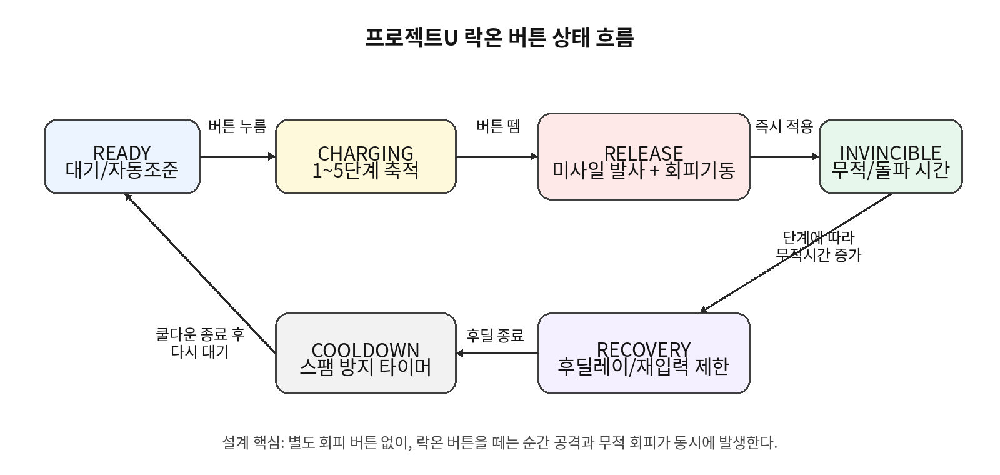

Project U / Lock-on System Spec v0.1

---

# 프로젝트 U

## 락온 시스템 개발 사양서

Lock-on Charge / Missile Release / Invincible Dodge System

| 항목 | 내용 |
| --- | --- |
| 문서 버전 | v0.1 |
| 작성일 | 2026-07-31 |
| 프로젝트 | 프로젝트U |
| 대상 | 기획자 / 클라이언트 프로그래머 / UI·VFX·애니메이션 담당 |
| 목적 | 락온 버튼 기반 공격·회피 통합 시스템을 개발자가 바로 구현 검토할 수 있도록 정리 |

> **핵심 한 줄**
>
> 락온 버튼을 누르고 있으면 1~5단계 락온이 축적되고, 버튼을 떼는 순간 미사일 발사와 무적 회피 기동이 동시에 발생한다.

이 문서는 현재 기획 결론을 기준으로 한 개발 전달용 초안이다. 실제 수치, 쿨다운, 데미지, 무적시간은 프로토타입 플레이 테스트 후 조정한다.

---

## 목차

1. 시스템 목표와 확정 방향
2. 플레이어 조작 구조
3. 락온 버튼 기본 플로우
4. 상태 머신 설계
5. 락온 타겟 선정 규칙
6. 단계별 효과와 밸런스 초안
7. 미사일 발사 / 무적 회피 처리
8. UI, 애니메이션, VFX, SFX 요구사항
9. 데이터 구조 / 개발 파라미터
10. 의사 코드
11. 리스크와 대응
12. 개발 체크리스트

---

## 1. 시스템 목표와 확정 방향

프로젝트U는 대도시를 침공한 거대괴수를 상대로 헬기가 괴수 주변을 선회하며 싸우는 3D 공중 액션 보스전 게임이다. 이 게임의 조작은 비행 시뮬레이션이 아니라 보스 패턴 회피와 공격 타이밍에 집중해야 한다.

### 1.1 확정된 전투 방향

| 분류 | 확정 내용 | 개발상 의미 |
| --- | --- | --- |
| 전투 방식 | 괴수 중심 선회형 | 플레이어는 괴수 주변 고정 전투 반경에서 상하좌우 회피와 공격 타이밍에 집중한다. |
| 거리 조작 | 전후 입력 제거 | 괴수와의 거리는 시스템이 자동 유지한다. 조작 축을 줄여 회피 피로도를 낮춘다. |
| 조준 방식 | 자동조준 / 락온 보정 | 별도 조준 스틱을 요구하지 않는다. 조준은 시스템이 돕고 플레이어 판단은 타이밍에 둔다. |
| 회피 방식 | 별도 회피 버튼 삭제 | 락온 버튼을 떼는 순간 미사일 발사와 무적 회피가 동시에 발생한다. |
| 핵심 판단 | 더 모을지, 지금 떼서 살지 | 락온 차지 욕심과 생존 판단이 순간 선택의 중심이다. |

### 1.2 시스템 목표

- 조작을 단순화한다. 이동은 상하좌우, 공격·회피는 락온 버튼 중심으로 묶는다.
- 조준 스트레스를 줄이고 보스 패턴 회피와 타이밍 판단을 강조한다.
- 낮은 락온 단계는 생존용, 높은 락온 단계는 강한 공격용이 되도록 역할을 나눈다.
- 풀차지 성공 시 양옆 대형 미사일까지 발사되는 풀무장 연출로 보상을 확실히 준다.
- 1단계 짧은 회피 남발과 5단계만 정답이 되는 문제를 밸런스로 방지한다.

## 2. 플레이어 조작 구조

| 입력 | 동작 | 비고 |
| --- | --- | --- |
| 상하좌우 이동 | 헬기의 고도 조절 및 괴수 주변 선회 위치 이동 | 회피의 핵심 조작. 전후 거리 조작은 없음. |
| 락온 버튼 누름 | 락온 차지 시작 / 괴수 부위에 락온 아이콘 순차 활성화 | 버튼 유지 시간에 따라 1~5단계까지 증가. |
| 락온 버튼 뗌 | 현재 단계만큼 미사일 발사 + 무적 회피 기동 발동 | 공격과 회피가 한 버튼에서 동시에 처리됨. |
| 기본 사격 | 자동 지속 사격 또는 별도 버튼 사격 | 프로토타입에서 결정. 락온 시스템과 독립 가능. |
| 특수무장 | 추후 결정 | 필수 기능은 아님. 락온 풀차지와 겹치지 않게 설계 필요. |

> **조작 철학**
>
> 플레이어는 조준점을 세밀하게 움직이는 것이 아니라, 위험 패턴 속에서 락온 버튼을 얼마나 오래 붙잡고 언제 떼는지를 판단한다.

## 3. 락온 버튼 기본 플로우

1. 플레이어가 락온 버튼을 누른다.
2. 시스템이 현재 화면 안의 괴수 락온 포인트를 검색한다.
3. 시간이 지날수록 1단계부터 5단계까지 락온 아이콘이 순차 활성화된다.
4. 락온 중에도 플레이어는 상하좌우로 회피 이동할 수 있다.
5. 플레이어가 버튼을 떼면 현재 누적 단계에 맞춰 미사일을 발사한다.
6. 동시에 헬기는 무적 회피 / 돌파 기동 상태가 된다.
7. 발사 후 짧은 후딜레이와 쿨다운을 거쳐 다시 락온 가능 상태가 된다.

락온 단계는 버튼을 누른 시간으로 결정하되, 타겟이 일시적으로 화면 밖으로 나가도 즉시 초기화하지 않는다. 회피 때문에 잠깐 빠지는 경우를 허용해야 조작 스트레스가 줄어든다.



*그림 1. 락온 버튼 상태 흐름*

## 4. 상태 머신 설계

| 상태 | 진입 조건 | 처리 내용 | 종료 조건 |
| --- | --- | --- | --- |
| READY | 쿨다운 종료 / 전투 가능 | 자동조준 대기, 기본 타겟 후보 갱신 | 락온 버튼 누름 |
| CHARGING | 락온 버튼 누름 | 차지 시간 누적, 단계 증가, 락온 아이콘 생성, 타겟 후보 갱신 | 버튼 뗌 / 피격 중단 조건 / 보스 페이즈 전환 |
| RELEASE | 버튼 뗌 | 단계 계산, 미사일 큐 생성, 회피 방향 결정, 무적 시작 이벤트 호출 | 발사 이벤트 처리 완료 |
| INVINCIBLE | RELEASE 직후 | 무적 판정, 헬기 돌파/회피 애니메이션, 충돌 무시 또는 피해 무시 | 단계별 무적시간 종료 |
| RECOVERY | 무적 종료 또는 발사 종료 | 짧은 후딜레이, 입력 완충 처리, 카메라 복귀 | 후딜레이 종료 |
| COOLDOWN | RECOVERY 종료 | 연속 사용 방지 타이머 | 쿨다운 종료 후 READY |

### 4.1 중단/예외 규칙

- 락온 중 플레이어가 일반 피격을 당해도 차지를 전부 끊을지, 일부만 깎을지는 난이도에 따라 결정한다.
- 보스가 페이즈 전환으로 약점을 닫으면 기존 락온은 몸통 임시 타겟으로 전환하거나 서서히 사라진다.
- 건물에 의해 완전히 가려진 락온 포인트는 일정 시간 후 해제한다.
- 차지 도중 보스가 화면 밖으로 나가는 상황은 카메라 보정으로 최소화한다.

## 5. 락온 타겟 선정 규칙

락온은 플레이어가 직접 부위를 고르는 방식이 아니다. 시스템이 괴수의 후보 포인트를 평가해 단계별로 자동 배정한다. 단, 완전 랜덤은 불쾌할 수 있으므로 랜덤성과 우선순위를 섞는다.

| 우선순위 | 타겟 조건 | 설명 |
| --- | --- | --- |
| 1 | 현재 노출된 약점 | 가장 높은 데미지 보상. 약점이 열렸을 때 자동으로 우선 배정. |
| 2 | 강공격을 준비 중인 부위 | 브레스 기관, 에너지 구체 생성 부위 등. 공격 차단/경직과 연결 가능. |
| 3 | 플레이어가 최근 공격한 부위 | 타격 연속성을 유지해 조작감이 흔들리지 않게 함. |
| 4 | 화면 중앙에 가까운 부위 | 플레이어의 위치 선정과 카메라 방향이 결과에 반영됨. |
| 5 | 가까운 대형 부위 | 항상 최소 공격 대상이 생기도록 보장. |

### 5.1 타겟 후보 필터

| 필터 | 통과 조건 | 비고 |
| --- | --- | --- |
| 시야 | 카메라 화면 안에 있거나 화면 경계 근처 | 완전히 화면 밖이면 우선순위 하락. |
| 가림 | 건물/보스 몸체에 완전히 가려지지 않음 | 잠깐 가림은 유지 허용. |
| 공격 가능 | 현재 파괴 불가 / 무적 부위가 아님 | 무효 부위 락온 방지. |
| 거리 | 전투 반경 기준 허용 거리 안 | 거리 조작이 없으므로 시스템이 안정적으로 유지. |
| 중복 | 같은 부위에 과도하게 몰리지 않음 | 단계별로 여러 부위에 배정해 풀무장 느낌 강화. |

### 5.2 단계별 배정 방식

- 1단계는 가장 안정적으로 맞출 수 있는 주요 부위에 배정한다.
- 2~4단계는 주변 부위와 약점을 섞어 배정한다.
- 5단계는 핵심 약점 + 복수 부위 + 대형 미사일 타겟을 함께 잡아 풀무장 느낌을 만든다.
- 락온 아이콘이 활성화되는 순서는 약간의 무작위성을 주되, 위험 패턴 차단 부위와 약점은 높은 가중치를 준다.

## 6. 단계별 효과와 밸런스 초안

아래 수치는 개발 시작용 임시값이다. 실제 재미는 보스 패턴 속도, 미사일 데미지, 무적 프레임, 후딜레이에 크게 좌우되므로 프로토타입에서 반드시 튜닝한다.

| 단계 | 권장 차지 시간 | 미사일 수 | 무적 시간 | 역할 | 연출 |
| --- | --- | --- | --- | --- | --- |
| 1 | 0.25~0.40초 | 1~2발 | 0.20~0.30초 | 긴급 회피 | 짧은 회피 궤적 + 소형 미사일 |
| 2 | 0.60~0.80초 | 3~4발 | 0.30~0.40초 | 회피 우선 | 살짝 긴 부스트 + 소형 연속 발사 |
| 3 | 1.10~1.30초 | 5~6발 | 0.40~0.50초 | 공방 절충 | 중형 미사일 섞임 |
| 4 | 1.60~1.90초 | 7~8발 | 0.50~0.60초 | 공격 우세 | 좌우 포드 개방 연출 |
| 5 | 2.30~2.70초 | 10~12발 + 대형 2발 | 0.65~0.85초 | 풀차지 보상 | 양옆 대형 미사일까지 풀무장 발사 |

### 6.1 밸런스 원칙

- 1~2단계는 생존에 유용하지만 딜 효율은 낮아야 한다.
- 5단계는 위험을 감수한 만큼 시간 대비 데미지와 경직치 보상이 있어야 한다.
- 무적 시간은 단계에 비례하지만, 후딜레이/쿨다운으로 연속 무적 남발을 막는다.
- 보스 분노 상태나 대형 브레스 패턴에서 낮은 단계 회피가 의미 있게 쓰이도록 공격 타이밍을 설계한다.
- 단계가 올라갈수록 락온 사운드와 UI 피드백을 강하게 해서 플레이어가 현재 위험-보상 상태를 즉시 알아야 한다.

## 7. 미사일 발사 / 무적 회피 처리

### 7.1 발사 처리

- 버튼을 뗀 순간 현재 단계의 타겟 리스트를 확정한다.
- 미사일은 한 프레임에 모두 생성하지 말고 0.03~0.08초 간격으로 큐 발사해 연출과 성능 부담을 조절한다.
- 소형 미사일은 현재 락온된 부위를 추적한다.
- 5단계 대형 미사일은 핵심 약점 또는 가장 높은 우선순위 부위를 추적한다.
- 타겟이 사라지면 가까운 유효 부위로 재지정하거나 직선 관성 비행 후 폭발한다.

### 7.2 무적 회피 처리

| 항목 | 설계안 | 개발 메모 |
| --- | --- | --- |
| 발동 시점 | 락온 버튼을 뗀 즉시 | 입력 지연 없이 생존 도구로 체감되어야 함. |
| 회피 방향 | 현재 이동 입력 방향 우선, 입력이 없으면 위험 반대 방향 | 브레스/장판 회피를 직관적으로 처리. |
| 무적 판정 | 단계별 시간 동안 피해 무시 | 충돌까지 무시할지 피해만 무시할지 별도 결정. |
| 카메라 | 짧은 흔들림/속도감 후 괴수 시점 복귀 | 멀미 방지를 위해 과한 회전 금지. |
| 후딜레이 | 무적 종료 후 짧은 재입력 제한 | 1단계 스팸 방지 핵심. |

### 7.3 위험 패턴과의 상호작용

- 브레스, 거대탄, 충격파 등 위험 패턴은 락온 발사 무적 타이밍으로 통과 가능해야 한다.
- 정확한 타이밍에 떼면 피해를 피하면서 딜을 넣는 손맛을 준다.
- 완벽 회피 판정은 선택 사항이다. 적용 시 추가 락온 게이지 보너스, 미사일 재장전 단축, 데미지 보너스 등을 줄 수 있다.
- 무적 회피 중에도 미사일 발사는 정상 진행되어야 한다. 공격과 회피가 동시에 이루어지는 시스템 정체성을 유지한다.

## 8. UI, 애니메이션, VFX, SFX 요구사항

| 분야 | 필수 요구사항 | 설명 |
| --- | --- | --- |
| UI | 1~5단계 락온 아이콘 | 괴수 부위 위에 순차적으로 활성화. 단계별 색/크기/효과 차등. |
| UI | 차지 단계 게이지 | 버튼을 누르는 동안 현재 단계와 다음 단계까지의 진행률 표시. |
| UI | 릴리즈 가능 피드백 | 1단계부터 발사 가능하다는 것을 즉시 알려야 함. |
| VFX | 미사일 궤적 | 소형/대형 미사일의 궤적, 연기, 빛을 구분. |
| VFX | 무적 회피 잔상 | 버튼을 뗀 순간 헬기 돌파 궤적, 속도선, 방어막/왜곡 효과. |
| VFX | 5단계 풀무장 | 양옆 대형 미사일 포드 개방, 다연장 발사, 큰 화면 흔들림. |
| 애니메이션 | 헬기 회피 기동 | 단계별 회피 강도 변화. 낮은 단계 짧고 빠르게, 5단계는 길고 강하게. |
| SFX | 단계 상승음 | 1~5단계 상승마다 명확한 사운드. 5단계는 별도 완성음 필요. |
| SFX | 릴리즈음 | 발사음 + 부스트음이 동시에 나야 시스템 정체성이 명확함. |

### 8.1 이벤트 훅 목록

| 이벤트명 | 호출 시점 | 사용처 |
| --- | --- | --- |
| OnLockStart | 락온 버튼을 처음 누름 | UI 게이지 시작, 락온 사운드 시작 |
| OnLockStageUp(stage) | 락온 단계 상승 | 단계 아이콘 활성화, 단계 상승음 |
| OnLockTargetAdded(target) | 새 타겟이 락온됨 | 부위 위 아이콘 생성, 타겟 하이라이트 |
| OnLockRelease(stage, targets) | 버튼을 뗌 | 미사일 큐 생성, 회피 기동 시작 |
| OnInvincibleStart(duration) | 릴리즈 직후 | 무적 판정, 회피 VFX, 헬기 애니메이션 |
| OnMissileFired(missileType, target) | 개별 미사일 발사 | 발사 이펙트, 사운드, 카메라 진동 |
| OnFullSalvo | 5단계 릴리즈 | 대형 미사일 포드 개방, 강한 연출 |
| OnPerfectDodge | 위험 판정 직전 정확히 릴리즈 | 보너스 연출/보상. 선택 사항 |

## 9. 데이터 구조 / 개발 파라미터

아래 구조는 Unity, Unreal, 자체 엔진 어디서든 옮겨 쓸 수 있는 개념 모델이다. 실제 클래스명과 자료형은 엔진에 맞춰 조정한다.

### 9.1 주요 설정값

| 파라미터 | 의미 | 초기값 예시 |
| --- | --- | --- |
| maxLockStage | 최대 락온 단계 | 5 |
| stageChargeTimes | 각 단계 도달 시간 | [0.35, 0.75, 1.25, 1.80, 2.50] |
| missileCountByStage | 단계별 소형 미사일 수 | [2, 4, 6, 8, 12] |
| heavyMissileCountAtStage5 | 5단계 대형 미사일 수 | 2 |
| invincibleTimeByStage | 단계별 무적 시간 | [0.25, 0.35, 0.45, 0.55, 0.75] |
| releaseRecoveryTime | 릴리즈 후딜레이 | 0.20~0.35초 |
| lockCooldownTime | 재사용 쿨다운 | 0.25~0.50초 |
| targetGraceTime | 화면 밖/가림 유지 허용 시간 | 1.0~1.5초 |
| missileFireInterval | 미사일 큐 발사 간격 | 0.03~0.08초 |
| minStageForRelease | 릴리즈 가능한 최소 단계 | 1 |

### 9.2 타겟 포인트 데이터

| 필드 | 설명 |
| --- | --- |
| targetId | 괴수 부위의 고유 ID |
| worldPosition | 미사일이 추적할 월드 좌표 또는 본/소켓 위치 |
| priority | 기본 우선순위. 약점, 공격 준비 부위일수록 높음 |
| isWeakPoint | 약점 여부 |
| isAttackable | 현재 공격 가능한지 여부 |
| isVisible | 카메라 기준 보이는지 여부 |
| occlusionState | 건물/보스 몸체에 가렸는지 여부 |
| lastLockedTime | 최근 락온된 시간. 연속성 유지에 사용 |
| stageAssigned | 현재 차지 중 몇 단계에 배정되었는지 |

## 10. 의사 코드

아래 코드는 개발자가 시스템 흐름을 빠르게 파악하기 위한 의사 코드다. 엔진별 문법에 맞춰 변환한다.

```text
state = READY
chargeTime = 0
currentStage = 0
lockedTargets = []

Update(deltaTime):
    if state == READY:
        UpdateAutoAimCandidates()
        if Input.LockButtonDown:
            StartLockCharge()

    elif state == CHARGING:
        chargeTime += deltaTime
        UpdateTargetCandidatesWithGraceTime()
        newStage = CalculateStage(chargeTime)

        if newStage > currentStage:
            for stage in range(currentStage + 1, newStage + 1):
                target = SelectBestLockTarget(stage)
                lockedTargets.Add(target)
                Emit(OnLockStageUp(stage))
                Emit(OnLockTargetAdded(target))
            currentStage = newStage

        if Input.LockButtonUp and currentStage >= 1:
            ReleaseLockOn()

ReleaseLockOn():
    state = RELEASE
    Emit(OnLockRelease(currentStage, lockedTargets))

    evadeDirection = DecideEvadeDirection(inputMove, incomingThreat)
    invincibleDuration = config.invincibleTimeByStage[currentStage]
    StartInvincibleDodge(evadeDirection, invincibleDuration)

    missileQueue = BuildMissileQueue(currentStage, lockedTargets)
    FireMissileQueue(missileQueue, config.missileFireInterval)

    if currentStage == 5:
        Emit(OnFullSalvo)

    state = INVINCIBLE

OnInvincibleEnd():
    state = RECOVERY
    StartRecovery(config.releaseRecoveryTime)

OnRecoveryEnd():
    state = COOLDOWN
    StartCooldown(config.lockCooldownTime)

OnCooldownEnd():
    ResetLockData()
    state = READY
```

## 11. 리스크와 대응

| 리스크 | 문제 상황 | 대응 방향 |
| --- | --- | --- |
| 1단계 스팸 | 짧게 눌렀다 떼기만 반복해 무적을 남발 | 낮은 단계 무적시간 짧게, 후딜/쿨다운 부여, 연속 사용 시 효율 감소 검토. |
| 5단계만 정답 | 항상 풀차지가 최적이라 플레이가 단조로움 | 보스 패턴 간격을 촘촘히 배치해 중간 릴리즈가 필요하게 설계. |
| 딜 효율 손해 | 차지 시간이 길어 오히려 풀차지가 손해로 체감 | 5단계에는 대형 미사일, 경직치, 약점 보너스를 추가. |
| UI 과밀 | 괴수 몸에 아이콘이 많아 화면이 지저분함 | 현재 단계 아이콘만 강조, 이전 단계는 축소/투명화, 중요 부위 우선 표시. |
| 락온 끊김 스트레스 | 회피 때문에 잠깐 화면 밖으로 나가면 차지가 무효화 | 1~1.5초 타겟 유지 유예시간 적용. |
| 성능 부담 | 미사일과 폭발이 한 번에 많이 발생 | 큐 발사, 오브젝트 풀링, LOD 이펙트 사용. |
| 회피 방향 불쾌감 | 버튼을 떼도 예상과 다른 방향으로 돌파 | 현재 이동 입력 우선. 입력이 없을 때만 위험 반대 방향 자동 선택. |

## 12. 개발 체크리스트

### 12.1 프로토타입 1차 구현 범위

- 락온 버튼 누름/뗌 입력 처리
- 1~5단계 차지 시간 계산
- 괴수 부위 락온 포인트 5개 이상 등록
- 단계별 락온 아이콘 표시
- 버튼 릴리즈 시 미사일 단계별 발사
- 릴리즈 순간 무적 시간 적용
- 무적 중 피격 무시 처리
- 릴리즈 후 후딜레이/쿨다운 적용
- 1단계 긴급 회피와 5단계 풀차지의 체감 차이 검증

### 12.2 기능 검수 기준

| 검수 항목 | 통과 기준 |
| --- | --- |
| 조작 단순성 | 플레이어가 조준 스틱 없이 상하좌우 이동과 락온 버튼만으로 공격/회피를 이해할 수 있다. |
| 릴리즈 반응성 | 버튼을 뗀 순간 미사일 발사와 무적 회피가 즉시 체감된다. |
| 단계 피드백 | 현재 1~5단계 중 어디인지 UI/SFX로 즉시 알 수 있다. |
| 생존 판단 | 1~2단계 릴리즈가 실제 위험 회피에 유효하다. |
| 공격 보상 | 5단계 릴리즈가 기다린 보상으로 충분히 강하고 멋지다. |
| 남발 방지 | 짧은 단계 반복만으로 모든 공격을 무력화할 수 없다. |
| 타겟 안정성 | 회피 중 잠깐 가려져도 락온이 지나치게 쉽게 끊기지 않는다. |
| 연출 일관성 | 락온, 미사일, 회피, 무적 이펙트가 한 시스템처럼 연결되어 보인다. |

### 12.3 다음 결정 필요 사항

- 기본 사격을 자동 지속 사격으로 둘지, 별도 버튼으로 둘지 결정.
- 무적 회피가 피해만 무시할지, 건물/탄 충돌까지 통과할지 결정.
- 완벽 회피 보너스를 넣을지 결정.
- 락온 중 피격 시 차지를 전부 취소할지, 일부 단계만 감소시킬지 결정.
- 보스 부위 파괴와 락온 보너스를 연결할지 결정.
- 5단계 풀무장 연출의 카메라 줌/슬로우 연출 사용 여부 결정.

## 부록 A. 개발자 전달 핵심 요약

> **필수 구현 핵심**
>
> 1) 버튼 누름 = 락온 축적
> 2) 버튼 뗌 = 미사일 발사 + 무적 회피
> 3) 1~2단계 = 생존용
> 4) 5단계 = 풀무장 강공격
> 5) 별도 회피 버튼 없음

이 시스템이 성공하려면 “락온을 오래 모을수록 강하지만, 위험할 때는 낮은 단계라도 떼서 살아야 한다”는 판단이 반복적으로 발생해야 한다. 개발 초기에는 데미지보다 입력 반응성, 무적 타이밍, UI 피드백, 5단계 연출 차이를 먼저 검증한다.

---

개발 공유용 초안 - 수치와 용어는 프로토타입 검증 후 조정
